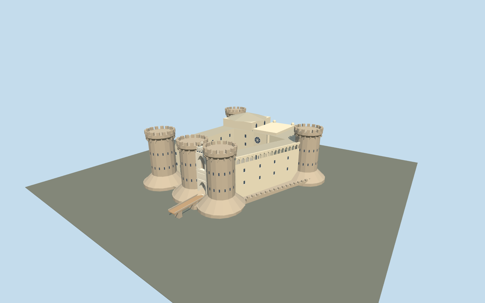

# Castel Nuovo

Five flat crenellated piperno towers on battered footings,tufo curtain wings,stacked pale marble entrance arch,open trapezoid courtyard,rose-window chapel,raised Barons Hall and nine court arcades.

## Evidence and reconstruction

Published dimensions and reconstructed details are separated in spec.json. Primary references:

- [Reference](https://www.comune.napoli.it/vivere-il-comune/luoghi/castel-nuovo-maschio-angioino/)
- [Reference](https://cultura.regione.campania.it/en/web/itinerari/poi?id=766084)
- [Reference](https://cultura.gov.it/luogo/museo-civico-castelnuovo)
- [Reference](https://www.castcampania.it/castelli-di-napoli---castel-nuovo.html)
- [Reference](https://static-www.comune.napoli.it/wp-content/uploads/2024/09/Castel-Nuovo-Maschio-Angioino.jpg)
- [Reference](https://static-www.comune.napoli.it/wp-content/uploads/2024/09/Castel_Nuovo_o_Maschio_Angioino.jpg)
- [Reference](https://media.cultura.gov.it/mibac/files/boards/bec8803f226b6c1f1d4be3ed98d36b8e/Campania%201/Museo%20civico%20Castelnuovo.jpg)
- [Reference](https://commons.wikimedia.org/wiki/File:NapoliMaschioAngioinoDaSanMartino.jpg)
- [Reference](https://commons.wikimedia.org/wiki/File:NapoliMaschioAngioinoIngresso.jpg)
- [Reference](https://commons.wikimedia.org/wiki/File:Napoli-castelnuovo01.jpg)
- [Reference](https://commons.wikimedia.org/wiki/File:Napoli_Castel_Nuovo_cortile_1060655-6.JPG)
- [Reference](https://www.openstreetmap.org/relation/15009683)

Mapped footings and court reproduce separately attributed OpenStreetMap data under ODbL-1.0. All other geometry is original approximate authoring. No downloaded mesh,research photograph or unique texture is embedded;four shared material graphs supply reusable surfaces.

## Model and axes

7,590 triangles; 22,770 vertices; 6 material groups; 914,372 bytes. Native bounds: -73.500, 0.000, -56.326 to 60.400, 40.000, 56.326. Source hash: `sha256:b139e307657f796d5df2dd8efb0cdfd81d7591de8c7da3bfc8a7c1115f402f06`.

{"up":"+Y","lateral":"+X approximately east along cached map axis; signed registration pending","longitudinal":"+Z approximately south; entrance faces native -X","origin":"Cached map envelope center. Y0 lower estimated footing;Y5 estimated court/entrance deck."}

Original approximate exterior on mapped footing/court rings;inactive until real-site review.

## Reproduce

Run `node packages/worldgen/scripts/generate-signature-towers.mjs --ids=N0289` (or add `--check`). The generator preserves manually edited masters by checking their baseline hashes. Import through the standard authored-model workflow with optimization disabled; then capture all QA cameras, including shared-surface views.

## Pending work

- Original approximate current exterior: full mapped footings/court,estimated upper curtain outline,shaft radii,heights,gate,chapel,Barons Hall and bridge. No measured exterior-height evidence;maximum40m is an authoring estimate.
- Five flat crenellated towers,real stacked gate openings and one open courtyard survive skyline. Street adds9 court arcades,31 southern upper arches,glazed east loggia,rose window and stair. Reliefs/statuary are symbolic broad forms;fine sculpture,masonry fluting/scales,flags,lettering,microbevels and full interiors omitted.
- Four existing256²shared graphs:basalt,sandstone,marble and timber. Linear palette tints,metric UVs and per-graph linear means for far colors. No unique images,photographs,baked shadows or AO in GLBs.
- Exterior gallery and chapel/hall controls are photograph-based estimates;interior26m/28m documentation does not certify their exterior bounds. Research inspected7 architecture photos;one additional chapel photo failed retrieval and supplies no evidence.
- Synthetic Italian-palazzo neighbors and flat review ground are style comparisons,not geographic proof. Inactive draft,replaceFootprint=false. Signed orientation,map fit,ground datum and terrain remain pending.
- Preloaded forced-LOD motion samples do not certify automatic selection,network upgrades,subframe shimmer or physical-device frame timing.

This bundle follows the medium-fi standard. Medium-fi appearance and geographic fit are reviewed separately. Hash-bound visual acceptance is recorded separately after capture inspection.

## Additional geographic data

© OpenStreetMap contributors;Municipality of Naples;Italian Ministry of Culture;Campania region;Italian Institute of Castles,Campania;primary photographers MM,currybet,Lalupa.
