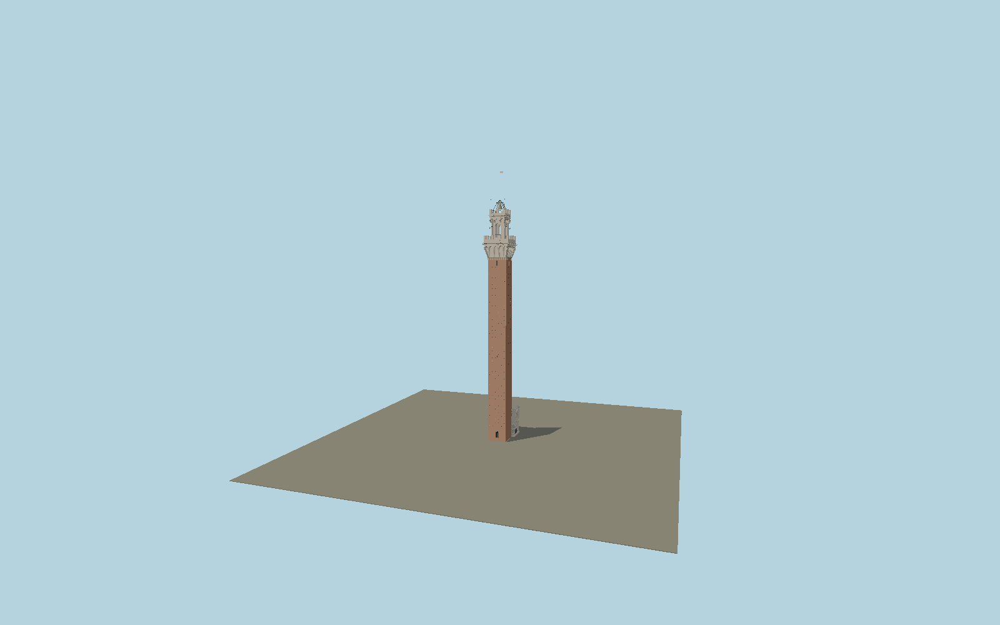

# Torre del Mangia

Siena’s brick civic tower with deeply projecting travertine arcades, two crenellated crowns, through-open belfry, exposed Sunto bell and curved iron support, clock and attached sculptured Cappella di Piazza.

## Identity and geometry

Catalog N0596, [Q2472396](https://www.wikidata.org/wiki/Q2472396). The Comune di Siena publishes a roughly 7 m square shaft and 87/102 m masonry/lightning heights. The Italian bell-research association separately records 87.45 m masonry and 97 m including the exposed bell structure. The 97 m bell-structure scope is ambiguous: the primary aerial image places the curved support roughly twice the 2.34 m bell height above its footing. The arch is reconstructed with a 91.1 m apex; the thin central lightning mast continues to the owner’s 102 m tip. The conflicting tabulated height is retained as evidence rather than used to stretch the visible support. The city museum’s high-resolution exterior photographs establish the paired crowns, arches, sockets, clock, chapel niches and relief. The city’s aerial bell photograph and published 2.34 × 1.98 m bell dimensions inform the separate open iron support. Intermediate levels, supports and sculptural detail are proportional original reconstructions, not a new survey.

Center of the mapped tower crown in XZ; Y=0 is the Piazza del Campo ground at the chapel. Native -Z faces Piazza del Campo and the projecting chapel; +X follows the northeast facade axis; +Y is up. The geographic proposal identifies its anchor and orientation evidence separately from remaining terrain and azimuth uncertainty.

Source facts and measured references are recorded in spec.json. References: [1](https://comune.siena.it/luogo/torre-del-mangia), [2](https://museocivico.comune.siena.it/il-palazzo), [3](https://www.visitsiena.it/33-il-campanone/), [4](https://campanologia.org/sites/www.campanologia.org/files/allegati_pagina_base/Campanili%20pi%C3%B9%20alti%20d'Italia%20-%20altezza%20superiore%20ai%2070%20mt_15.pdf), [5](https://cultura.gov.it/luogo/torre-del-mangia), [6](https://www.openstreetmap.org/way/265416598), [7](https://www.openstreetmap.org/way/252463679). Reference pages and images are not redistributed.

## Original source and shared materials

Geometry is authored in `packages/worldgen/scripts/torre-del-mangia-model.mjs`. Shared material graphs with metric repeat UV0 and original vertex tints; GLB PBR fallback remains self-contained. No per-model texture duplication. No third-party mesh or photograph is embedded.

115,282 triangles; 235,852 vertices; 9 material groups; 9,643,208 source bytes. Source hash: `sha256:ca741b450e261ae8f602fe7ad2c6bad944b7799000d0f6a85c1068bb8ed02c35`. Geometry validation checks finite Float32 coordinates, indices, triangle area and winding before export.

Regenerate with `node packages/worldgen/scripts/generate-heritage-towers.mjs N0596`; add `--check` for reproducibility. The generator refuses to overwrite a master whose hash differs from source.json. Import uses `--no-optimize` to preserve facade recesses.

## Remaining detail and review

- The tower and attached chapel are included; the remaining Palazzo Pubblico, interior stairways and neighboring urban fabric are separate assets.
- Small saint, griffin, wolf-drain and heraldic details are original polygonal relief informed by primary photographs; inscriptions and individual historic cracks are not facsimiles.
- Masonry and lightning heights follow published owner dimensions. The 97 m bell-association structure datum has unclear scope and is not the visible curved support apex; the arch apex at 91.1 m and intermediate vertical intervals are proportional reconstructions from the primary aerial photograph.
- Near/far visual QA, shared-material inspection and maximum-fidelity approval remain pending.

Named near/far cameras are included for lit visual review. A valid export is not maximum-fidelity certification.
