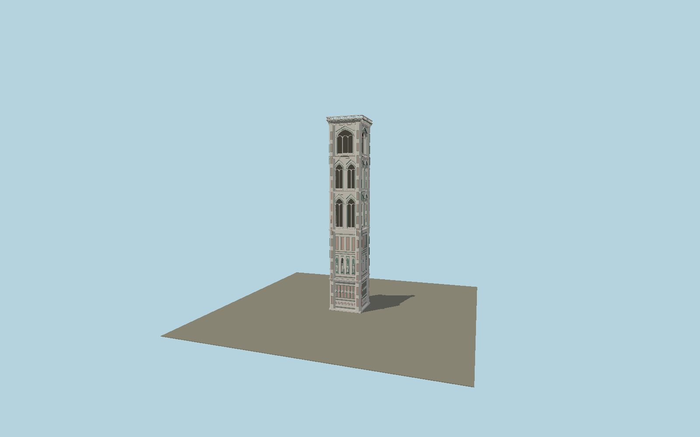

# Giotto’s Campanile

Florentine polychrome marble campanile, with reinforced octagonal corners, hexagonal and diamond relief cycles, statue niches, paired biforas and a three-light belfry loggia, Gothic gables, projecting corbels and an open flat crown.

## Identity and geometry

Catalog N0572, [Q1140023](https://www.wikidata.org/wiki/Q1140023). Opera del Duomo published 84.7 m height and roughly 15 m square base; mapped reinforced-corner plan determines shaft width and alignment. Photographer Roberto Di Ferdinando’s exterior image and Opera descriptions establish loggia/window and marble-panel hierarchy.

Exact-QID mapped shaft center at exterior pavement. −Z is the cathedral-facing north entrance elevation; +Y is up. The geographic proposal identifies its anchor and orientation evidence separately from remaining terrain and azimuth uncertainty.

Source facts and measured references are recorded in spec.json. References: [1](https://duomo.firenze.it/en/discover/giotto-s-bell-tower), [2](https://duomo.firenze.it/en/visit/plan-your-visit), [3](https://curiositadifirenze.blogspot.com/2018/01/campanile-di-giotto.html), [4](https://www.openstreetmap.org/way/251650632). Reference pages and images are not redistributed.

## Original source and shared materials

Geometry is authored in `packages/worldgen/scripts/next-heritage-tower-models.mjs`. Shared material graphs with metric repeat UV0 and original vertex tints; GLB PBR fallback remains self-contained. No per-model texture duplication. No third-party mesh or photograph is embedded.

211,048 triangles; 448,220 vertices; 3 material groups; 18,670,856 source bytes. Source hash: `sha256:447b0690fed0f559b769422d386a97ad48859d1908ffc88390ec96185236204f`. Geometry validation checks finite Float32 coordinates, indices, triangle area and winding before export.

Regenerate with `node packages/worldgen/scripts/generate-heritage-towers.mjs N0572`; add `--check` for reproducibility. The generator refuses to overwrite a master whose hash differs from source.json. Import uses `--no-optimize` to preserve facade recesses.

## Remaining detail and review

- The narrative bas-reliefs and statues retain their counts, shapes and architectural niches but are original simplified sculptural reliefs, not reproductions of the individual named artworks.
- Panel elevations, marble flower designs, moulding sections and window tracery are fitted to exterior photography. Exact conservation stone-cut patterns are not claimed.
- Permanent exterior is modeled; temporary restoration scaffolding is excluded.
- Near/far visual QA, shared-material inspection and maximum-fidelity approval remain pending.

Named near/far cameras are included for lit visual review. A valid export is not maximum-fidelity certification.
