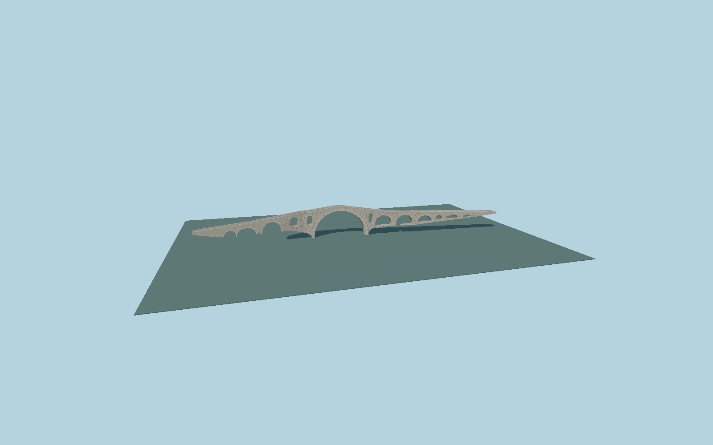

# Mes Bridge

Thirteen unequal stone arches with a21.5m main vault, raised pointed flood openings, the distinctive bent western approach, humped cobbled walkway, paired radial arch bands, low rough-stone parapets and edge-set step courses.

## Evidence

- [Primary reference](https://akt.gov.al/atraksionet/ura-e-mesit/)
- [Primary reference](https://drtkshkoder.com/fileadmin/user_upload/Ura_e_mesit_prokurim/Pasaporta_e_pasurise_kulturore_Ura_e_Mesit.pdf)
- [Primary reference](https://ahnp.ub.uni-heidelberg.de/journals/heritage/article/viewFile/21004/14776)
- [Primary reference](https://commons.wikimedia.org/wiki/File:Mesi_Bridge_2025.jpg)
- [Primary reference](https://commons.wikimedia.org/wiki/File:Mes_Bridge_Shkodra_02.jpg)
- [Primary reference](https://commons.wikimedia.org/wiki/File:Mes_Bridge_Shkodra_06.jpg)
- [Primary reference](https://commons.wikimedia.org/wiki/File:Mesi_bridge_detail.jpg)
- [Primary reference](https://www.openstreetmap.org/way/86888378)

Published dimensions and reconstruction assumptions are separated in spec.json. Source photos were consulted; no photos or third-party geometry are embedded. Map plan attribution: © OpenStreetMap contributors, ODbL-1.0.

## Source

334084 triangles; 30021728 bytes; 2 material groups. SHA256: sha256:f0ac311a7395e85cddfa1ab2cc2e472ca53c734260d5e1387bcc2ab2883a896c.

Shared surfaces (stone_drywall, stone_granite) are loaded through the central library; any transparent materials use local PBR parameters. Axis and provisional vertical datum are in spec.json.

Regenerate with node packages/worldgen/scripts/generate-researched-bridges.mjs --ids=N0011; append --check to verify. Import and capture through the standard next-1000 scripts. Geometry validation does not substitute for current-frame visual review.

## Reconstruction limits

- Original detailed exterior reconstruction; no survey-quality minor arch ordinates or hidden foundations are claimed.
- OSM maps124.721m walkway including bank approaches; the heritage authority108m historic body is kept separately. Published3.4m width provides a reconstructed transverse outline.
- Exposed support bases follow photo-scaled river rocks; terrain fit remains dependent on the host rocky-bank surface. River water and rock scenery, the adjacent concrete road bridge, vegetation and houses are not embedded.
- Photographs and printed plan were inspected for shape; no external meshes, image textures or copyrighted sign artwork are embedded.
