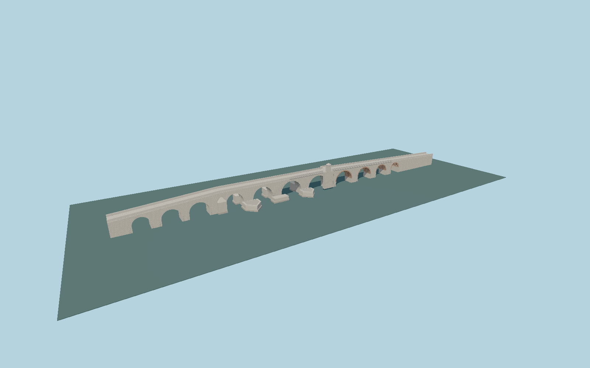

# Stone Bridge in Skopje

Detailed travertine crossing with four unequal river vaults, separately jointed brick approach vaults, mapped asymmetric cutwaters, stepped foundations, dressed parapets, rosettes, prayer niche with muqarnas and opposite corbelled balcony.

## Evidence

- [Primary reference](https://macedonia-timeless.com/eng/about/about/did-you-know/stone-bridge)
- [Primary reference](https://dergipark.org.tr/en/download/article-file/288477)
- [Primary reference](https://dergipark.org.tr/tr/download/article-file/3321195)
- [Primary reference](https://haemus.org.mk/stone-bridge/)
- [Primary reference](https://ceipa.pmf.ukim.mk/en/node/126)
- [Primary reference](https://commons.wikimedia.org/wiki/File:Skopje_-_Kamen_Most_(9454032526).jpg)
- [Primary reference](https://openjicareport.jica.go.jp/pdf/11945227_01.pdf)
- [Primary reference](https://www.openstreetmap.org/way/734159692)

Published dimensions and reconstruction assumptions are separated in spec.json. Source photos were consulted; no photos or third-party geometry are embedded. Map plan attribution: © OpenStreetMap contributors, ODbL-1.0.

## Source

466084 triangles; 38184464 bytes; 3 material groups. SHA256: sha256:9577841e21d7aaeeeb8549fc026401ec1befff3e824e0eeb84c52d316f9bd8e7.

Shared surfaces (stone_travertine, clay_fired, metal_painted) are loaded through the central library; any transparent materials use local PBR parameters. Axis and provisional vertical datum are in spec.json.

Regenerate with node packages/worldgen/scripts/generate-researched-bridges.mjs --ids=N0004; append --check to verify. Import and capture through the standard next-1000 scripts. Geometry validation does not substitute for current-frame visual review.

## Reconstruction limits

- Exterior reconstruction with metric masonry detail; heights, shore vault stations, mihrab decoration and individual block layout are reconstructed from published field photographs, not survey ordinates.
- Historical sources disagree on total arch counts and describe buried end spans. Eleven exposed/reconstructed vaults are modeled; the buried ends use closed approach masonry.
- Absolute datum follows a2009 river study. Host terrain, present channel bed and river stage can differ; shoreline and nearby statues are separate features.
