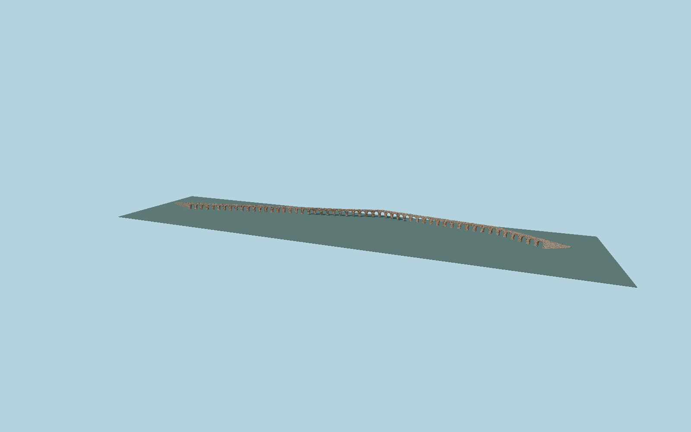

# Skopje Aqueduct

Bent54-arch water conduit with53 square piers,42 distinct upper relief openings, mixed rounded stone and brick courses, individual radial brick rings and soffits, open water channel, broken cap courses and two end ramps.

## Evidence

- [Primary reference](https://repository.ukim.mk/bitstream/20.500.12188/28646/1/5%20Sidnej%20-%2020ICSMGE%20-%20Akvadukt.pdf)
- [Primary reference](https://repository.ukim.mk/bitstream/20.500.12188/28652/1/MASE20%20-%20akvadukt.pdf)
- [Primary reference](https://karpos.gov.mk/wp-content/uploads/2017/08/turisticki-lokaliteti-Karpos.pdf)
- [Primary reference](https://commons.wikimedia.org/wiki/File:Skopje_Aqueduct_9.jpg)
- [Primary reference](https://commons.wikimedia.org/wiki/File:Skopje_Aqueduct_3.jpg)
- [Primary reference](https://commons.wikimedia.org/wiki/File:Skopje_Aqueduct_8.jpg)
- [Primary reference](https://www.openstreetmap.org/way/180360206)
- [Primary reference](https://pub-a8a09a2ee9454482a412c12c7e4f463e.r2.dev/Godisna%20programa%202026.pdf)

Published dimensions and reconstruction assumptions are separated in spec.json. Source photos were consulted; no photos or third-party geometry are embedded. Map plan attribution: © OpenStreetMap contributors, ODbL-1.0.

## Source

2224784 triangles; 185039096 bytes; 2 material groups. SHA256: sha256:c0b1d1d5f930c07cd294ea0a60344090680cdfab8a7ac90865ba07a31371cb00.

Shared surfaces (stone_limestone_raw, clay_fired) are loaded through the central library; any transparent materials use local PBR parameters. Axis and provisional vertical datum are in spec.json.

Regenerate with node packages/worldgen/scripts/generate-researched-bridges.mjs --ids=N0018; append --check to verify. Import and capture through the standard next-1000 scripts. Geometry validation does not substitute for current-frame visual review.

## Reconstruction limits

- Conservation work continued after the dated photo set; exact2026 stone repairs require further confirmation.
- Unknown relief-opening stations and ramp lengths are reconstruction assumptions explicitly recorded in spec.json.
- Original geometry from visual and dimensional evidence, not a laser scan or measured stone-by-stone survey.
- Actual local ground contact and placement remain pending.
