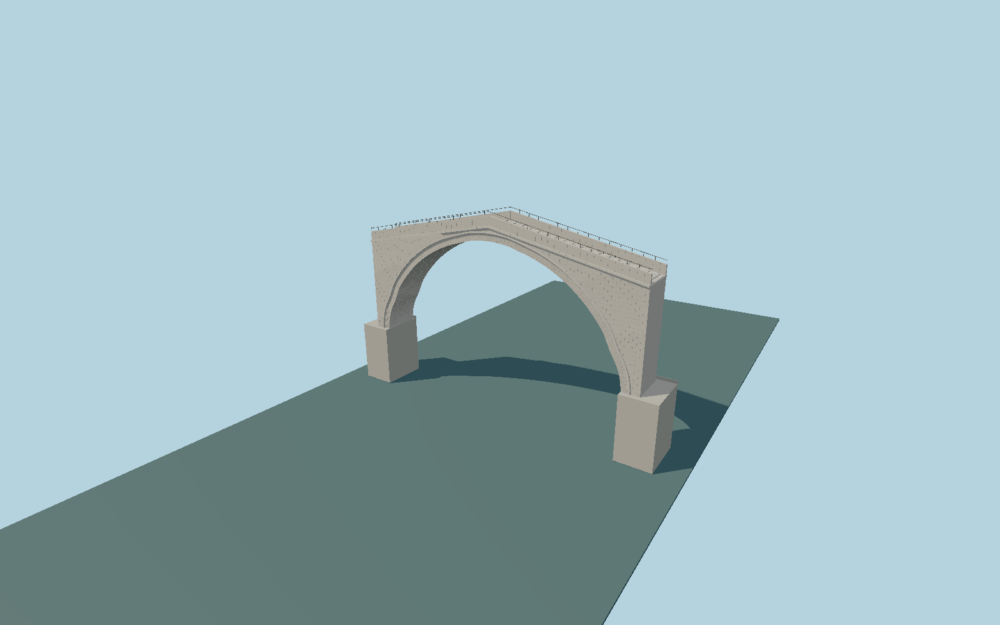

# Stari Most

Narrow humpbacked Tenelija-stone arch with 111 individually jointed radial courses, ashlar spandrels, shaped cornices, stone parapets, iron guards and transverse walkway traction strips.

## Evidence

- [Primary reference](https://www.mostarbridge.org/starimost/01_intro/orig_des/orig_des.htm)
- [Primary reference](https://www.mostarbridge.org/starimost/02_techdata/stone_cut04/st_cut04.htm)
- [Primary reference](https://www.mostarbridge.org/starimost/01_intro/hist_most/hist02.htm)
- [Primary reference](https://whc.unesco.org/en/activities/349)

Published dimensions and reconstruction assumptions are separated in spec.json. Source photos were consulted; no photos or third-party geometry are embedded. Map plan attribution: © OpenStreetMap contributors, ODbL-1.0.

## Source

56312 triangles; 4689320 bytes; 3 material groups. SHA256: sha256:53ad9863952d0c2f42050ddd2d1de6fb2410acbdb13bbf83db8380b1ccbcea53.

Shared surfaces (stone_granite, metal_painted, stone_drywall) are loaded through the central library; any transparent materials use local PBR parameters. Axis and provisional vertical datum are in spec.json.

Regenerate with node packages/worldgen/scripts/generate-researched-bridges.mjs --ids=N0001; append --check to verify. Import and capture through the standard next-1000 scripts. Geometry validation does not substitute for current-frame visual review.

## Reconstruction limits

- Detailed exterior reconstruction of the rebuilt bridge; historical survey dimensions guide its silhouette, without claiming exact current stone-by-stone survey coordinates.
- Tara and Halebija towers, adjacent town buildings, rocky riverbanks and the bent public streets beyond bridge bearings are separate scene features.
- The absolute vertical placement uses the published historical low-water datum; terrain datasets and seasonal river surfaces can vary.
