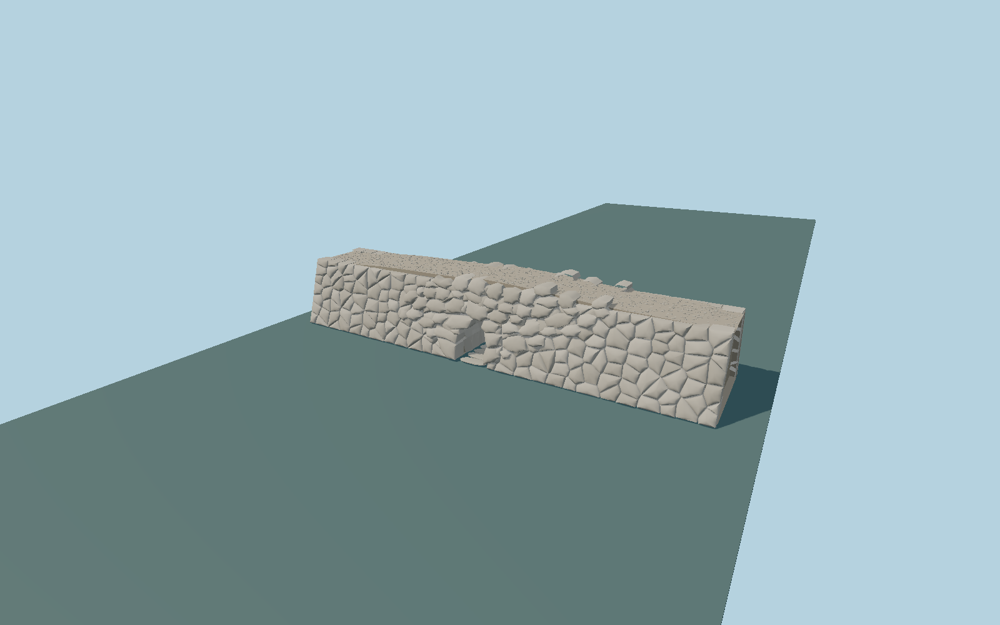

# Kazarma Mycenaean Bridge

Surviving Cyclopean corbel bridge, reconstructed as individual irregular limestone boulders, projecting horizontal tunnel courses and closing stone, battered retaining wings, small dry-joint packing stones and an uneven gravel road surface.

## Evidence

- [Primary reference](https://www.argolisculture.gr/el/lista-mnimeion/mykinaiki-gefyra-kazarmas/)
- [Primary reference](https://odysseus.culture.gr/h/2/gh251.jsp?obj_id=1710)
- [Primary reference](https://pergamos.lib.uoa.gr/uoa/dl/object/3417312/file.pdf)
- [Primary reference](https://commons.wikimedia.org/wiki/File:Arkadiko_bridge,_mycenaean,_Late_Heladic_age,_202418.jpg)
- [Primary reference](https://commons.wikimedia.org/wiki/File:Arkadiko_bridge,_mycenaean,_Late_Heladic_age,_202420.jpg)
- [Primary reference](https://commons.wikimedia.org/wiki/File:Kazarma_bridge_9267.jpg)
- [Primary reference](https://www.openstreetmap.org/way/306121794)

Published dimensions and reconstruction assumptions are separated in spec.json. Source photos were consulted; no photos or third-party geometry are embedded. Map plan attribution: © OpenStreetMap contributors, ODbL-1.0.

## Source

97254 triangles; 11613072 bytes; 2 material groups. SHA256: sha256:f84ee3da46d21a01e511b4268160a6f0b7b1e0c5d63b7e7968d00ce6464a8100.

Shared surfaces (gravel, stone_limestone_weathered) are loaded through the central library; any transparent materials use local PBR parameters. Axis and provisional vertical datum are in spec.json.

Regenerate with node packages/worldgen/scripts/generate-researched-bridges.mjs --ids=N0012; append --check to verify. Import and capture through the standard next-1000 scripts. Geometry validation does not substitute for current-frame visual review.

## Reconstruction limits

- Original detailed exterior; individual boulder shapes, hidden tunnel joints and full retaining-wing extent are interpreted from photographs and published overall dimensions.
- No modern safety parapet, regular Roman voussoirs, embedded source photograph or surrounding landscape is invented.
- The 22 m published length includes retaining wings; do not stretch the 7.943 m mapped central bridge path to 22 m. Exact rocky-bank exposure and streambed height require local terrain review.
