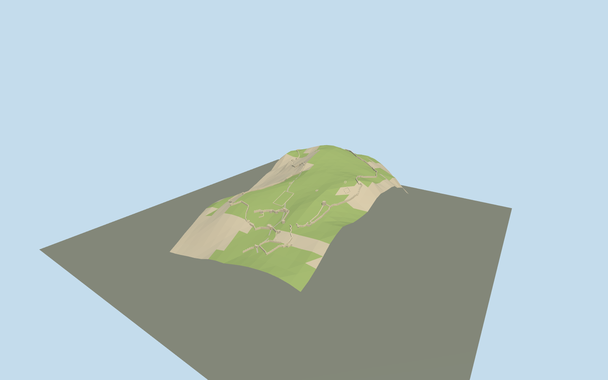

# Acrocorinth

Fortified twin ridge with three successive western gates,surviving terrain-following curtains,inner towers,rectangular Ottoman summit keep,citadel,cistern terrace and selected roofless remains. A relative terrain study,not a flat site-boundary extrusion.

## Evidence and reconstruction

Published dimensions and reconstructed details are separated in spec.json. Primary references:

- [Reference](https://castleroute.culture.gov.gr/en/acrocorinth/)
- [Reference](https://www.ascsa.edu.gr/excavations/ancient-corinth/digital-corinth/maps-gis-data-and-archaeological-data-for-corinth-and-greece)
- [Reference](https://github.com/tilezen/joerd/blob/master/docs/data-sources.md)
- [Reference](https://github.com/tilezen/joerd/blob/master/docs/attribution.md)
- [Reference](https://www.openstreetmap.org/way/146863144)

Model geometry adapts licensed archaeological wall data,under CC-BY-SA-4.0;see LICENSE.md. Terrain grid is produced using Copernicus data and information funded by the European Union - EU-DEM layers,through Mapzen/Terrain Tiles. Research photographs remain external evidence,never textures or bundled images. Existing shared surface graphs carry their own repository license.

## Model and axes

6,430 triangles; 19,290 vertices; 4 material groups; 774,372 bytes. Native bounds: -480.000, 0.000, -320.000 to 480.000, 312.850, 320.000. Source hash: `sha256:49eeb61fed8d0796fb0d4aebf8f8a0c21f644a923795e184bf09df32215adafb`.

{"up":"+Y","longitudinal":"+X approximately east along the ridge","lateral":"+Z approximately south toward the Ottoman keep","origin":"Cached OSM site-boundary frame anchor;relative terrain datum258.37m,not local anchor ground height"}

Do not use the OSM site polygon as a building replacement. Relative terrain patch is not a surveyed host-terrain replacement. Signed orientation,component heights,current-state alignment and patch edges await review.

## Reproduce

Run `node packages/worldgen/scripts/generate-signature-towers.mjs --ids=N0281` (or add `--check`). The generator preserves manually edited masters by checking their baseline hashes. Import through the standard authored-model workflow with optimization disabled; then capture all QA cameras, including shared-surface views.

## Pending work

- Primary GIS plan gives2D surviving archaeological wall lines,not a present-day3D survey. Some courses have gaps;roofless remains are not reconstructed as complete historical buildings. Small interior ruin identities remain unconfirmed.
- Terrarium terrain samples mix30m-resolution source data. A960×640m patch and estimated gate thresholds cannot establish centimeter-level footings,cliff shape or terrace elevations. Terrain is a relative study patch;patch edges require host-terrain blending and local corrections.
- The cached OSM archaeological-site boundary is not the curtain footprint. GIS and OSM outlines differ;absolute registration,signed direction,temporal state and vertical datum require in-world review. Inactive draft;replaceFootprint=false.
- Three gate widths/heights,blind arches,bastions,keep elevations,merlons,cistern terrace and ruin wall heights are approximate photo interpretations. Extent-based closeup detail omits joints,arrow slits,fine battlements,carvings and railings.
- Modern approach road,vegetation,visitor fixtures,interiors,buried archaeology,lost roofs and all minor individual remains are excluded. The living AgiosDimitrios church is not guessed onto an unidentified outline.
- ASCSA adapted wall data and this asset geometry areCC-BY-SA-4.0;generator code remains under repository license. OSM identity/frame areODbL-1.0. Copernicus/EU-DEM terrain attribution retained. Research photographs are linked only,never redistributed or used as textures.
- Shared256² limestone,weathered limestone and gravel graphs plus untextured terrain/recess colors. No embedded images,baked lighting or AO. Physical-device timings and continuous-motion LOD behavior remain unmeasured.

This bundle follows the medium-fi standard. Medium-fi appearance and geographic fit are reviewed separately. Hash-bound visual acceptance is recorded separately after capture inspection.

## Additional geographic data

James A.Herbst,Corinth Excavations,American School of Classical Studies at Athens;© OpenStreetMap contributors;Hellenic Ministry of Culture;Mapzen/Terrain Tiles;produced using Copernicus data and information funded by the European Union - EU-DEM layers.
