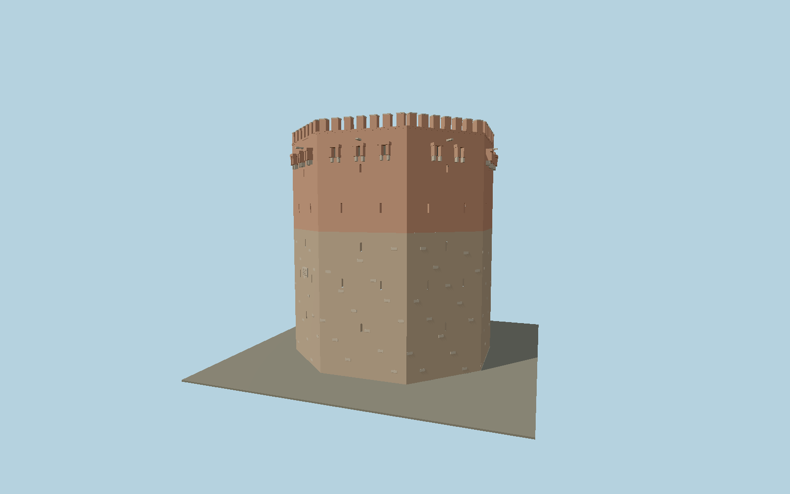

# Kızıl Kule

Alanya’s octagonal Red Tower: heavy limestone lower walls, red brick upper defenses, narrow arrow slits, twenty-two projecting drop openings, crenellated crown, open arcaded roof court, gallery stairs, cistern and sixteen light wells.

## Identity and geometry

Catalog N0591, [Q2470666](https://www.wikidata.org/wiki/Q2470666). Alanya municipality publishes the 33 m eastern height, 3 m terrain difference, eight-sided plan and defensive opening counts. Exact OSM corners set the asymmetric plan; municipal aerial photographs establish the stone/brick transition, crenels and open roof court with lower arches and two stair flights.

Exact mapped tower centroid with lowest eastern stone base at Y=0; the western ground naturally rises around its lower three metres. Exact mapped native frame; the small west entrance occupies the west-facing diagonal wall; +Y is up. The geographic proposal identifies its anchor and orientation evidence separately from remaining terrain and azimuth uncertainty.

Source facts and measured references are recorded in spec.json. References: [1](https://www.alanya.bel.tr/S/811/Red-Tower), [2](https://www.alanya.bel.tr/Photos/Pages/850440640.jpg), [3](https://www.alanya.bel.tr/Photos/Gallery/Photos/503820288.jpg), [4](https://www.alanya.bel.tr/Photos/Gallery/Photos/400203936.jpg), [5](https://www.openstreetmap.org/way/57956094). Reference pages and images are not redistributed.

## Original source and shared materials

Geometry is authored in `packages/worldgen/scripts/heritage-towers-580-models.mjs`. Shared material graphs with metric repeat UV0 and original vertex tints; GLB PBR fallback remains self-contained. No per-model texture duplication. No third-party mesh or photograph is embedded.

25,650 triangles; 51,292 vertices; 4 material groups; 2,105,688 source bytes. Source hash: `sha256:ed3c225b160d05e5833746dde48195f265da863b369e14cd75d5a527c746f937`. Geometry validation checks finite Float32 coordinates, indices, triangle area and winding before export.

Regenerate with `node packages/worldgen/scripts/generate-heritage-towers.mjs N0591`; add `--check` for reproducibility. The generator refuses to overwrite a master whose hash differs from source.json. Import uses `--no-optimize` to preserve facade recesses.

## Remaining detail and review

- Inscription tablets preserve their documented faces and relief rhythm without inventing legible Arabic text. Minor individual reused stone positions are original geometric reconstructions.
- The visible open rooftop court, stairs, gallery, cistern and light wells are modeled; enclosed interior museum rooms are outside this exterior asset.
- Near/far visual QA, shared-material inspection and maximum-fidelity approval remain pending.

Named near/far cameras are included for lit visual review. A valid export is not maximum-fidelity certification.
