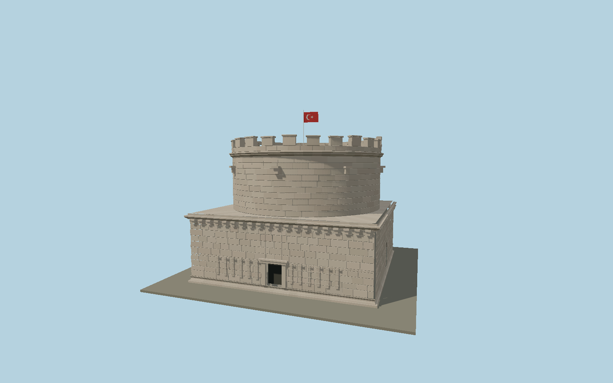

# Hıdırlık Tower

Antalya’s Roman monumental tower: measured square podium and broad circular drum in individual warm ashlar courses, moulded Roman cornices and modillions, northeast Ionic entrance with twelve fasces reliefs, blocked northwest doorway, rooftop pedestal and asymmetric surviving crenellations with southern defensive infill. Current national flag and stone terrace complete the exterior.

## Identity and geometry

Catalog N0610, [Q218118](https://www.wikidata.org/wiki/Q218118). The municipal festival identifies a17.20×17.30 m podium. The Istanbul University thesis p84 (PDF105), citing Şebnem Alp’s2005 measured study, records the15.80 m drum diameter and1.55×2.05 m northeast entrance. The ambiguous7.95/7.97 m tourism figure is not used as a drum diameter. Published approximate14 m height, current2026 TRT photographs and geolocated first-hand2011/2014 photographs constrain the split between podium, drum and parapets. Individual stone lengths and eroded profiles are original proportional reconstructions; the southern infill and northern crenellations preserve the surviving asymmetry.

Center of the square podium, Y=0 at the exposed bottom plinth. Native +Z northeast toward the main Ionic doorway; +X northwest along the front facade; +Y is up. The geographic proposal identifies its anchor and orientation evidence separately from remaining terrain and azimuth uncertainty.

Source facts and measured references are recorded in spec.json. References: [1](https://www.kaleicioldtown.com/tr/tarihi-yerler/hidirlik-kulesi/4), [2](https://nek.istanbul.edu.tr/ekos/TEZ/47362.pdf), [3](https://www.antalya.bel.tr/tr/kaleici), [4](https://www.antalyaekspres.com.tr/hidirlik-kulesine-girdik), [5](https://commons.wikimedia.org/wiki/File:Antalya_H%C4%B1d%C4%B1rl%C4%B1k_Tower_in_2011_01.jpg), [6](https://commons.wikimedia.org/wiki/File:Antalya_H%C4%B1d%C4%B1rl%C4%B1k_Tower_in_2011_02.jpg), [7](https://commons.wikimedia.org/wiki/File:Antalya_H%C4%B1d%C4%B1rl%C4%B1k_Tower_in_2011_03.jpg), [8](https://commons.wikimedia.org/wiki/File:H%C4%B1d%C4%B1rl%C4%B1k_Tower_01.jpg), [9](https://www.trthaber.com/foto-galeri/antalyanin-yeni-bulusma-ve-toplanma-noktasi-hidirlik-kulesi/77988.html), [10](https://www.openstreetmap.org/way/110321832). Reference pages and images are not redistributed.

## Original source and shared materials

Geometry is authored in `packages/worldgen/scripts/hidirlik-tower-model.mjs`. Shared material graphs with metric repeat UV0 and original vertex tints; GLB PBR fallback remains self-contained. No per-model texture duplication. No third-party mesh or photograph is embedded.

77,044 triangles; 153,464 vertices; 4 material groups; 6,298,468 source bytes. Source hash: `sha256:d729802c6f134256f8a8ee6b84f8cb4c6b73cc9681f84cb3d08ce30c8756be65`. Geometry validation checks finite Float32 coordinates, indices, triangle area and winding before export.

Regenerate with `node packages/worldgen/scripts/generate-heritage-towers.mjs N0610`; add `--check` for reproducibility. The generator refuses to overwrite a master whose hash differs from source.json. Import uses `--no-optimize` to preserve facade recesses.

## Remaining detail and review

- The measured podium, drum and entrance dimensions govern scale. Intermediate heights, individual ashlar lengths, modillion profiles and parapet erosion are reconstructed from published photographs rather than represented as a laser survey.
- The twelve fasces retain shallow rod-bundle and axe relief, with weathered detail abstracted in the shared polygonal style. The rooftop pedestal footprint is documented; its current height, paving joints and small fittings are proportional exterior reconstruction.
- Current2026 photographs verify the surviving tower silhouette and restored surroundings. Excavated neighboring monuments, glazed visitor terraces, interiors and movable equipment are not incorporated into this individual tower model.
- Near/far visual QA, shared-material inspection and maximum-fidelity approval remain pending.

Named near/far cameras are included for lit visual review. A valid export is not maximum-fidelity certification.
