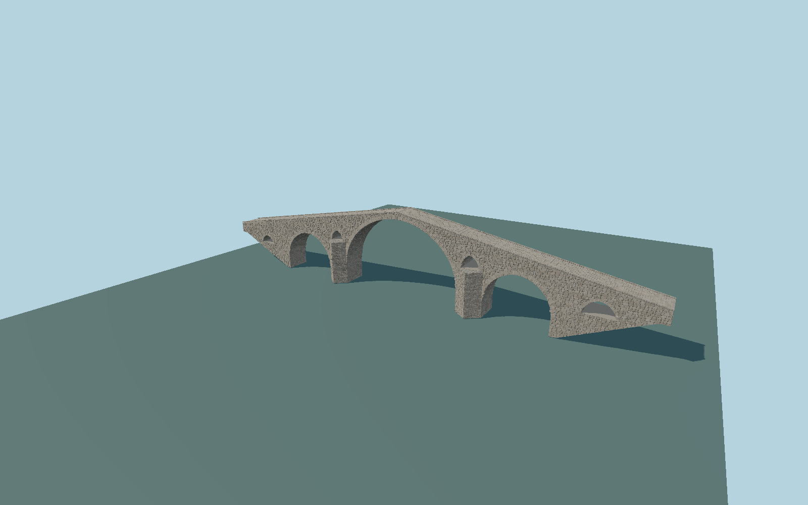

# Dyavolski Most (Devil’s Bridge)

Individually reconstructed Arda crossing with three unequal major vaults, four separate flood openings, upstream pointed cutwaters, irregular mineral stone masonry, exposed stone soffits, steep humped cobbled walkway and extremely low stone edges.

## Evidence

- [Primary reference](https://www.tourism.government.bg/sites/tourism.government.bg/files/bulletin_5_march_2019_eden_iii_edition_english.pdf)
- [Primary reference](https://basa-architecture.eu/_files/osnovna_tqlo_2023_compressed-1.pdf)
- [Primary reference](https://doi.org/10.3390/buildings14010054)
- [Primary reference](https://commons.wikimedia.org/wiki/File:Bulgaria-Diavolski_most-01.jpg)
- [Primary reference](https://commons.wikimedia.org/wiki/File:Bulgaria-Diavolski_most-02.jpg)
- [Primary reference](https://commons.wikimedia.org/wiki/File:DJI_vp3.jpg)
- [Primary reference](https://www.openstreetmap.org/way/58478181)

Published dimensions and reconstruction assumptions are separated in spec.json. Source photos were consulted; no photos or third-party geometry are embedded. Map plan attribution: © OpenStreetMap contributors, ODbL-1.0.

## Source

519774 triangles; 40936384 bytes; 1 material groups. SHA256: sha256:8c7c94eb189d9f3dd098b6fe7d2a878a9bb5f90e91ab6c9aef264c55c36e833f.

Shared surfaces (stone_granite) are loaded through the central library; any transparent materials use local PBR parameters. Axis and provisional vertical datum are in spec.json.

Regenerate with node packages/worldgen/scripts/generate-researched-bridges.mjs --ids=N0016; append --check to verify. Import and capture through the standard next-1000 scripts. Geometry validation does not substitute for current-frame visual review.

## Reconstruction limits

- Tourism documents state56m length; engineering publications state65.7m, and the mapped path is59.092m. The engineering extent is retained and the disagreement remains explicit.
- The original stone-by-stone model is reconstructed from photos and a published elevation, not a scan or measured current survey.
- The original low stone edge is retained. Surrounding bedrock, trees and modern visitor shelters are terrain/scenery, not embedded into the bridge model.
- Actual riverbed and both approach terrain elevations need review before geographic approval.
