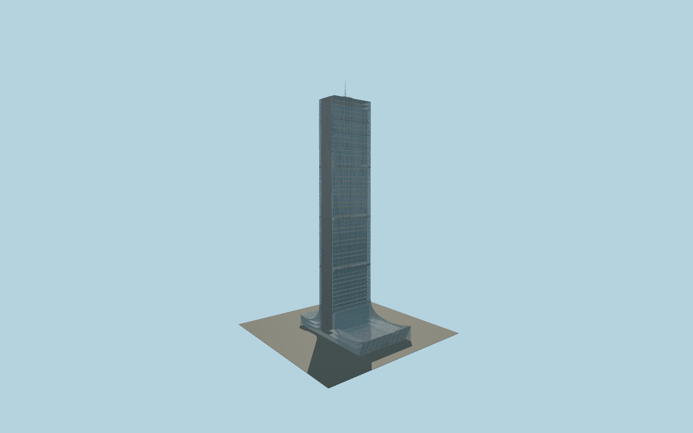

# Istanbul Sapphire

Slightly tapered double glass envelope with three-storey garden cavities, recessed residential glazing, projecting wood balcony edges, opaque end blade, asymmetric curved retail canopy, two observation floors and a separate rooftop mast.

## Evidence and reconstruction

Published dimensions and reconstructed details are separated in spec.json. Primary references:

- [Reference](https://www.tabanlioglu.com/project/sapphire/)
- [Reference](https://www.tabanlioglu.com/au-march-2013-2/)
- [Reference](https://www.tabanlioglu.com/larchitetto-april-2011/)
- [Reference](https://www.skyscrapercenter.com/building/torre-costanera/748)
- [Reference](https://www.openstreetmap.org/way/673790538)

No third-party geometry, photograph or bitmap texture is embedded. Shared surface graphs come from the central library; vertex tints carry model colors. Glazing uses PBR materials; transparent surfaces are declared per model.

## Model and axes

1,547,192 triangles; 3,085,608 vertices; 9 material groups; 79,531,556 bytes. Native bounds: -31.160, 0.000, -65.055 to 31.160, 261.000, 40.057. Source hash: `sha256:506abc7a5d43de50edd7d0ef1d4612782a8051f90d4c66633c9cc6b57feffad9`.

{"up":"+Y","longitudinal":"+X along the mapped tower axis, approximately south","front":"-Z provisionally toward the main-road canopy","origin":"Cached tower part center at provisional pavement contact"}

The geographic proposal uses exact-QID OpenStreetMap evidence. Map-derived orientation and estimated architectural details require real-site visual review; preview eligibility is distinct from geographic/fidelity approval. Map attribution: © OpenStreetMap contributors, ODbL-1.0.

## Reproduce

Run `node packages/worldgen/scripts/generate-signature-towers.mjs --ids=N0229` (or add `--check`). The generator preserves manually edited masters by checking their baseline hashes. Import through the standard authored-model workflow with optimization disabled; then capture all QA cameras, including shared-surface views.

## Pending work

- Maximum exterior fidelity is pending. Tower taper, window module count, cavity dimensions, balcony/plant distribution and support-floor heights require dimensioned facade and floor drawings.
- The 261 m tip, 234.9 m observatory and mapped 235 m height are distinct evidence. The 239.35 m working roof and mast division remain a section-guided reconstruction, not verified height datums.
- The cached footprint is a tower building:part only. Retail canopy dimensions, signed orientation, end-blade side, entrances and site ground contact require an independently registered site plan.
- Transparent mall galleries and winter-garden plants represent visible exterior depth; apartment interiors, exact retail layouts, lettering and rooftop equipment still need further reference.
- The 55 registry floors, 64 map levels and reconstructed facade row counts are recorded separately; facade subdivisions do not validate storey numbering.

This bundle contains source geometry, not a claim of maximum-fidelity completion. Hash-bound visual acceptance is recorded separately after capture inspection.
