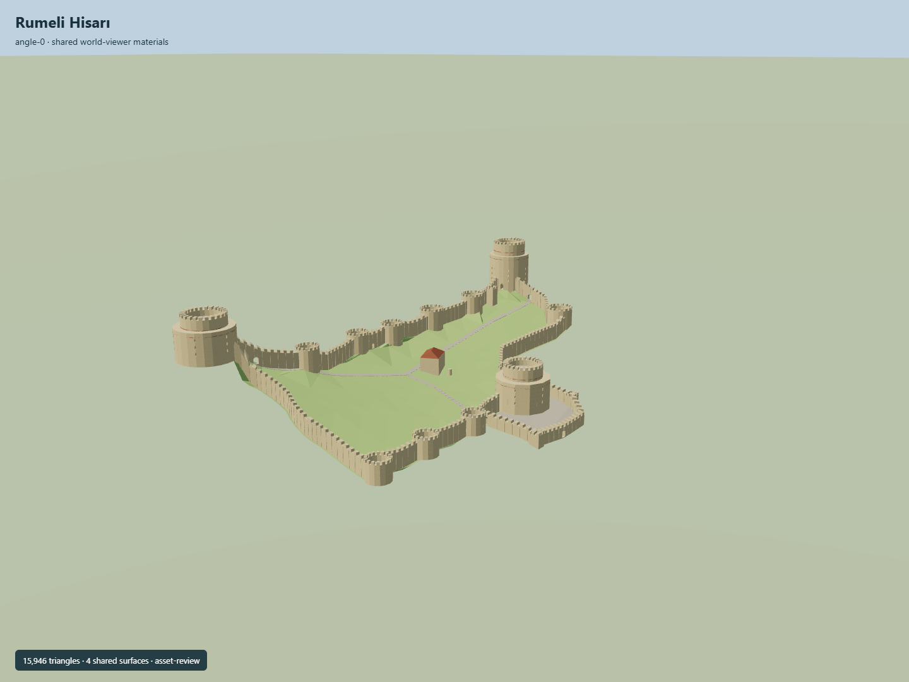

# Rumeli Hisarı

Three stepped roofless towers over a sloping narrow enclosure: cylindrical Saruca and Zağanos,12-sided seaward Halil lower body, ten mapped minor bastions, estimated square forecourt defenses, real masonry gates, selected slits and a mapped mosque with tiled hip roof.

## Evidence and reconstruction

Published dimensions and reconstructed details are separated in spec.json. Primary references:

- [Reference](https://api.openstreetmap.org/api/0.6/map?bbox=29.0538,41.0834,29.0578,41.0863)
- [Reference](https://turkishmuseums.kprod.kultur.gov.tr/museum/detail/2077-istanbul-rumeli-hisari/2077/1)
- [Reference](https://goturkiye.com/istanbul/rumeli-fortress)
- [Reference](https://www.turkishmuseums.com/Uploads/Müze/Foto/Fotoğraflar/35c0ee5a-ca31-4568-afc7-8721028ae56a.jpg)
- [Reference](https://www.turkishmuseums.com/Uploads/Müze/Foto/Fotoğraflar/4cd7cb2b-1c19-4c0b-9dae-4ab7189af351.jpg)
- [Reference](https://www.turkishmuseums.com/Uploads/Müze/Foto/Fotoğraflar/67f5bbde-8a55-4024-83d8-fd77912a2e59.jpg)
- [Reference](https://www.turkishmuseums.com/Uploads/Müze/Foto/Fotoğraflar/8b2c4eaf-ce01-473c-9b9e-c580ef96f665.jpg)
- [Reference](https://www.turkishmuseums.com/Uploads/Müze/Foto/Fotoğraflar/93ca2761-bf5c-4566-8ce8-6c947d8e7b72.jpg)
- [Reference](https://www.turkishmuseums.com/Uploads/Müze/Foto/Fotoğraflar/95131563-de5d-4443-9d3d-c1a6c7157ac2.jpg)
- [Reference](https://www.turkishmuseums.com/Uploads/Müze/Foto/Fotoğraflar/98cfd614-24ed-4e48-a884-52127cf3695c.jpg)
- [Reference](https://www.turkishmuseums.com/Uploads/Müze/Foto/Fotoğraflar/a0d4e764-2bc4-43d6-bf16-ae5c3011eb26.jpg)
- [Reference](https://www.turkishmuseums.com/Uploads/Müze/Foto/Fotoğraflar/b6cca14f-f14f-4f2f-918c-933e8b5621f4.jpg)
- [Reference](https://www.turkishmuseums.com/Uploads/Müze/Foto/Fotoğraflar/b92c1dca-bcca-4610-ad95-328c637d6c19.jpg)
- [Reference](https://www.turkishmuseums.com/Uploads/Müze/Foto/Fotoğraflar/bb6f6995-a1ab-45d2-a97b-23d13ceec39c.jpg)
- [Reference](https://cdn2.goturkiye.com/istanbul-ci-1-rumeli-fortress-1400x788.jpg?2026-04-10T19%3A43%3A05.956Z)
- [Reference](https://isprs-archives.copernicus.org/articles/XLII-2-W9/723/2019/)
- [Reference](https://s3.amazonaws.com/elevation-tiles-prod/terrarium/14/9514/6137.png)

Four existing shared material graphs with metric UVs; no embedded/new images or imported third-party mesh. Cropped coarse terrain, original pads and exact East/South map frame are source controls,not proof of real host placement.

## Model and axes

15,946 triangles; 47,838 vertices; 5 material groups; 1,916,772 bytes. Native bounds: -69.474, 10.068, -128.642 to 71.250, 72.999, 121.494. Source hash: `sha256:1d0258086ab366cac08fea36dc2ab34c408cb794cf6c5d645da9f5384c73090c`.

{"up":"+Y","longitudinal":"+Z south","front":"+X east toward Bosphorus","origin":"Exact-QID cached map anchor; native Y0 is coarse DEM sample-grid minimum, not real host ground datum."}

Raw multipolygon roles appear reversed. Model retains open court and independently authored towers. Map identity is exact; forecourt interpretation and host terrain fit require review before activation.

## Reproduce

Run `node packages/worldgen/scripts/generate-signature-towers.mjs --ids=N0293` (or add `--check`). The generator preserves manually edited masters by checking their baseline hashes. Import through the standard authored-model workflow with optimization disabled; then capture all QA cameras, including shared-surface views.

## Pending work

- Own attributed wall coordinates and mapped tower arcs are not a surveyed castle model. Raw outer/inner relation roles appear reversed; corrected site/court interpretation and original polygonal Halil base remain explicit source controls.
- Published tower heights are22/21/28m; thickness, step levels, battlement dimensions, aperture positions, original forecourt/square-bastion positions and wall heights are photographic estimates.
- Coarse20m terrain samples do not resolve terraced foundations. Ground pads, stairs and native minimum datum need real host-terrain and vertical-datum review.
- Mapped mosque body is distinct from its estimated roof and minaret stub. Current mosque state, restoration fixtures, landscaping and visitor infrastructure remain pending; vegetation will belong to host terrain/ecology.
- Research photographs and navigation plan stay private. No downloaded mesh, scan or unique photographic texture is embedded. Interiors use selected visible floors and hollow walls; full floor-by-floor rooms, inscriptions, exhibits, cannon collection and walkable collision are not complete.
- Each LOD must preserve the three stepped towers, narrow sloping enclosure, minor defenses and open courtyard. Actual continuous transitions, physical laptop/phone timing and geographic activation require review.

This bundle follows the medium-fi standard. Medium-fi appearance and geographic fit are reviewed separately. Hash-bound visual acceptance is recorded separately after capture inspection.

## Additional geographic data

© OpenStreetMap contributors;Turkish Museums;Türkiye Tourism Promotion and Development Agency;Mapzen/NASA/USGS.
