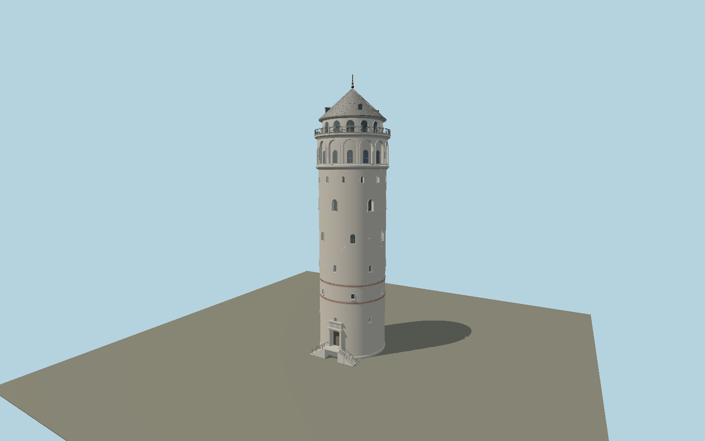

# Galata Tower — N0561

Detailed present-day exterior: cylindrical stone body with recessed arched openings, brick repair bands and chain courses, fourteen-bay upper arcade, cantilevered iron-railed gallery, smaller observation storey, lead roof seams and four dormers, gold finial, and south-facing marble double stair.

## Identity and evidence

Exact catalog identity **Q91274**. Source facts: `{"baseDiameterMeters":16.45,"roofTipMeters":62.59,"finialTipMeters":66.9,"observationDeckMeters":51.65,"brickBandsMeters":[13.2,17.17],"upperBays":14,"entrance":"south","measurementSources":"Turkish Museums / Galata Tower Museum brochure; Istanbul Fire Department; Semavi Eyice architectural account."}`. The source specification keeps published dimensions separate from reconstructed details.

- https://muze.gov.tr/s3/MysFileLibrary/566f7fe8-c812-421d-9baa-86e7bb228337.pdf
- https://itfaiye.ibb.gov.tr/en/fire-towers.html
- https://islamansiklopedisi.org.tr/galata-kulesi
- https://turkishmuseums.kprod.kultur.gov.tr/museum/detail/22341-istanbul-galata-tower-museum/22341/4
- https://www.openstreetmap.org/way/23236783

Operator and municipal photographs/plans were inspected as references. No third-party image, plan pixels or mesh is included. Original geometry uses the repository license; OSM geographic evidence is © OpenStreetMap contributors, ODbL.

## Authored geometry and materials

121,046 triangles, 233,414 vertices, 9 surface groups; 9,627,060 source bytes. SHA-256: `sha256:128a0b54fcf07ca1d836e63c1b6f35ed5431df46371a889ecbc8f9a2e46de289`. Actual bounds: -9.080, 0.000, -9.080 to 9.080, 66.900, 10.120 m.

Shared canonical material graphs with metric UV repeats in extras.molenSurface; portable glTF PBR factors and vertex colors remain. Dark recesses/lantern panels retain local fallback materials. Shared references: `matgraph:molen.worldgen.material.brick` (1.92 × 0.9 m), `matgraph:molen.worldgen.material.plaster_lime` (2 × 2 m), `matgraph:molen.worldgen.material.stone_ashlar` (2.4 × 1.5 m), `matgraph:molen.worldgen.material.stone_drywall` (2 × 2 m), `matgraph:molen.worldgen.material.metal_standing_seam` (2.5 × 3 m), `matgraph:molen.worldgen.material.metal_painted` (2 × 2 m), `matgraph:molen.worldgen.material.wood_plain` (2 × 0.25 m). Model-native axes: {"up":"+Y","front":"+Z south entrance","origin":"center of circular masonry footprint at outside paving grade"}.

## Placement proposal

Circular exact-QID OSM footprint center supplies the anchor; museum brochure explicitly locates the entrance on the south axis. Native +Z is south, so heading 0. Ground contact uses the host terrain at the masonry base; the stairs are part of the model. Proposed anchor 28.974214291, 41.025634117 (longitude, latitude), heading 0 radians. Elevation policy: **terrain-contact**. This is a reviewable proposal, not a completed site-fit certification. The tower uses terrain contact at its outside paving grade.

## Limitations and review

- Exterior architectural reconstruction; individual repaired stones, fine calligraphy, and changing temporary signs are not facsimiles. Window row heights, roof seams and rail divisions are proportioned from operator imagery rather than a measured facade survey.
- The museum gives 62.59 m to the roof tip; the municipal fire department separately gives 66.90 m including the ornament. Those distinct levels are retained.

Near/far fixtures are in `spec.qaCameras`. Float32 finite geometry, triangle degeneracy and winding are checked by the generator. Rendering, shared-material alignment, maximum-fidelity and geographic reviews remain pending until their hash-bound reports exist.

Regenerate with `node packages/worldgen/scripts/generate-galata-tower.mjs --ids=N0561`; add `--check` for reproducibility. Editable component recipes are in `packages/worldgen/scripts/galata-tower-model.mjs`. The generator protects artist-edited master hashes and preserves import/capture/shared-capture/QA documents.
