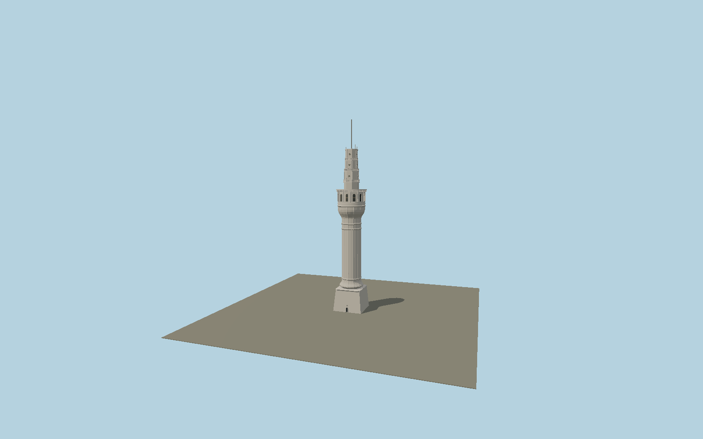

# Beyazıt Tower

The surveyed Istanbul fire tower: tapered square limestone pedestal, twelve-fluted cylindrical shaft, double-curved capital, arched watch room, three octagonal signalling levels with round windows and stone balustrades, and slender flagpole.

## Identity and geometry

Catalog N0587, [Q853029](https://www.wikidata.org/wiki/Q853029). Şekerci, Damcı and Öztorun (Buildings 2025, 15, 650; CC BY 4.0) report the restoration survey dimensions and reproduce the measured elevation and compass plans. The 67 m masonry body and approximately 12 m flagpole are used directly. Their surveyed 12 windows take precedence over the 13-window secondary summaries. University photographs establish the current stonework and aerials.

Center of the exact mapped tower at the surveyed ground datum Y=0. +Z is the north-north-west entrance facade; +Y is up. The geographic proposal identifies its anchor and orientation evidence separately from remaining terrain and azimuth uncertainty.

Source facts and measured references are recorded in spec.json. References: [1](https://doi.org/10.3390/buildings15050650), [2](https://mdpi-res.com/d_attachment/buildings/buildings-15-00650/article_deploy/buildings-15-00650.pdf), [3](https://iletim.istanbul.edu.tr/index.php/2025/09/09/turk-tarih-mirascisi-istanbul-universitesi/), [4](https://itfaiye.ibb.gov.tr/tr/yangin-kuleleri.html), [5](https://www.openstreetmap.org/way/639302102). Reference pages and images are not redistributed.

## Original source and shared materials

Geometry is authored in `packages/worldgen/scripts/civic-tower-more-models.mjs`. Shared material graphs with metric repeat UV0 and original vertex tints; GLB PBR fallback remains self-contained. No per-model texture duplication. No third-party mesh or photograph is embedded.

60,860 triangles; 116,808 vertices; 5 material groups; 4,938,560 source bytes. Source hash: `sha256:083fcdf850906b0a381695330f549deea605e33ec2a104330342da83b90bfdc3`. Geometry validation checks finite Float32 coordinates, indices, triangle area and winding before export.

Regenerate with `node packages/worldgen/scripts/generate-heritage-towers.mjs N0587`; add `--check` for reproducibility. The generator refuses to overwrite a master whose hash differs from source.json. Import uses `--no-optimize` to preserve facade recesses.

## Remaining detail and review

- Minor weathering, individual carved calligraphic strokes and changing weather-light colours are not transcribed; the inscription is a recessed relief panel with a nontextual line treatment.
- The measured 79 m overall envelope differs from the widely repeated 85 m tourist summary; that discrepancy is preserved explicitly rather than hidden by arbitrary scaling.
- Near/far visual QA, shared-material inspection and maximum-fidelity approval remain pending.

Named near/far cameras are included for lit visual review. A valid export is not maximum-fidelity certification.
