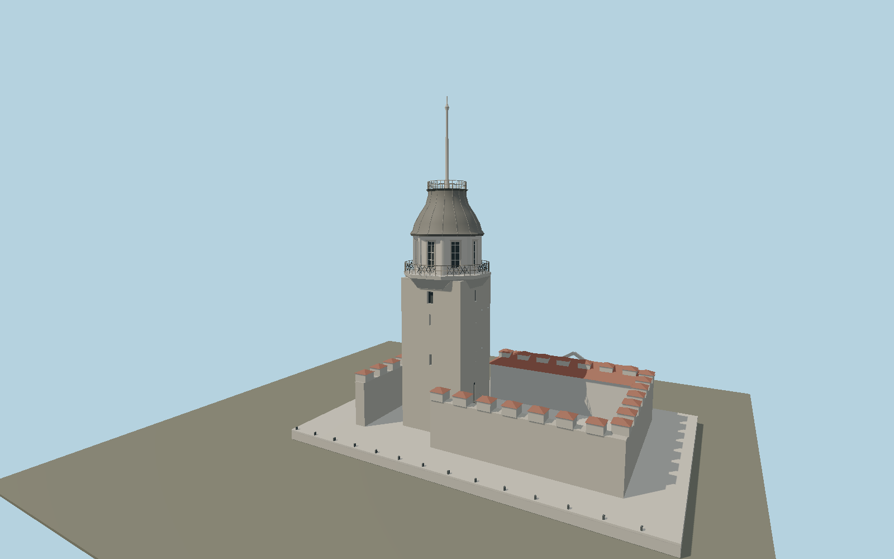

# Maiden's Tower — N0638

Restored Bosphorus castle-tower ensemble: stone square shaft, projecting octagonal plaster room, curved lead-colored cap, ornamental balconies, tall mast, crenellated courtyard and one-storey pavilion.

## Identity and evidence

Exact catalog identity **Q848397**. Source facts: `{"restoration":"2023 restoration follows the Mahmut II period arrangement with timber upper structure and a one-storey western building.","modeledHeightMeters":32.5,"heightBasis":"Photo-proportioned full mast envelope; not a published measured height."}`. The source specification keeps published dimensions separate from reconstructed details.

- https://kizkulesi.gov.tr/en/restoration-diary
- https://www.openstreetmap.org/way/398210643
- https://www.openstreetmap.org/way/103821245
- https://kizkulesi.gov.tr/images/kiz-kulesi-banner1.png
- https://kizkulesi.gov.tr/images/kiz-kulesi-komepage-lastImage.png

Original geometry and shared procedural materials. Official photographs are research references only; no reference imagery or third-party mesh is embedded or redistributed.

## Authored geometry and materials

16,480 triangles, 29,768 vertices, 7 surface groups; 1,273,544 source bytes. SHA-256: `sha256:edc07774f5ba692057bb7c1ff2a5434e52ac14466f05501839bf8a372fc4f4b0`. Actual bounds: -12.000, 0.000, -13.700 to 22.000, 32.500, 9.300 m.

Shared canonical material graphs with metric UV repeats in extras.molenSurface; portable glTF PBR factors and vertex colors remain. Dark recesses/lantern panels retain local fallback materials. Shared references: `matgraph:molen.worldgen.material.plaster_lime` (2 × 2 m), `matgraph:molen.worldgen.material.stone_ashlar` (2.4 × 1.5 m), `matgraph:molen.worldgen.material.tile_ceramic` (2.4 × 2.4 m), `matgraph:molen.worldgen.material.metal_painted` (2 × 2 m), `matgraph:molen.worldgen.material.stone_granite` (2 × 2 m), `matgraph:molen.worldgen.material.wood_plain` (2 × 0.25 m). Model-native axes: {"up":"+Y","front":"+Z","origin":"Authored main tower center at local base level; attached ensembles are offset from this origin."}.

## Placement proposal

Mapped main shaft way398210643 fixes6.4m plan and tower center. Heading1.721295251 sends authored+X north-northwest along the court; the restored pavilion is west, court east/north and tower entry faces the court. Terrain contact uses the mapped inhabited island surface at the tower center; no artificial water-level offset is applied. Proposed anchor 29.004093, 41.02106 (longitude, latitude), heading 1.721295251 radians. Elevation policy: **terrain-contact**. This is a reviewable proposal, not a completed site-fit certification. Ground models require terrain contact; offshore models also require water-datum and base-height checks.

## Limitations and review

- The modeled exterior follows the cited published facts and inspected photographs. Unpublished dimensions and local fittings are explicitly photo-proportioned; no claim of engineering survey accuracy is made.
- Portable PBR and shared metric surfaces are provided. Surface weathering, material color under local lighting and fine facade relief require close render review before maximum-detail acceptance.
- Main shaft width/center, fort axis and pavilion side are mapped. Total mast height32.5m, restored pavilion roof/window proportions and seawall boundary follow official restoration images; these are photographic reconstructions, not measured survey elevations. Decorative railing motifs are geometric reconstructions and moving flag cloth is excluded from the architectural source.

Near/far fixtures are in `spec.qaCameras`. Float32 finite geometry, triangle degeneracy and winding are checked by the generator. Current rendering, shared-material, maximum-fidelity and geographic review results are recorded in `qa.json` and the readiness ledger; source generation alone does not approve a model.

Regenerate with `node packages/worldgen/scripts/generate-lighthouse-models.mjs --ids=N0638`; add `--check` for reproducibility. Editable component recipes are in `packages/worldgen/scripts/lighthouse-expansion-models.mjs`. The generator protects artist-edited master hashes and preserves import/capture/shared-capture/QA documents.
