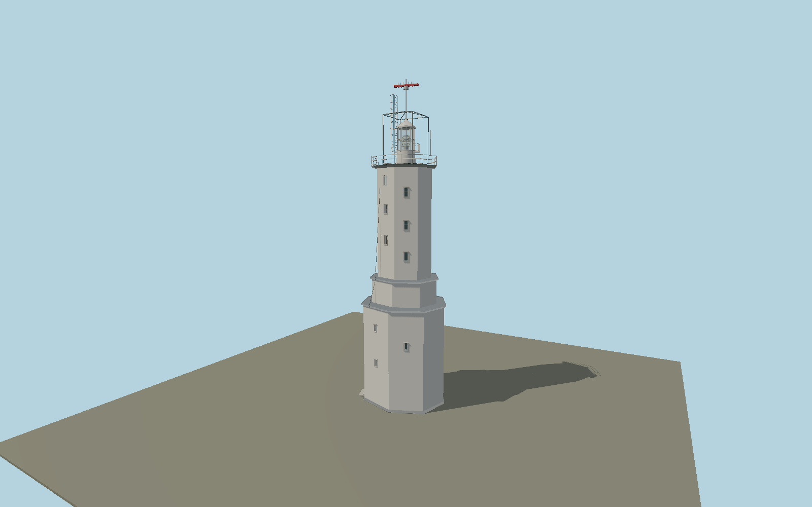

# Rumeli Feneri — N0670

White three-stage octagonal masonry tower on its mapped eight-sided base, narrow staggered staircase windows, projecting zinc-colored stage caps, railed gallery, small clear lantern on tapering service drum, conical cap, tall four-legged external antenna cage, caged ladder, red radar array and exterior cable.

## Identity and evidence

Exact catalog identity **Q3269761**. Source facts: `{"towerHeightMeters":30,"focalElevationMeters":58,"modeledRadarMastHeightMeters":33.8,"basis":"Coastal Safety Directorate publishes30m three-stage masonry tower and58m light elevation. Its opposed day/night and aerial photographs constrain stage proportions, white masonry, narrow stair windows, lantern and characteristic cage/antenna ensemble. OSMtower way1035459712 supplies the8.9x8.54m octagonal ground envelope; photographed stage proportions are13.5m combined lower tiers and11.3m upper shaft. Radar extension is photo-proportioned above the published tower height."}`. The source specification keeps published dimensions separate from reconstructed details.

- https://kiyiemniyeti.gov.tr/yer-detay/114/TURKELI-(RUMELI)-FENERI
- https://kiyiemniyeti.gov.tr/Data/1/Files/Place/Images/8Q/ju/AM/9T/Original/123_51b9a3a8-3b62-4eec-8029-3624335177dc.png
- https://kiyiemniyeti.gov.tr/Data/1/Files/Place/Images/WW/Xw/Mi/51/Original/69_f929c4b0-19da-4c74-8b62-d66b70cc76f0.jpg
- https://www.openstreetmap.org/way/1035459712
- https://sgb.uab.gov.tr/haberler/ulastirma-bakani-karaismailoglu-tarihi-sile-deniz-feneri-ni-ozgun-haline-geri-dondurduk

Original geometry and shared procedural materials. Official photographs are research references only; no reference imagery or third-party mesh is embedded or redistributed.

## Authored geometry and materials

21,710 triangles, 40,856 vertices, 7 surface groups; 1,735,420 source bytes. SHA-256: `sha256:783c7d52e6578dbcce5403fb3eb3bfab84a9c23dce9bcc8d45e43444a39712d9`. Actual bounds: -4.991, 0.000, -4.462 to 4.650, 33.800, 4.462 m.

Shared canonical material graphs with metric UV repeats in extras.molenSurface; portable glTF PBR factors and vertex colors remain. Dark recesses/lantern panels retain local fallback materials. Shared references: `matgraph:molen.worldgen.material.plaster_lime` (2 × 2 m), `matgraph:molen.worldgen.material.stone_limestone` (2.4 × 1.6 m), `matgraph:molen.worldgen.material.metal_painted` (2 × 2 m), `matgraph:molen.worldgen.material.stone_granite` (2 × 2 m), `matgraph:molen.worldgen.material.wood_plain` (2 × 0.25 m). Model-native axes: {"up":"+Y","front":"+Z","origin":"Authored main tower center at local base level; attached ensembles are offset from this origin."}.

## Placement proposal

Mapped octagonal tower bounding-box center; authored+X east,+Z south and all eight ground vertices preserve the actual footprint direction. This is within one meter of the exact-QID tower node. South/southeast photographed stair-window faces are matched to the coastal photo axis, while the west doorway faces the landward approach. Ground contact uses the tower footing, not the58m optical elevation. Proposed anchor 29.11214925, 41.23422865 (longitude, latitude), heading 0 radians. Elevation policy: **terrain-contact**. This is a reviewable proposal, not a completed site-fit certification. Ground models require terrain contact; offshore models also require water-datum and base-height checks.

## Limitations and review

- The modeled exterior follows the cited published facts and inspected photographs. Unpublished dimensions and local fittings are explicitly photo-proportioned; no claim of engineering survey accuracy is made.
- Portable PBR and shared metric surfaces are provided. Surface weathering, material color under local lighting and fine facade relief require close render review before maximum-detail acceptance.
- Source follows the operator-published tower exterior and antenna configuration. Ministry reports restoration activity but provides no verified completed replacement equipment configuration; temporary construction gear is omitted. Unpublished floor heights, windows, lantern hardware and tomb doorway trim are photograph-proportioned. Unresolved inscription text is not fabricated. Neighboring detached keeper/public buildings, mosque and modern control tower remain separate map structures.

Near/far fixtures are in `spec.qaCameras`. Float32 finite geometry, triangle degeneracy and winding are checked by the generator. Current rendering, shared-material, maximum-fidelity and geographic review results are recorded in `qa.json` and the readiness ledger; source generation alone does not approve a model.

Regenerate with `node packages/worldgen/scripts/generate-lighthouse-models.mjs --ids=N0670`; add `--check` for reproducibility. Editable component recipes are in `packages/worldgen/scripts/lighthouse-rumeli-model.mjs`. The generator protects artist-edited master hashes and preserves import/capture/shared-capture/QA documents.
