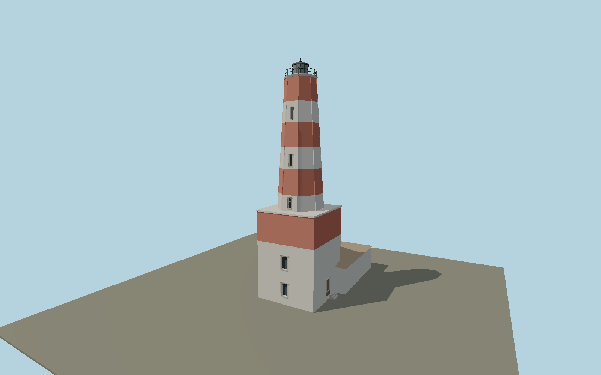

# Shabla Lighthouse — N0656

Tall red and white tapering octagon with real recessed narrow openings, crisp corner ribs and a small dark lantern. Broad square striped masonry base with stacked southern windows and attached low hipped keeper house to the north.

## Identity and evidence

Exact catalog identity **Q21014964**. Source facts: `{"heightMeters":32,"basis":"Municipality publishes32m and an exterior photograph showing the square base, six shaft bands and octagonal taper. Exact-QID OSM lighthouse node9031362149 identifies the tower19m south of the old catalog point; attached service building262498736 fixes northward extent and axis. Cross sections and storey elevations are photograph proportions."}`. The source specification keeps published dimensions separate from reconstructed details.

- https://shabla.bg/directory/shablenski-far/
- https://shabla.bg/wp-content/uploads/2024/02/shabla-lightghouse-slide-1.jpg
- https://www.openstreetmap.org/node/9031362149
- https://www.openstreetmap.org/way/262498736

Original geometry and shared procedural materials. Official photographs are research references only; no reference imagery or third-party mesh is embedded or redistributed.

## Authored geometry and materials

7,738 triangles, 14,580 vertices, 9 surface groups; 608,232 source bytes. SHA-256: `sha256:2b8bdd2cb74510a05e0b6f155e21f75812a98f5eebca917c74fab43ef35c4ab1`. Actual bounds: -4.990, 0.000, -14.480 to 5.950, 32.000, 4.390 m.

Shared canonical material graphs with metric UV repeats in extras.molenSurface; portable glTF PBR factors and vertex colors remain. Dark recesses/lantern panels retain local fallback materials. Shared references: `matgraph:molen.worldgen.material.plaster_lime` (2 × 2 m), `matgraph:molen.worldgen.material.stone_ashlar` (2.4 × 1.5 m), `matgraph:molen.worldgen.material.stone_limestone` (2.4 × 1.6 m), `matgraph:molen.worldgen.material.tile_ceramic` (2.4 × 2.4 m), `matgraph:molen.worldgen.material.metal_painted` (2 × 2 m), `matgraph:molen.worldgen.material.stone_granite` (2 × 2 m), `matgraph:molen.worldgen.material.wood_plain` (2 × 0.25 m), `matgraph:molen.worldgen.material.concrete_plain` (2 × 2 m). Model-native axes: {"up":"+Y","front":"+Z","origin":"Authored main tower center at local base level; attached ensembles are offset from this origin."}.

## Placement proposal

Exact-QID lighthouse node replaces older point19m north. Mapped attached service building262498736 extends north (-Z); its east-west wall axis sets heading. Tower footprint dimensions are primary-photo proportions, not a mapped tower polygon. Proposed anchor 28.6069834, 43.5401767 (longitude, latitude), heading -0.047379 radians. Elevation policy: **terrain-contact**. This is a reviewable proposal, not a completed site-fit certification. Ordinary ground models use terrain contact; Kiipsaare requires an offshore water/base-height check.

## Limitations and review

- The modeled exterior follows the cited published facts and inspected photographs. Unpublished dimensions and local fittings are explicitly photo-proportioned; no claim of engineering survey accuracy is made.
- Portable PBR and shared metric surfaces are provided. Surface weathering, material color under local lighting and fine facade relief require close render review before maximum-detail acceptance.
- Paint wear and individual repairs are represented by shared masonry; the official image has no precise capture date. Tower plan is photograph-scaled against32m height; neighboring detached station houses remain separate map features.

Near/far fixtures are in `spec.qaCameras`. Float32 finite geometry, triangle degeneracy and winding are checked by the generator. Rendering, shared-material alignment, maximum-fidelity and geographic reviews remain pending until their hash-bound reports exist.

Regenerate with `node packages/worldgen/scripts/generate-lighthouse-models.mjs --ids=N0656`; add `--check` for reproducibility. Editable component recipes are in `packages/worldgen/scripts/lighthouse-models.mjs`. The generator protects artist-edited master hashes and preserves import/capture/shared-capture/QA documents.
