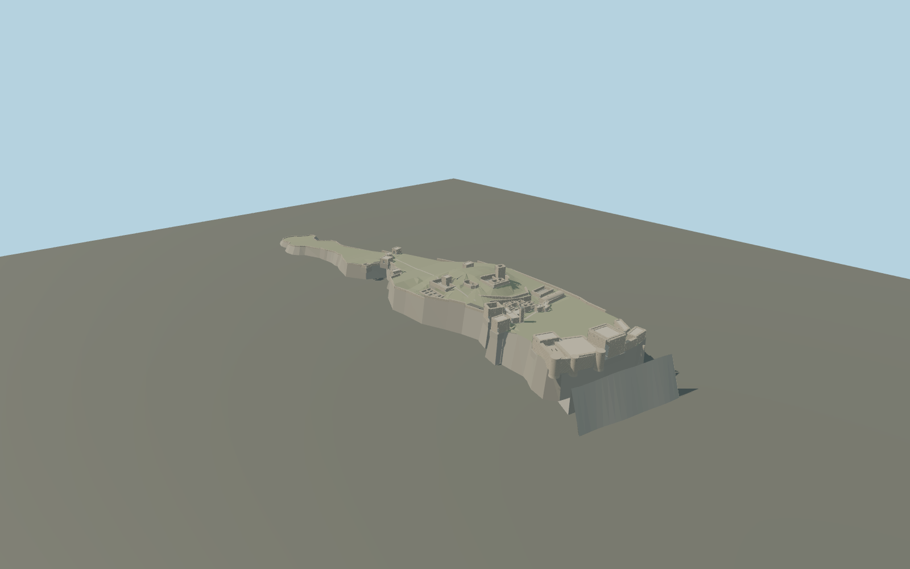

# Citadel of Salah Ed-Din

Syrian citadel exterior on its long rocky ridge: square master tower, pillared hall, round front towers, open eastern moat with isolated needle, low western town walls, raised Byzantine ruins, cisterns, Ayyubid courtyard and baths, mosque and square minaret.

## Evidence and reconstruction

Published dimensions and reconstructed details are separated in spec.json. Primary references:

- [Reference](https://www.openstreetmap.org/relation/5579293)
- [Reference](https://s3.amazonaws.com/media.archnet.org/system/publications/contents/6721/original/DPC3576.pdf?1384801256=)
- [Reference](https://whc.unesco.org/document/168916)
- [Reference](https://whc.unesco.org/document/226794)

No third-party geometry, photograph or bitmap texture is embedded. Shared surface graphs come from the central library; vertex tints carry model colors. Glazing uses PBR materials; transparent surfaces are declared per model.

## Model and axes

320,144 triangles; 649,070 vertices; 7 material groups; 27,212,528 bytes. Native bounds: -362.535, 0.000, -85.919 to 403.884, 70.299, 101.319. Source hash: `sha256:eb61f0965485bbac558b40961c24e71d0cf5b17691dbbe1d7f23a08cc50c593e`.

{"up":"+Y","longitudinal":"+X toward the eastern moat, 24.466 degrees north of east","front":"Master tower and rock-cut ditch toward +X; lower western ward toward -X","origin":"Mapped ridge anchor; model base Y=0, eastern court Y=42"}

Signed native map frame preserves known tower positions. Model terrain is relative and must be fitted to world terrain before approval.

## Reproduce

Run `node packages/worldgen/scripts/generate-signature-towers.mjs --ids=N0257` (or add `--check`). The generator preserves manually edited masters by checking their baseline hashes. Import through the standard authored-model workflow with optimization disabled; then capture all QA cameras, including shared-surface views.

## Pending work

- Maximum exterior fidelity remains pending: exact ruin profiles, recently collapsed entrance roof and propping, chamber openings and masonry scars need additional current photographic review.
- Palace and unmapped walls are approximate plan traces; inferred terrain and levels require in-world review. replaceFootprint=false.
- This exterior includes visible vault and courtyard geometry, not a complete navigable interior. No reference photographs or bitmap textures are embedded.
- Detailed master plus four independent runtime models share reusable stone, plaster, metal and gravel surfaces. Physical laptop and phone tests remain pending.

This bundle contains source geometry, not a claim of maximum-fidelity completion. Hash-bound visual acceptance is recorded separately after capture inspection.

## Additional geographic data

Map data © OpenStreetMap contributors, ODbL-1.0. Original authored geometry informed by cited conservation plans; no third-party images or meshes embedded.
