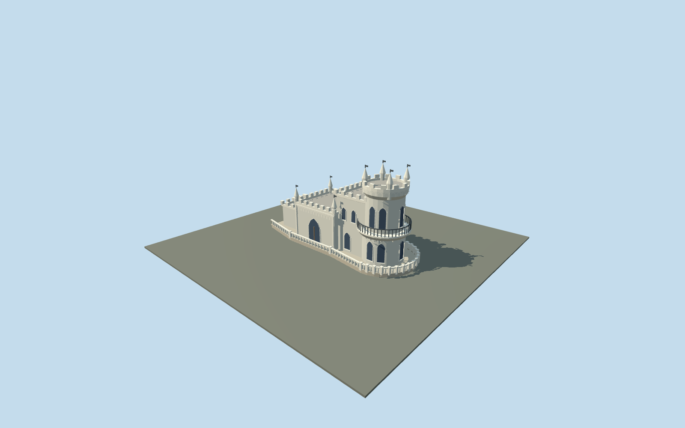

# Swallow's Nest

Small limestone seaside folly with a stepped rectangular hall, four low pinnacles, a round eastern tower with four tall crown spires, projecting balcony and wraparound terrace.

## Evidence and reconstruction

Published dimensions and reconstructed details are separated in spec.json. Primary references:

- [Reference](https://xn-----6kcbqggkggtcllvchedg5cwa0j.xn--p1ai/galereya)
- [Reference](https://www.culture.ru/institutes/13925/lastochkino-gnezdo)
- [Reference](https://www.openstreetmap.org/way/103635688)
- [Reference](https://ru.krymr.com/a/photo-lastochkino-gnezdo-rekonstruktsiya/30968661.html)

No third-party geometry, photograph or bitmap texture is embedded. Shared surface graphs come from the central library; vertex tints carry model colors. Glazing uses PBR materials; transparent surfaces are declared per model.

## Model and axes

9,123 triangles; 23,793 vertices; 5 material groups; 969,276 bytes. Native bounds: -11.570, 0.000, -4.470 to 11.920, 12.000, 5.435. Source hash: `sha256:0c7db20070ec6f948ab365fd15450270ecd96aeee3489309b305ac9b1a7a17e1`.

{"up":"+Y","longitudinal":"+X east-northeast, about19.92degrees north of east","front":"+X tower above sea; -X entrance toward approach","origin":"Mapped main-building center; architectural terrace baseY=0"}

Mapped anchor and signed19.92degree axis retained. Immediate terrace is approximate; geographic activation awaits cliff and approach review.

## Reproduce

Run `node packages/worldgen/scripts/generate-signature-towers.mjs --ids=N0271` (or add `--check`). The generator preserves manually edited masters by checking their baseline hashes. Import through the standard authored-model workflow with optimization disabled; then capture all QA cameras, including shared-surface views.

## Pending work

- An original medium-fi reconstruction, not a measured conservation survey.
- Fine tracery, iron scrollwork, pipework and interiors omitted; masonry uses shared surfaces.
- Museum photographs can be older than2020; post-restoration photographs establish main masses, not every current fixture.
- Natural cliff, remote approach and neighboring buildings omitted.
- Actual terrain seating, continuous-motion shimmer and physical-device performance pending.

This bundle follows the medium-fi standard. Medium-fi appearance and geographic fit are reviewed separately. Hash-bound visual acceptance is recorded separately after capture inspection.

## Additional geographic data

© OpenStreetMap contributors, ODbL-1.0; museum and November2020 press photographs used only as visual references.
