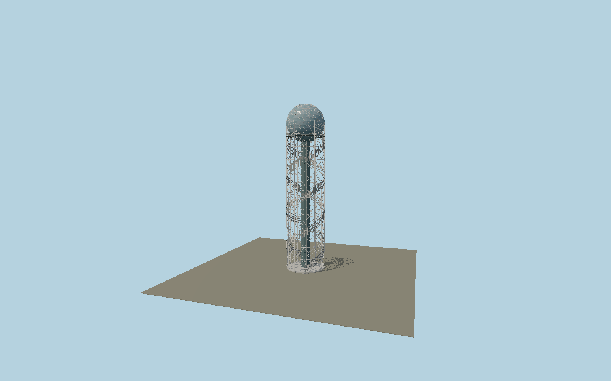

# Alphabetic Tower

Batumi’s 130 m language monument: twelve exposed steel columns and cross braces, a central glazed lift core, two open helical mesh ribbons bearing all thirty-three distinct Georgian letters, an observation balcony and a triangulated blue glass globe.

## Identity and geometry

Catalog N0582, [Q18822753](https://www.wikidata.org/wiki/Q18822753). Georgian national and regional tourism sources publish 130 m height and thirty-three letters; steel fabricator ANRO publishes a 30 m base. Their current whole-tower photograph and glazing-contractor construction/roof photographs establish the open twelve-column frame, wire ribbons and triangular glass globe. Every letter is static extruded geometry derived from licensed Noto Sans Georgian outlines; font provenance and OFL text are preserved in reference-metadata.json.

Exact mapped tower center at ground Y=0. Mapped twelve-column axis; the circular plan has no single principal facade; +Y is up. The geographic proposal identifies its anchor and orientation evidence separately from remaining terrain and azimuth uncertainty.

Source facts and measured references are recorded in spec.json. References: [1](https://georgia.travel/alphabetic-tower), [2](https://visitbatumi.com/en/monuments-951/alphabet-tower), [3](https://storage.georgia.travel/images/alphabetic-tower-gnta.webp), [4](https://anro.es/nuestros-proyectos-en-georgia/), [5](https://miarpe2008.com/torre-alphabetic-tower), [6](https://miarpe2008.com/wp-content/uploads/2018/07/alphabetic-tower-galeria2-1024x576.jpg), [7](https://miarpe2008.com/wp-content/uploads/2018/07/alphabetic-tower-galeria1-1024x576.jpg), [8](https://github.com/google/fonts/tree/main/ofl/notosansgeorgian), [9](https://www.openstreetmap.org/way/405852444). Reference pages and images are not redistributed.

## Original source and shared materials

Geometry is authored in `packages/worldgen/scripts/alphabetic-tower-model.mjs`. Shared material graphs with metric repeat UV0 and original vertex tints; GLB PBR fallback remains self-contained. No per-model texture duplication. No third-party mesh or photograph is embedded.

163,028 triangles; 415,834 vertices; 3 material groups; 16,928,728 source bytes. Source hash: `sha256:ad5c22c8700eff0dc5b379d4ce94a705a95db9be124683c19ec8394567268bf2`. Geometry validation checks finite Float32 coordinates, indices, triangle area and winding before export.

Regenerate with `node packages/worldgen/scripts/generate-heritage-towers.mjs N0582`; add `--check` for reproducibility. The generator refuses to overwrite a master whose hash differs from source.json. Import uses `--no-optimize` to preserve facade recesses.

## Remaining detail and review

- Thirty-three separate readable Georgian glyphs are represented using the openly licensed Noto Sans Georgian design. They are a typographic reconstruction, not copied fabrication CAD for the original sculptures.
- The observed open steel structure and outer globe are complete. Rotating restaurant motion, interior furniture and seasonal light shows are not part of this static exterior asset.
- Near/far visual QA, shared-material inspection and maximum-fidelity approval remain pending.

Named near/far cameras are included for lit visual review. A valid export is not maximum-fidelity certification.
