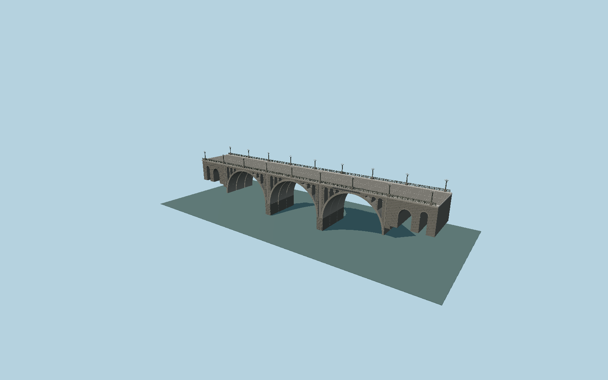

# Haghtanak (Victory) Bridge

Original detailed Victory Bridge exterior: three major basalt-faced reinforced-concrete arches, triple transverse structural units, six open spandrel windows per main span, four approach passages, individually coursed basalt faces, dressed piers, cast-iron four-petal circle lattice and perforated borders, three-globe lamps and the full mapped deck.

## Evidence

- [Primary reference](https://www.visityerevan.am/places/details/820/en/)
- [Primary reference](https://commons.wikimedia.org/wiki/File:Segerbron_20260401.jpg)
- [Primary reference](https://commons.wikimedia.org/wiki/File:Haghtanak_bridge_01.jpg)
- [Primary reference](https://commons.wikimedia.org/wiki/File:Haghtanak_bridge_04.jpg)
- [Primary reference](https://commons.wikimedia.org/wiki/File:Haghtanak_bridge,_Yerevan_18.jpg)
- [Primary reference](https://www.openstreetmap.org/way/1164537616)

Published dimensions and reconstruction assumptions are separated in spec.json. Source photos were consulted; no photos or third-party geometry are embedded. Map plan attribution: © OpenStreetMap contributors, ODbL-1.0.

## Source

3448236 triangles; 316513248 bytes; 6 material groups. SHA256: sha256:e4b38ec16d86f03e1ed10acfe4ab0638e478dda0138f8f9253607efc0b973993.

Shared surfaces (stone_basalt_raw, concrete_plain, metal_painted, stone_granite) are loaded through the central library; any transparent materials use local PBR parameters. Axis and provisional vertical datum are in spec.json.

Regenerate with node packages/worldgen/scripts/generate-researched-bridges.mjs --ids=N0014; append --check to verify. Import and capture through the standard next-1000 scripts. Geometry validation does not substitute for current-frame visual review.

## Reconstruction limits

- Arch spans, spandrel dimensions, transverse division and pier elevations are photo-scaled reconstructions, not engineering plans.
- Street furnishings and decorative cast iron follow the original 2013/2019 photographs; latest whole-bridge 2026 photograph verifies continued overall appearance. Transient adverts, vehicles and wires are omitted.
- Bank retaining ends extend below expected terrain; real gorge and bank elevations must be inspected before geographic approval.
