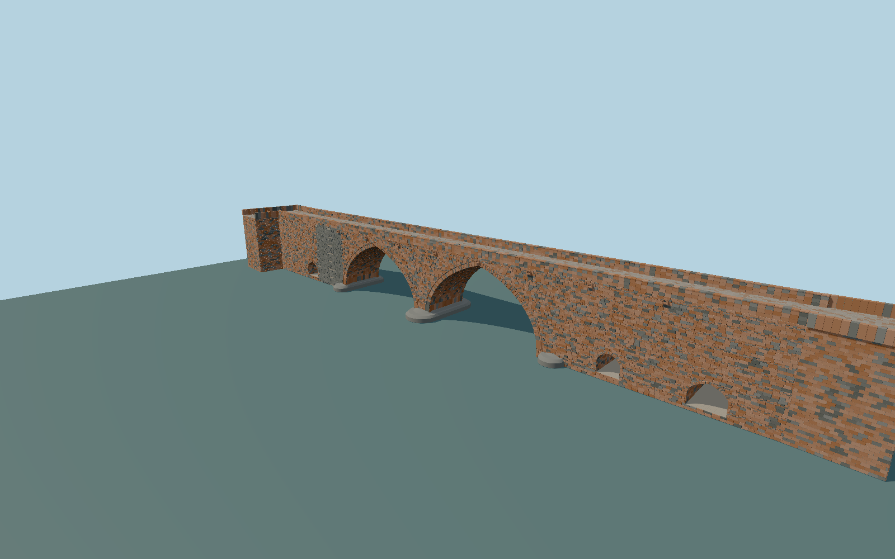

# Red Bridge, Yerevan — restored crossing

Current2025 restoration with unequal pointed central vaults, lower historic pedestrian passages, red/charcoal tuff, retained basalt abutment repairs, thin brick levelling bands, double arch mouldings, rounded stepped cutwaters, restored low parapets, cobbled deck and bent south approach.

## Evidence

- [Primary reference](https://escs.am/am/news/32750)
- [Primary reference](https://www.yerevan.am/en/news/verakangnman-ashkhatank-nerits-heto-erewani-17-rd-darowm-karhowts-vats-patmakan-karmir-kamowrje-pash/)
- [Primary reference](https://commons.wikimedia.org/wiki/File:Red_Bridge,_Yerevan,_after_reconstruction._01.jpg)
- [Primary reference](https://commons.wikimedia.org/wiki/File:Red_Bridge_in_Yerevan,_2026_april.jpg)
- [Primary reference](https://commons.wikimedia.org/wiki/File:Renovated_Red_Bridge,_Yerevan_03.jpg)
- [Primary reference](https://www.openstreetmap.org/way/1166072142)

Published dimensions and reconstruction assumptions are separated in spec.json. Source photos were consulted; no photos or third-party geometry are embedded. Map plan attribution: © OpenStreetMap contributors, ODbL-1.0.

## Source

746998 triangles; 62732056 bytes; 3 material groups. SHA256: sha256:680b961d019685af24bbf9cb69d1bb3dd49b299d4270f0a6ecc1a69f95326512.

Shared surfaces (stone_sandstone_raw, clay_fired, stone_basalt_raw) are loaded through the central library; any transparent materials use local PBR parameters. Axis and provisional vertical datum are in spec.json.

Regenerate with node packages/worldgen/scripts/generate-researched-bridges.mjs --ids=N0017; append --check to verify. Import and capture through the standard next-1000 scripts. Geometry validation does not substitute for current-frame visual review.

## Reconstruction limits

- Arch stations, minor surface details and footing elevations are interpreted from primary photographs, not engineering survey or photogrammetry.
- Historic and restored stone positions are reconstructed; shared raw mineral textures establish library consistency while geometry carries actual joints.
- Adjacent hotel, river landscaping and stairs up the distant cliff are separate scenery.
- Real terrain fitting and final placement approval remain pending.
