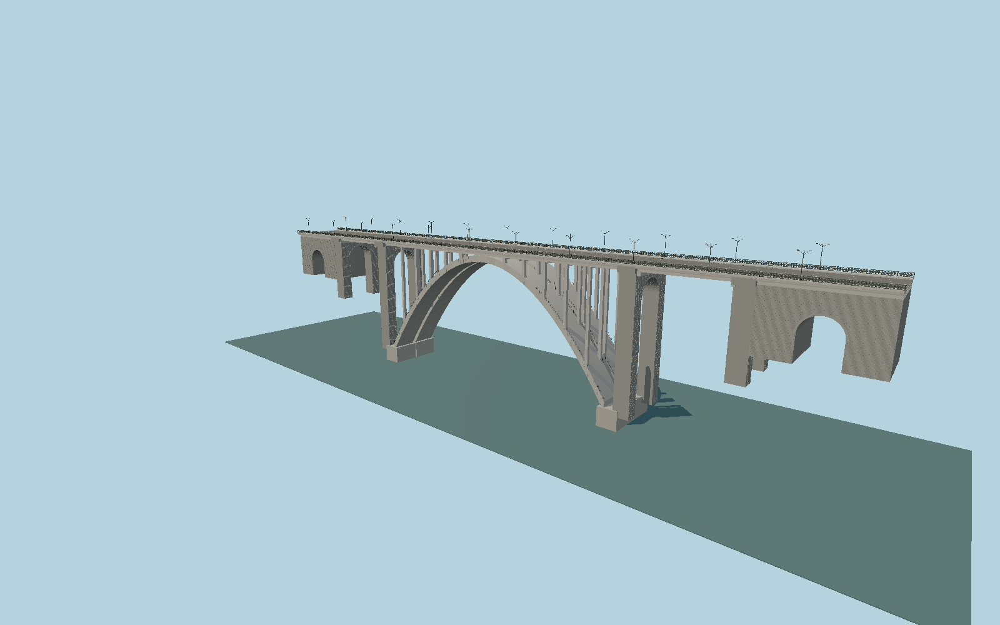

# Great Bridge of Hrazdan (Kievyan Bridge)

Paired broad concrete arch vaults, open spandrel posts, basalt-faced transverse pier portals, approach access arches, deck girders and open cast-iron rosette railings.

## Evidence

- [Primary reference](https://visityerevan.am/places/details/819/en/)
- [Primary reference](https://www.yerevan.am/en/news/kiewyan-kamowrjn-amboghjowt-yamb-norogvowm-e/)
- [Primary reference](https://www.yerevan.am/hy/news/kiewyan-kamrji-himnanorogowmn-ent-ats-k-i-mej-e/)
- [Primary reference](https://www.yerevan.am/edfiles/video/KIEVYAN%20KAMURJ%2007.07.mp4)
- [Primary reference](https://commons.wikimedia.org/wiki/File:Great_Hrazdan_Bridge,_Yerevan.jpg)
- [Primary reference](https://commons.wikimedia.org/wiki/File:Kievyan_003.jpg)
- [Primary reference](https://commons.wikimedia.org/wiki/File:Hrazdan_bridge.JPG)
- [Primary reference](https://www.openstreetmap.org/relation/15750527)

Published dimensions and reconstruction assumptions are separated in spec.json. Source photos were consulted; no photos or third-party geometry are embedded. Map plan attribution: © OpenStreetMap contributors, ODbL-1.0.

## Source

3082666 triangles; 272015896 bytes; 7 material groups. SHA256: sha256:1aa78429090f6e58cce6a7c4c8efdd33248139e18090873c2ae6b6003ee0e5f8.

Shared surfaces (concrete_plain, metal_painted, stone_basalt_raw, stone_granite, metal_stainless) are loaded through the central library; any transparent materials use local PBR parameters. Axis and provisional vertical datum are in spec.json.

Regenerate with node packages/worldgen/scripts/generate-researched-bridges.mjs --ids=N0024; append --check to verify. Import and capture through the standard next-1000 scripts. Geometry validation does not substitute for current-frame visual review.

## Reconstruction limits

- No survey drawing found for internal member dimensions. Arch profile, transverse vault widths and pier spacing require further primary drawing confirmation.
- Owner totals364m and351m disagree; exposed map outline272.304m is modeled without stretching the arch to those totals. Approach extent remains under review.
- Current2026 owner repair footage documents rail pattern and joint work, but does not establish final completed roadway or lighting changes.
- Terrain elevation and full bank contacts need actual gorge terrain review; flat capture is not geographic approval.
