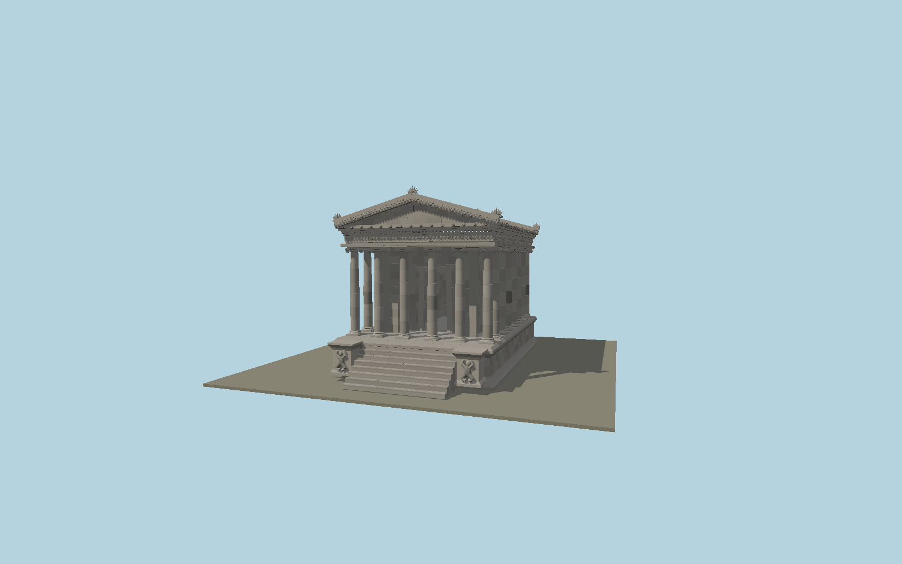

# Garni Temple

Restored basalt peripteral temple with twenty-four smooth entasis columns assembled in drums, Ionic spiral capitals, an open cella doorway and barrel vault, sculpted entablature, dentils, coffered portico soffits, paired pediments, individual stone roof tiles, palmette acroteria and nine steps flanked by kneeling relief figures.

## Identity and geometry

Catalog N0498, [Q684072](https://www.wikidata.org/wiki/Q684072). Sahinyan’s restoration measurements define the podium, order, column axes, doorway and cella. Modern photographs establish smooth drum shafts, varied restoration stones and carved decorative zones. The broad OSM outline is not used to stretch the measured temple dimensions.

Temple axis in plan, at the bottom-stair ground datum. +Z is the northern entrance and nine-step stair; signed geographic fit requires review; +Y is up. The geographic proposal identifies its anchor and orientation evidence separately from remaining terrain and azimuth uncertainty.

Source facts and measured references are recorded in spec.json. References: [1](https://arar.sci.am/dlibra/publication/39737/edition/35633?language=en), [2](https://armeniahiddengems.aua.am/monument/garni-temple/), [3](https://www.openstreetmap.org/way/108255791). Reference pages and images are not redistributed.

## Original source and shared materials

Geometry is authored in `packages/worldgen/scripts/garni-temple-model.mjs`. Shared material graphs with metric repeat UV0 and original vertex tints; GLB PBR fallback remains self-contained. No per-model texture duplication. No third-party mesh or photograph is embedded.

1,209,054 triangles; 2,357,174 vertices; 2 material groups; 99,368,824 source bytes. Source hash: `sha256:e0bcd04a75baad4b60f9b65534a23bff413f08cb0bcddc764b810d480c08e67a`. Geometry validation checks finite Float32 coordinates, indices, triangle area and winding before export.

Regenerate with `node packages/worldgen/scripts/generate-heritage-towers.mjs N0498`; add `--check` for reproducibility. The generator refuses to overwrite a master whose hash differs from source.json. Import uses `--no-optimize` to preserve facade recesses.

## Remaining detail and review

- Exterior study in progress; maximum-fidelity and real-location placement approval remain pending.
- Individual ancient reliefs differ across the monument. Current foliage, lion heads and stair figures reconstruct their motifs without reproducing the distinct surviving carvings; facial anatomy and weathering need closer references.
- Roof pitch, acroterion profiles, coffer distribution, exact restored stone pattern and staircase cheek extents need drawing and photographic comparison. There is no claim of a measured survey for these elements.
- Adjacent palace, bathhouse, church ruins and surrounding precinct are outside this individual temple model.
- Near/far visual QA, shared-material inspection and maximum-fidelity approval remain pending.

Named near/far cameras are included for lit visual review. A valid export is not maximum-fidelity certification.
