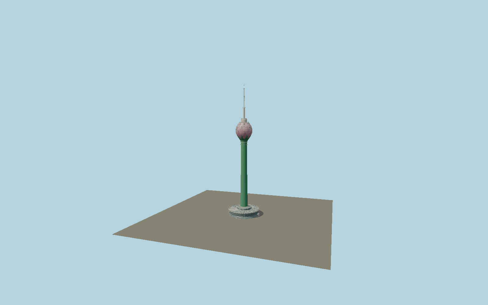

# Lotus Tower

Colombo’s green stem and thirty-two overlapping pink glazed lotus petals, individually modeled mullion grids, white lotus podium fascia, roof terrace, four entrances and antenna mast with service platforms.

## Identity and geometry

Catalog N0583, [Q3449463](https://www.wikidata.org/wiki/Q3449463). Operator floor elevations and regulator construction sections set vertical massing; exact-QID mapped podium and nearby tower parts set circular diameters. CVU distinguishes 351.5 m architectural height from 356.3 m tip; the operator’s commonly rounded 350 m is retained as a conflicting rounded description. Regulator and operator photos establish the overlapping lotus petals, two maintenance rings, white leaf fascia and mast platforms.

Exact-QID circular podium center, ground contact Y=0. +Z is the west-northwest mapped podium entrance; four entrances repeat at quarter turns; +Y is up. The geographic proposal identifies its anchor and orientation evidence separately from remaining terrain and azimuth uncertainty.

Source facts and measured references are recorded in spec.json. References: [1](https://colombolotustower.lk/), [2](https://colombolotustower.lk/tower), [3](https://www.trc.gov.lk/content/files/reports/AnnualReport2019-E.pdf), [4](https://www.trc.gov.lk/content/files/reports/AR2020_E.pdf), [5](https://kingsview.lk/img/pdf/Profile.pdf), [6](https://www.skyscrapercenter.com/building/id/13823), [7](https://www.openstreetmap.org/way/728831229), [8](https://www.openstreetmap.org/node/13680101733). Reference pages and images are not redistributed.

## Original source and shared materials

Geometry is authored in `packages/worldgen/scripts/lotus-tower-model.mjs`. Shared material graphs with metric repeat UV0 and original vertex tints; GLB PBR fallback remains self-contained. No per-model texture duplication. No third-party mesh or photograph is embedded.

339,396 triangles; 681,602 vertices; 3 material groups; 28,612,796 source bytes. Source hash: `sha256:23fbac8ac47f8f205bdcae1ba3d76601ecbff205314ae09ab7ec86398e7f0521`. Geometry validation checks finite Float32 coordinates, indices, triangle area and winding before export.

Regenerate with `node packages/worldgen/scripts/generate-heritage-towers.mjs N0583`; add `--check` for reproducibility. The generator refuses to overwrite a master whose hash differs from source.json. Import uses `--no-optimize` to preserve facade recesses.

## Remaining detail and review

- Architectural 351.5 m and highest-tip 356.3 m are distinct CVU values; the operator commonly rounds height to 350 m. The model retains explicit floor elevations from the operator rather than uniformly stretching the body.
- Petal curvature, individual glazing modules and service-rail spacing are photographic reconstructions. Nighttime programmable LED animations and changing terrace furniture are not baked into the daytime exterior.
- The surrounding lakefront promenade, parking and separate service buildings are outside the tower asset.
- Near/far visual QA, shared-material inspection and maximum-fidelity approval remain pending.

Named near/far cameras are included for lit visual review. A valid export is not maximum-fidelity certification.
