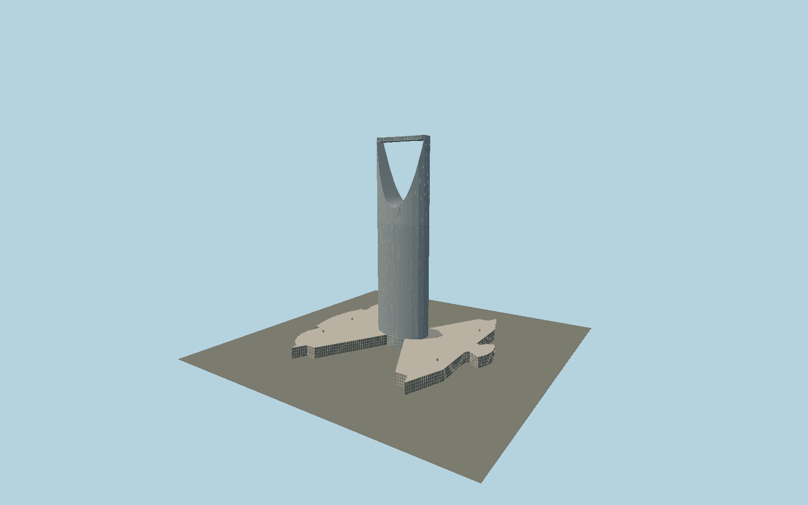

# Kingdom Centre

Riyadh’s elliptical mirrored tower with a true through-opening bounded by a curved catenary roof, glass skybridge, clipped end piers and the independently mapped spreading shopping and event podium.

## Evidence and reconstruction

Published dimensions and reconstructed details are separated in spec.json. Primary references:

- [Reference](https://www.arup.com/en-us/projects/kingdom-centre/)
- [Reference](https://omrania.com/project/kingdom-center/)
- [Reference](https://www.architectmagazine.com/project-gallery/kingdom-centre/)
- [Reference](https://www.openstreetmap.org/way/264745922)

No third-party geometry, photograph or bitmap texture is embedded. Shared surface graphs come from the central library; vertex tints carry model colors. Glazing uses PBR materials; transparent surfaces are declared per model.

## Model and axes

217,710 triangles; 514,022 vertices; 5 material groups; 21,120,500 bytes. Native bounds: -140.157, 0.000, -137.546 to 140.156, 302.389, 137.545. Source hash: `sha256:ac11062b72fdbda9b34a1cc85d3fe611eb8e011bded9c49e895b5e0488c26e5a`.

{"up":"+Y","longitudinal":"+X along the mapped building long axis","front":"+Z","origin":"Ground-level center of exact-QID mapped footprint frame"}

The geographic proposal uses exact-QID OpenStreetMap evidence. Map-derived orientation and estimated architectural details require real-site visual review; preview eligibility is distinct from geographic/fidelity approval. Map attribution: © OpenStreetMap contributors, ODbL-1.0.

## Reproduce

Run `node packages/worldgen/scripts/generate-signature-towers.mjs --ids=N0166` (or add `--check`). The generator preserves manually edited masters by checking their baseline hashes. Import through the standard authored-model workflow with optimization disabled; then capture all QA cameras, including shared-surface views.

## Pending work

- Exterior geometry uses published overall dimensions and map evidence; panel subdivision, connection dimensions and local entrance details are reconstructed. Glazing uses opaque PBR with explicit geometry; no copied facade photograph is embedded.
- Catenary parameters and curtain-wall panel schedule are reconstructed. The unobstructed void, inner curved roof and skybridge are modeled; interior uses, signs and individual rooftop equipment are excluded.

This bundle contains source geometry, not a claim of maximum-fidelity completion. Hash-bound visual acceptance is recorded separately after capture inspection.
