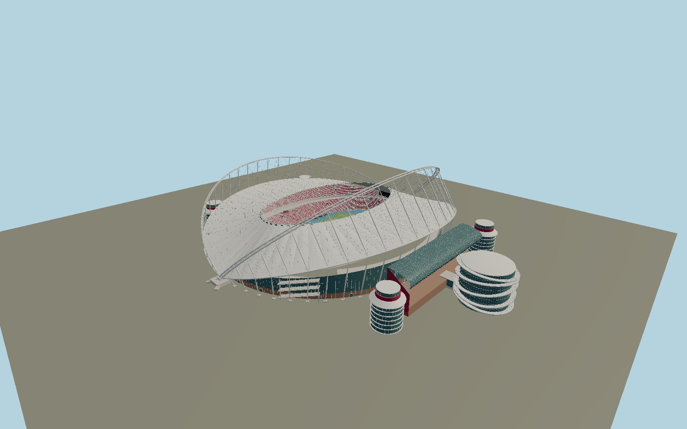

# Khalifa International Stadium — N0706

The unequal 2017 Khalifa saddle roof: paired tubular compression arches, the taller eastern bow and lower strengthened western bow, lower compression rings, radial stay/hanger network and six-cable tension ring. South transparent half-moon film, maroon/cream tiers, blue athletics oval, four ribbed circular stair turrets and the glass east museum with five tilted Olympic-inspired rings distinguish the complete ensemble.

## Identity and evidence

Exact catalog identity **Q772988**. Source facts: `{"published":"Maffeis engineers report 270m north-south chord,260m overall east-west plan,94m east and66m west arches; upper CHS1100/800 tubes spaced3.8/2.4m and a six70mm-cable tension ring. Birdair describes PTFE, south ETFE and lower-edge insulated membrane. Midmac confirms dismantling the previous lighting arch; the 2017 roof is distinct from the 2005 structure.","reconstructed":"Membrane form between measured arches, bowl inventory, pavilion heights and details, tower floor heights, museum ring tilts and local sections are reconstructed from primary architect/contractor photographs. The mapped north-south field axis and four annex/tower footprints fix the ensemble geography."}`. The source specification keeps published dimensions separate from reconstructed details.

- https://www.dar.com/work/project/expanding-the-khalifa-stadium%E2%80%99s-east-stand-
- https://www.maffeis.it/index.php/portfolio-items/khalifa-stadium/
- https://www.unicmi.it/index2.php?do_pdf=1&id=2554&option=com_content
- https://dokumen.pub/costruzioni-metalliche-2-2016nbsped.html
- https://www.arup.com/globalassets/downloads/arup-journal/the-arup-journal-2006-issue-2.pdf
- https://www.midmac.net/project/khalifa-stadium-and-museum-total-renovation/
- https://www.birdair.com/birdair-portfolio/khalifa-international-stadium/
- https://taiyo-europe.com/?taiyo-portfolio=khalifa-international-stadium
- https://yearsofculture.qa/posts/get-to-know-the-3-2-1-qatar-olympic-and-sports-museum
- https://www.openstreetmap.org/relation/8677986
- https://www.openstreetmap.org/way/770643307

Original geometry; copyrighted reference photographs and diagrams were consulted, never embedded. Maffeis 2016 primary journal paper consulted through its public indexed transcript and official publication metadata. Mapped coordinate derivatives ©OpenStreetMap contributors, ODbL1.0.

## Authored geometry and materials

1,147,020 triangles, 2,078,324 vertices, 7 surface groups; 86,509,500 source bytes. SHA-256: `sha256:d90749e29d6ddacb331804d5591ddb74f3ced7253b8e2b26e88a26fa8c5c702f`. Actual bounds: -201.200, -1.010, -145.656 to 148.000, 94.000, 145.656 m.

Shared canonical material graphs with metric UV repeats in extras.molenSurface; portable glTF PBR factors and vertex colors remain. Dark recesses/lantern panels retain local fallback materials. Shared references: `matgraph:molen.worldgen.material.membrane` (4 × 4 m), `matgraph:molen.worldgen.material.metal_painted` (2 × 2 m), `matgraph:molen.worldgen.material.concrete_plain` (2 × 2 m). Model-native axes: {"up":"+Y","front":"+Z","origin":"Exact mapped pitch centre at ground Y0; +Z north goal and +X west stand. The museum is on -X."}.

## Placement proposal

Exact field axis fixes north and the asymmetric east museum. Four circular annexes use their individual mapped positions. Native Y0 is plaza and pitch contact; canopy geometry is independently constrained by engineering dimensions rather than scaled to the OSM building outline. Proposed anchor 51.448223325, 25.26365745 (longitude, latitude), heading 3.13064450217727 radians. Elevation policy: **terrain-contact**. See qa.json for the geographic review status and scope; this placement proposal does not claim surveyed site accuracy. Native ground and pitch datums follow the individual geographic proposal; depressed bowls require their declared terrain cutout.

## Limitations and review

- Permanent detailed exterior and visible athletics bowl; private exhibits, internal rooms, sponsor artwork, event screens and exact seat inventory are excluded. Structural and skin dimensions not published in the cited papers are reconstructed from primary photographs, not claimed as fabrication measurements.

Portable review uses a flat ground contact fixture.

Near/far fixtures are in `spec.qaCameras`. Float32 finite geometry, triangle degeneracy and winding are checked by the generator. The hash-bound qa.json and capture reports record the scope and status of rendering, shared-material, exterior-fidelity and geographic reviews.

Regenerate with `node packages/worldgen/scripts/generate-stadium-models.mjs --ids=N0706`; add `--check` for reproducibility. Editable component recipes are registered by the imports and study list in `packages/worldgen/scripts/generate-stadium-models.mjs`. The generator protects artist-edited master hashes and preserves import/capture/shared-capture/QA documents.
