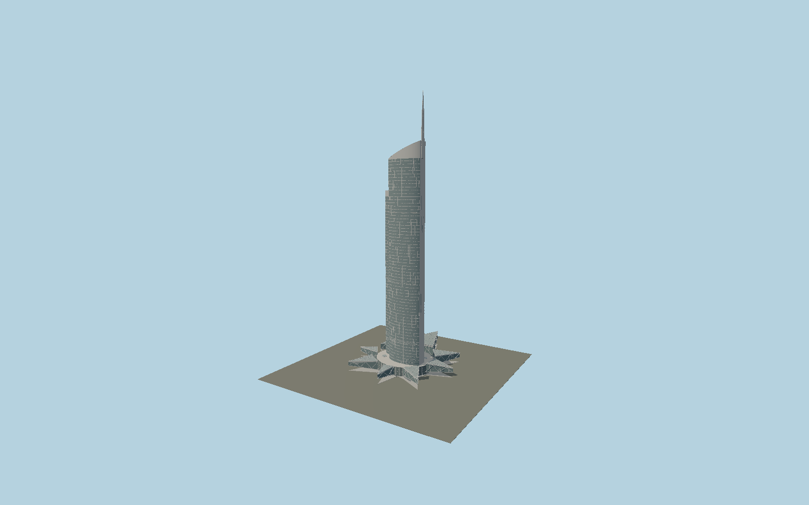

# Almas Tower

Dubai’s paired clipped-ellipse tower, with two different-height curved glazed shafts, broad silver end blades, sloping crowns, a measured81 m elliptical spire and eight individually framed projecting diamond-shaped podium wings.

## Evidence and reconstruction

Published dimensions and reconstructed details are separated in spec.json. Primary references:

- [Reference](https://www.atkinsrealisusn.com/~/media/Files/R/Renaissance/download-centre/en/technical-journals/technical-journal-06.pdf)
- [Reference](https://accgroup.com/our_projects/almas-towers-dubai/)
- [Reference](https://www.skyscrapercenter.com/building/almas-tower/298)
- [Reference](https://www.openstreetmap.org/way/1137607706)

No third-party geometry, photograph or bitmap texture is embedded. Shared surface graphs come from the central library; vertex tints carry model colors. Glazing uses PBR materials; transparent surfaces are declared per model.

## Model and axes

469,037 triangles; 1,190,619 vertices; 6 material groups; 48,494,384 bytes. Native bounds: -75.323, 0.000, -103.055 to 73.890, 360.000, 67.818. Source hash: `sha256:47b0d06a5b185563e65353dbce5a8e68a61904e98390a53b8a7f4c5798c1c105`.

{"up":"+Y","longitudinal":"+X is image-right in Atkins figures2 and9","front":"+Z is image-down in those plans","origin":"Ground-level tower center derived by a signed eight-petal primary-plan/map registration"}

The geographic proposal uses exact-QID OpenStreetMap evidence. Map-derived orientation and estimated architectural details require real-site visual review; preview eligibility is distinct from geographic/fidelity approval. Map attribution: © OpenStreetMap contributors, ODbL-1.0.

## Reproduce

Run `node packages/worldgen/scripts/generate-signature-towers.mjs --ids=N0175` (or add `--check`). The generator preserves manually edited masters by checking their baseline hashes. Import through the standard authored-model workflow with optimization disabled; then capture all QA cameras, including shared-surface views.

## Pending work

- Exterior geometry uses published overall dimensions and map evidence; panel subdivision, connection dimensions and local entrance details are reconstructed. Glazing uses opaque PBR with explicit geometry; no copied facade photograph is embedded.
- Ellipse radii, individual glazing bay widths, sloping crown planes and secondary petal elevations are reconstructed from engineer drawings and exterior photographs. The signed podium fit has2.09 m per-coordinate RMS and approximately5% drawing/map scale disagreement. Below-entry landscape terraces, basement parking and fine signage are excluded.

This bundle contains source geometry, not a claim of maximum-fidelity completion. Hash-bound visual acceptance is recorded separately after capture inspection.
