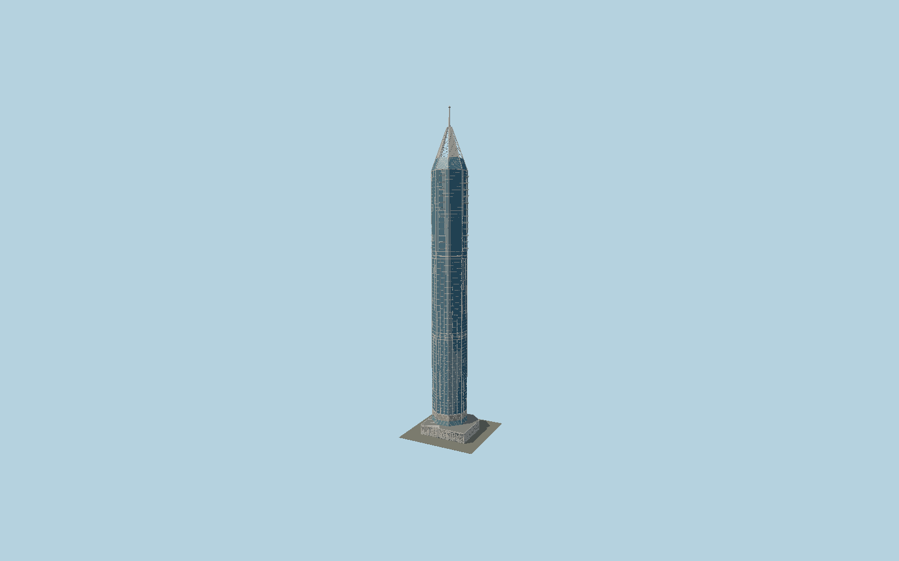

# 23 Marina

Dubai’s white-and-blue octagonal residential tower with mapped offset shaft, three facade zones,48 triangular duplex balconies with plunge basins, an open four-canopy crown, slender capped mast and decorated fan/lattice podium.

## Evidence and reconstruction

Published dimensions and reconstructed details are separated in spec.json. Primary references:

- [Reference](https://www.hafeezcontractor.com/projects/23-marina-dubai)
- [Reference](https://www.skyscrapercenter.com/building/23-marina/247)
- [Reference](https://www.openstreetmap.org/way/186351097)
- [Reference](https://www.openstreetmap.org/way/907717855)
- [Reference](https://www.openstreetmap.org/way/186351102)

No third-party geometry, photograph or bitmap texture is embedded. Shared surface graphs come from the central library; vertex tints carry model colors. Glazing uses PBR materials; transparent surfaces are declared per model.

## Model and axes

534,269 triangles; 1,564,579 vertices; 7 material groups; 62,740,084 bytes. Native bounds: -29.821, 0.000, -28.665 to 29.822, 392.400, 28.665. Source hash: `sha256:a5b611f58619c2d2a77a8784e114587f593ff699b5400466e614a51e30fa9c1b`.

{"up":"+Y","longitudinal":"+X along the mapped building long axis","front":"+Z","origin":"Ground-level center of exact-QID mapped footprint frame"}

The geographic proposal uses exact-QID OpenStreetMap evidence. Map-derived orientation and estimated architectural details require real-site visual review; preview eligibility is distinct from geographic/fidelity approval. Map attribution: © OpenStreetMap contributors, ODbL-1.0.

## Reproduce

Run `node packages/worldgen/scripts/generate-signature-towers.mjs --ids=N0182` (or add `--check`). The generator preserves manually edited masters by checking their baseline hashes. Import through the standard authored-model workflow with optimization disabled; then capture all QA cameras, including shared-surface views.

## Pending work

- Exterior geometry uses published overall dimensions and map evidence; panel subdivision, connection dimensions and local entrance details are reconstructed. Glazing uses opaque PBR with explicit geometry; no copied facade photograph is embedded.
- Intermediate belts, crown heights, balcony depth, individual pane schedule, podium rosette/fan spacing and mast collars are reconstructed from the architect’s completed exterior photographs. The tiny plunge pools are static shallow exterior basins; no pool simulation, interiors, lettering or landscape is included. Street-door position is a photograph reconstruction. The architect’s introductory380m wording is an early figure; its final factbox says393m and current CVU records392.4m.

This bundle contains source geometry, not a claim of maximum-fidelity completion. Hash-bound visual acceptance is recorded separately after capture inspection.
