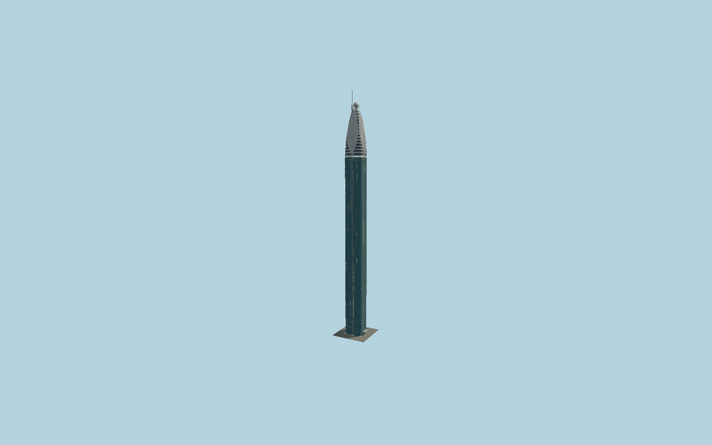

# Rose Rayhaan by Rotana

Dubai’s slender four-lobed blue-glass hotel with silver vertical recesses, physical gold eye rings and cornices, four curved silver crown petals, crossing tip ribbons, a sphere and offset northeast spire.

## Evidence and reconstruction

Published dimensions and reconstructed details are separated in spec.json. Primary references:

- [Reference](https://www.rotana.com/rayhaanhotelandresorts/unitedarabemirates/dubai/roserayhaanbyrotana)
- [Reference](https://www.manntech.com/project/the-rose-rayhaan-by-rotana/)
- [Reference](https://gxulighting.com/product/rose-rayhaan-hotel-by-rotana-2/)
- [Reference](https://www.skyscrapercenter.com/building/wd/369)
- [Reference](https://www.openstreetmap.org/way/64890199)

No third-party geometry, photograph or bitmap texture is embedded. Shared surface graphs come from the central library; vertex tints carry model colors. Glass is an opaque PBR approximation.

## Model and axes

623,688 triangles; 1,257,072 vertices; 5 material groups; 51,485,072 bytes. Native bounds: -16.850, 0.000, -12.071 to 13.363, 333.000, 13.500. Source hash: `sha256:1b6d0a3622e1207eab44b19e00c4cd819a1c538a95b4f3c430839b850373fbc3`.

{"up":"+Y","longitudinal":"+X along the mapped building long axis","front":"+Z","origin":"Ground-level center of exact-QID mapped footprint frame"}

The geographic proposal uses exact-QID OpenStreetMap evidence. Map-derived orientation and estimated architectural details require real-site visual review; preview eligibility is distinct from geographic/fidelity approval. Map attribution: © OpenStreetMap contributors, ODbL-1.0.

## Reproduce

Run `node packages/worldgen/scripts/generate-signature-towers.mjs --ids=N0184` (or add `--check`). The generator preserves manually edited masters by checking their baseline hashes. Import through the standard authored-model workflow with optimization disabled; then capture all QA cameras, including shared-surface views.

## Pending work

- Exterior geometry uses published overall dimensions and map evidence; panel subdivision, connection dimensions and local entrance details are reconstructed. Glazing uses opaque PBR with explicit geometry; no copied facade photograph is embedded.
- The map provides a rectangular envelope rather than a surveyed lobed plan. Curve radii, petal shapes, intermediate roof heights, fine glazing schedule, gold rings and entry canopy are reconstructed from operator/contractor exterior references. Moving facade access equipment, animated lighting, hotel branding and interiors are excluded. CVU counts71 floors while the operator describes72; the model follows their shared333m architectural height.

This bundle contains source geometry, not a claim of maximum-fidelity completion. Hash-bound visual acceptance is recorded separately after capture inspection.
