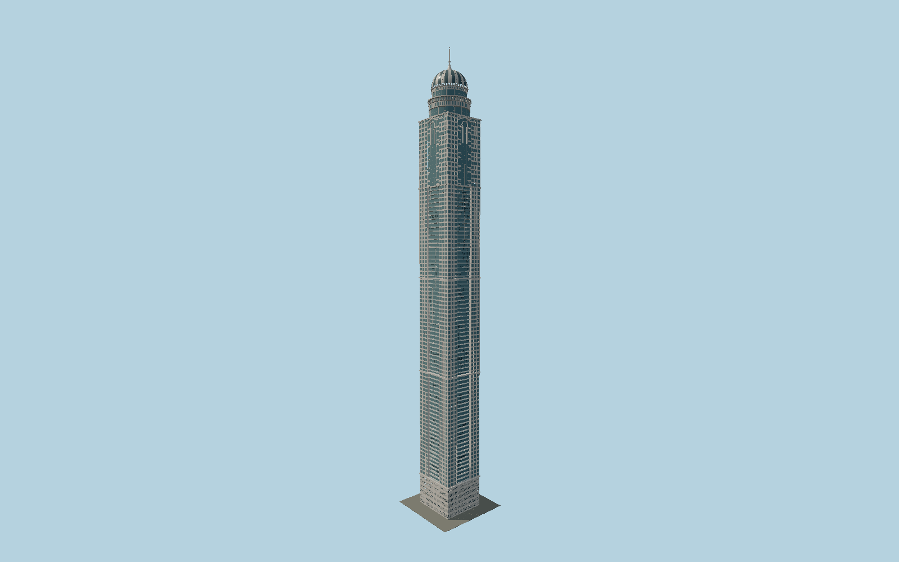

# Princess Tower

Individually modeled Dubai residential tower with inset bowed balconies, cream window piers, checkerboard upper glazing, raised keyhole-and-pediment crowns, two pointed ornamental rings and a striped dome with flared spire.

## Evidence and reconstruction

Published dimensions and reconstructed details are separated in spec.json. Primary references:

- [Reference](https://accgroup.com/our_projects/princess-tower-dubai/)
- [Reference](https://www.kone.ie/Images/factsheet-kone-princess-tower-references_tcm258-9016.pdf)
- [Reference](https://www.technosteel-uae.com/wp-content/uploads/2021/05/Structural-Steel-_PQ.pdf)
- [Reference](https://technosteelconstruction-uae.com/princess-tower)
- [Reference](https://www.skyscrapercenter.com/building/id/206)
- [Reference](https://old.skyscraper.org/EXHIBITIONS/TEN_TOPS/date.php)
- [Reference](https://www.openstreetmap.org/way/186351092)

No third-party geometry, photograph or bitmap texture is embedded. Shared surface graphs come from the central library; vertex tints carry model colors. Glazing uses PBR materials; transparent surfaces are declared per model.

## Model and axes

737,002 triangles; 1,599,202 vertices; 5 material groups; 66,418,492 bytes. Native bounds: -20.811, 0.000, -19.682 to 20.811, 414.000, 19.682. Source hash: `sha256:23683c8a62b40830fa971cbb8a8f943329ff420e53f137c97fc2c2d5a1d91f1a`.

{"up":"+Y","longAxis":"+X northeast","shortAxis":"+Z southeast"}

The geographic proposal uses exact-QID OpenStreetMap evidence. Map-derived orientation and estimated architectural details require real-site visual review; preview eligibility is distinct from geographic/fidelity approval. Map attribution: © OpenStreetMap contributors, ODbL-1.0.

## Reproduce

Run `node packages/worldgen/scripts/generate-signature-towers.mjs --ids=N0196` (or add `--check`). The generator preserves manually edited masters by checking their baseline hashes. Import through the standard authored-model workflow with optimization disabled; then capture all QA cameras, including shared-surface views.

## Pending work

- Exterior geometry uses published overall dimensions and map evidence; panel subdivision, connection dimensions and local entrance details are reconstructed. Glazing uses opaque PBR with explicit geometry; no copied facade photograph is embedded.
- Intermediate floor/course datums, balcony bow and guard dimensions, panel/window cadence, upper keyhole relief, pointed crown petal count and section, dome gore spacing and small entry hardware are reconstructed from KONE completed/construction photographs and the crown fabricator records. The final dome is closed; temporary construction gaps and hoists are excluded. Small entrance facade phase remains approximate; surrounding streets, neighboring buildings, interior fit-out and changing signage are excluded.

This bundle contains source geometry, not a claim of maximum-fidelity completion. Hash-bound visual acceptance is recorded separately after capture inspection.
