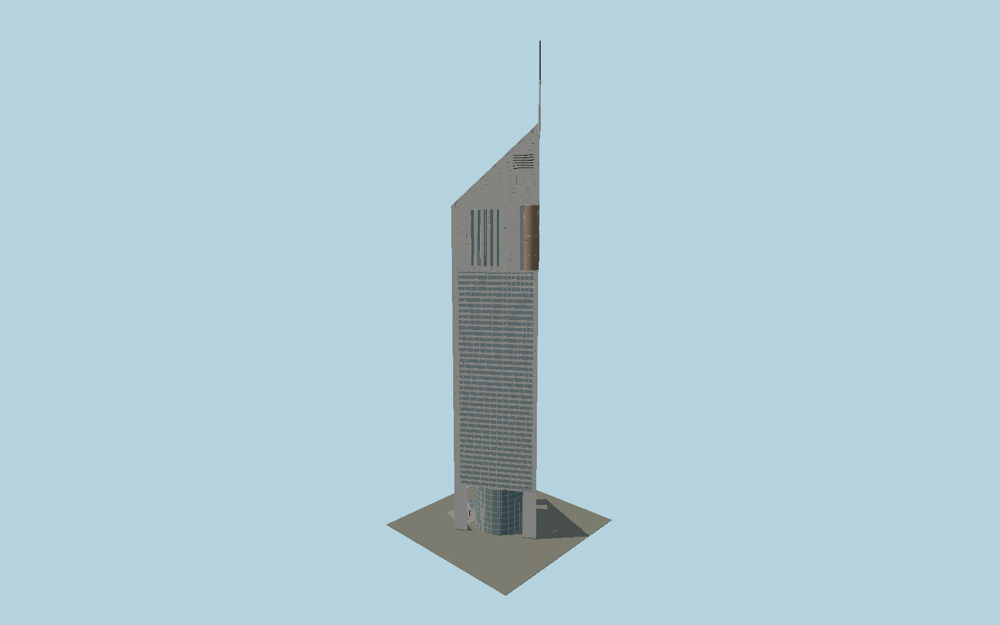

# Jumeirah Emirates Towers Hotel

A separately registered triangular Emirates tower with three open base piers, eight-storey glass drum, bowed outer curtain wall, horizontal ribbon facades, copper-glass beacon, slit-window upper floors and sloping glazed roof with a rectangular pinnacle.

## Evidence and reconstruction

Published dimensions and reconstructed details are separated in spec.json. Primary references:

- [Reference](https://norrgroup.com/jumeirah-emirates-towers-office/)
- [Reference](https://www.multiplex.global/projects/emirates-towers/)
- [Reference](https://www.turnerconstruction.com/projects/emirates-towers)
- [Reference](https://modularsa.com/wp-content/uploads/2021/01/The_Architecture_of_the_United_Arab_Emirates.pdf)
- [Reference](https://www.investindubai.gov.ae/fr/dubai-for-events/venues/-/media/venues/files/jumeirah-emirates-towers/floorplan.pdf)
- [Reference](https://www.jumeirah.com/en/stay/dubai/jumeirah-emirates-towers)
- [Reference](https://www.servcorp.ae/en/serviced-offices/locations/dubai/emirates-tower/)

No third-party geometry, photograph or bitmap texture is embedded. Shared surface graphs come from the central library; vertex tints carry model colors. Glazing uses PBR materials; transparent surfaces are declared per model.

## Model and axes

340,488 triangles; 761,392 vertices; 5 material groups; 31,499,296 bytes. Native bounds: -37.021, 0.000, -28.073 to 32.353, 309.000, 28.073. Source hash: `sha256:182f446b6f0fa9156c6175e28b310deba04c81a5327ff6271dde5fd73460f6d3`.

{"up":"+Y","front":"+X toward inward apex and mast","outerLobby":"-X opposite the mast"}

The geographic proposal uses exact-QID OpenStreetMap evidence. Map-derived orientation and estimated architectural details require real-site visual review; preview eligibility is distinct from geographic/fidelity approval. Map attribution: © OpenStreetMap contributors, ODbL-1.0.

## Reproduce

Run `node packages/worldgen/scripts/generate-signature-towers.mjs --ids=N0199` (or add `--check`). The generator preserves manually edited masters by checking their baseline hashes. Import through the standard authored-model workflow with optimization disabled; then capture all QA cameras, including shared-surface views.

## Pending work

- Exterior geometry uses published overall dimensions and map evidence; panel subdivision, connection dimensions and local entrance details are reconstructed. Glazing uses opaque PBR with explicit geometry; no copied facade photograph is embedded.
- Roof-stage and upper mechanical datums, fine curtain-wall pitch, facade panel joints, cylindrical bow, mast section and small entry hardware are reconstructed from primary sections and completed photographs. Contractor and architect sources round heights differently; selected overall heights are355m office and309m hotel. Interior fit-out, full common retail/parking complex, changing signs and neighboring Museum of the Future are excluded.

This bundle contains source geometry, not a claim of maximum-fidelity completion. Hash-bound visual acceptance is recorded separately after capture inspection.
