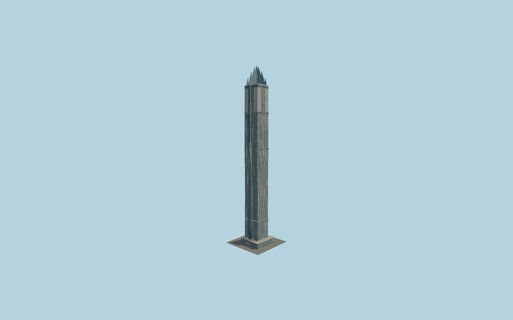

# Marina 101

Detailed425m Marina101 with two-tone aluminum piers and recessed glazing, three flared light-dish bands, sea-side paired panoramic lift, pale upper wings, four separate stepped blue pinnacles and granite street podium.

## Evidence and reconstruction

Published dimensions and reconstructed details are separated in spec.json. Primary references:

- [Reference](https://www.neb.ae/project/marina-101/)
- [Reference](https://sheffieldholdings.com/web/images/pages_uploaded_image/51481_Marina-101-Brochure.pdf)
- [Reference](https://cdnc.heyzine.com/files/uploaded/v2/d6e20aacb4cba4734ed48ff6ac644422f417d324.pdf)
- [Reference](https://www.tavconstruction.com/eng/TAV-Construction-Brochure-October2025.pdf)
- [Reference](https://www.skyscrapercenter.com/dubai/marina-101/207)
- [Reference](https://www.flickr.com/photos/npobre/49981386642/)
- [Reference](https://www.openstreetmap.org/way/195527261)
- [Reference](https://www.openstreetmap.org/way/1074877791)

No third-party geometry, photograph or bitmap texture is embedded. Shared surface graphs come from the central library; vertex tints carry model colors. Glazing uses PBR materials; transparent surfaces are declared per model.

## Model and axes

286,882 triangles; 769,522 vertices; 4 material groups; 31,148,084 bytes. Native bounds: -32.754, 0.000, -32.000 to 24.866, 425.019, 33.949. Source hash: `sha256:434af75e3651516837a961ba6e4ee620aaf01d57400a434ec2558f948995606c`.

{"up":"+Y","longAxis":"+X northeast toward Dubai","shortAxis":"+Z southeast toward Sheikh Zayed Road; -Z sea"}

The geographic proposal uses exact-QID OpenStreetMap evidence. Map-derived orientation and estimated architectural details require real-site visual review; preview eligibility is distinct from geographic/fidelity approval. Map attribution: © OpenStreetMap contributors, ODbL-1.0.

## Reproduce

Run `node packages/worldgen/scripts/generate-signature-towers.mjs --ids=N0200` (or add `--check`). The generator preserves manually edited masters by checking their baseline hashes. Import through the standard authored-model workflow with optimization disabled; then capture all QA cameras, including shared-surface views.

## Pending work

- Exterior geometry uses published overall dimensions and map evidence; panel subdivision, connection dimensions and local entrance details are reconstructed. Glazing uses opaque PBR with explicit geometry; no copied facade photograph is embedded.
- Crown shoulder contours, facade-course elevations, light-dish profiles, typical window modules, entry portal and service bracing are reconstructed from primary drawings and completed exterior photos. Architectural completion is represented without asserting hotel opening or occupancy. Temporary maintenance defects, leasing banners, buried basement structure, neighboring towers and interiors are excluded.

This bundle contains source geometry, not a claim of maximum-fidelity completion. Hash-bound visual acceptance is recorded separately after capture inspection.
