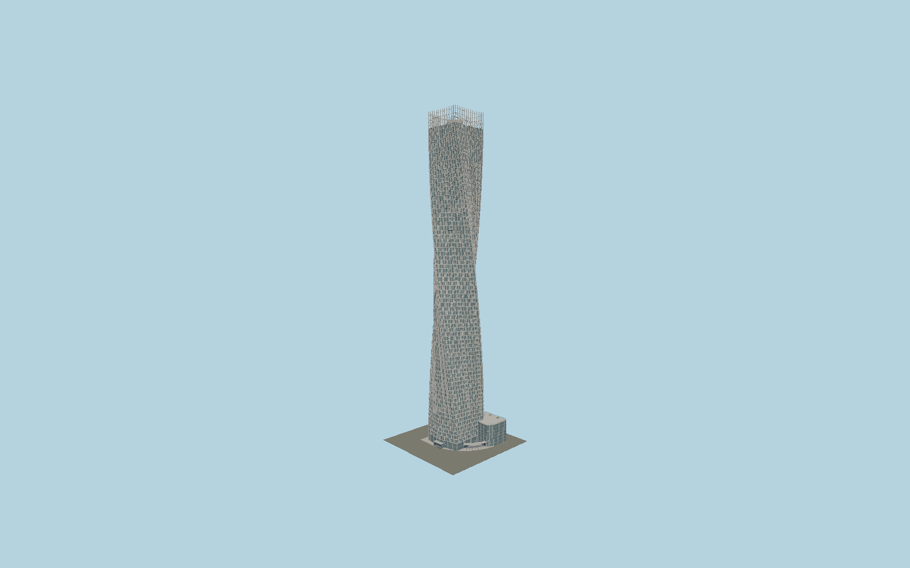

# Cayan Tower

SOM helical residential tower with a shallow chevron floorplate,90-degree clockwise twist,73 nominal residential levels and two upper mechanical courses, deeply recessed balconies,30–60% open round-metal shading screens, open steel crown, glazed six-level podium and rooftop pools.

## Evidence and reconstruction

Published dimensions and reconstructed details are separated in spec.json. Primary references:

- [Reference](https://www.som.com/projects/cayan-tower/)
- [Reference](https://www.som.com/news/soms-cayan-tower-opens/)
- [Reference](https://www.cayan.net/projects/cayantower/)
- [Reference](https://www.cayan.net/live/wp-content/uploads/2022/03/cayantower-floor-plans.pdf)
- [Reference](https://www.cayan.net/live/wp-content/uploads/2022/03/cayantower-brochure.pdf)
- [Reference](https://www.architectmagazine.com/design/buildings/cayan-tower-designed-by-skidmore-owings-merrill_o/)
- [Reference](https://www.usmodernist.org/AJ/A-2013-11.pdf)
- [Reference](https://www.skyscrapercenter.com/building/cayan-tower/464)
- [Reference](https://www.openstreetmap.org/way/195527255)

No third-party geometry, photograph or bitmap texture is embedded. Shared surface graphs come from the central library; vertex tints carry model colors. Glazing uses PBR materials; transparent surfaces are declared per model.

## Model and axes

489,408 triangles; 1,132,078 vertices; 7 material groups; 46,634,692 bytes. Native bounds: -24.288, 0.000, -25.873 to 34.025, 306.400, 35.025. Source hash: `sha256:560d5f251e599f9c90b5c8a5e86f8e117e9fec2fd8cf4997ae7e4620270747f8`.

{"up":"+Y","longAxis":"+X northeast toward attached parking podium","shortAxis":"+Z southeast; clockwise shaft twist viewed from above"}

The geographic proposal uses exact-QID OpenStreetMap evidence. Map-derived orientation and estimated architectural details require real-site visual review; preview eligibility is distinct from geographic/fidelity approval. Map attribution: © OpenStreetMap contributors, ODbL-1.0.

## Reproduce

Run `node packages/worldgen/scripts/generate-signature-towers.mjs --ids=N0202` (or add `--check`). The generator preserves manually edited masters by checking their baseline hashes. Import through the standard authored-model workflow with optimization disabled; then capture all QA cameras, including shared-surface views.

## Pending work

- Exterior geometry uses published overall dimensions and map evidence; panel subdivision, connection dimensions and local entrance details are reconstructed. Glazing uses opaque PBR with explicit geometry; no copied facade photograph is embedded.
- Intermediate floor elevations and bay schedules, chevron kink depth, crown equipment, ground door offsets and landscaped podium pool dimensions are exterior reconstruction. Source73/75-storey counts differ and are retained. Round9mm holes/12mm pitch are a reusable44% open pattern within the architect30–60% range, not a measured screen fabrication schedule. Neighboring towers, bridge, promenades beyond the own-site arcade and interiors are excluded.

This bundle contains source geometry, not a claim of maximum-fidelity completion. Hash-bound visual acceptance is recorded separately after capture inspection.
