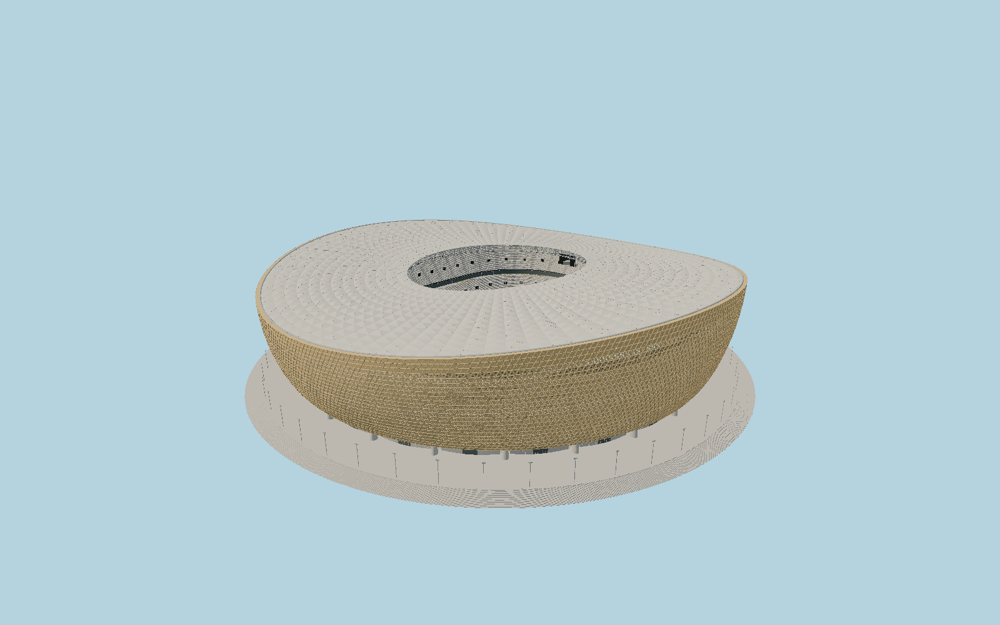

# Lusail Stadium — N0691

A burnished golden saddle-rimmed vessel with genuinely pierced, folded triangular metal fields,24 plinths and48 curved V-frame legs. Its white diamond membrane spans a double-layer cable net and two oculus tension rings. Sand-colored three-tier seating, hospitality bands, screens, roof lights, louvered GFRC base and a stepped circular podium retain the current completed exterior.

## Identity and evidence

Exact catalog identity **Q1186333**. Source facts: `{"published":"Foster and ALUTEC give the307m roof diameter. ALUTEC records about4200 triangular cladding assemblies; their smaller perforated fields are individually modeled. The ASCE project team describes24 plinths,48 V-frame pieces, the independent vessel and two inner tension rings. BRIGC’s project case reports a312m outer envelope and74m/58m high/low rim.","reconstructed":"Three-tier profiles, field-to-podium level, member sections and panel subdivision are reconstructed from AFL and fabricator photographs and the FHECOR section. The2016 tender section supplies topology only; completed photographs control the visible finish. OSM’s276m stadium trace is a ground/body reference, not a roof dimension, and is not used to shrink the published307m roof."}`. The source specification keeps published dimensions separate from reconstructed details.

- https://www.afl-architects.com/projects/lusail-stadium
- https://www.alutec.com/projects/lusail-stadium
- https://www.fosterandpartners.com/projects/lusail-stadium
- https://www.fhecor.com/multimedia/proyectos/file/000000005000/Estadio%20Lusail%20(Doha)_5712.pdf
- https://www.asce.org/publications-and-news/civil-engineering-source/civil-engineering-magazine/issues/magazine-issue/article/2023/11/world-cup-qatar-stadiums-inspired-by-middle-east-aesthetic
- https://en.brigc.net/Reports/research_subject/202011/P020201129780236943177.pdf
- https://www.openstreetmap.org/way/1006062424
- https://www.openstreetmap.org/way/684020896

Original authored geometry and shared procedural surfaces. Reference photographs, renderings and engineering illustrations are evidence only; no source pixels or third-party model are embedded. Geographic coordinates derive from OpenStreetMap contributors, ODbL1.0.

## Authored geometry and materials

500,330 triangles, 996,796 vertices, 6 surface groups; 41,892,176 source bytes. SHA-256: `sha256:ceb3700679b394a86aab99489e29ef46e58d2afa2ce052dde9dd87df599aab04`. Actual bounds: -170.400, -1.800, -170.400 to 170.400, 74.450, 170.400 m.

Shared canonical material graphs with metric UV repeats in extras.molenSurface; portable glTF PBR factors and vertex colors remain. Dark recesses/lantern panels retain local fallback materials. Shared references: `matgraph:molen.worldgen.material.membrane` (4 × 4 m), `matgraph:molen.worldgen.material.metal_painted` (2 × 2 m), `matgraph:molen.worldgen.material.concrete_plain` (2 × 2 m). Model-native axes: {"up":"+Y","front":"+Z","origin":"Mapped playing-field center, +Z north-northwest. Y0 is the surrounding plaza at the lowest outer step; the public entrance podium is +2.2m and the visible football field is recessed beneath it."}.

## Placement proposal

The mapped pitch-surround rectangle directs +Z north-northwest; its132x99m map extent is not interpreted as the105x68m playing field. The saddle high points are along the east/west sides. The roof intentionally overhangs the smaller cached stadium trace; authoritative architect dimensions govern its diameter. Proposed anchor 51.490348974999996, 25.420796 (longitude, latitude), heading -2.942382267989901 radians. Elevation policy: **terrain-contact**. See qa.json for the geographic review status and scope; this placement proposal does not claim surveyed site accuracy. Native ground and pitch datums follow the individual geographic proposal; depressed bowls require their declared terrain cutout.

## Limitations and review

- Detailed completed exterior and visible bowl in Molen’s shared material style. Exact chair inventory, facade assembly subdivisions, concourse levels and roof cable pre-camber remain photographic reconstructions. The surrounding urban precinct and temporary event structures are excluded. The model depicts the full football configuration shown in completed reference photographs.

Portable review uses a flat ground contact fixture.

Near/far fixtures are in `spec.qaCameras`. Float32 finite geometry, triangle degeneracy and winding are checked by the generator. The hash-bound qa.json and capture reports record the scope and status of rendering, shared-material, exterior-fidelity and geographic reviews.

Regenerate with `node packages/worldgen/scripts/generate-stadium-models.mjs --ids=N0691`; add `--check` for reproducibility. Editable component recipes are registered by the imports and study list in `packages/worldgen/scripts/generate-stadium-models.mjs`. The generator protects artist-edited master hashes and preserves import/capture/shared-capture/QA documents.
