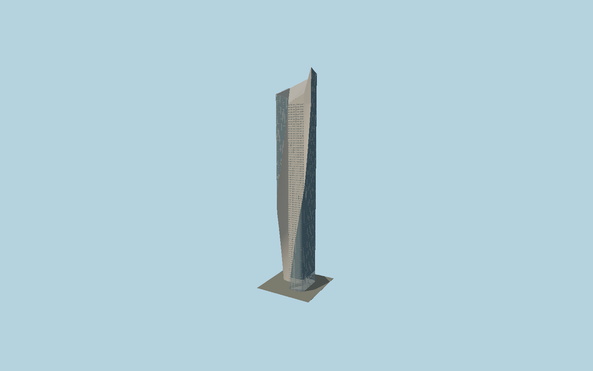

# Al Hamra Tower

Kuwait’s sculpted tower with a fixed rounded glass envelope, southwest-to-southeast moving courtyard cut, two continuous limestone flares, deep angled south-wall windows, sloping east blade and24m lamella-framed north entrance.

## Evidence and reconstruction

Published dimensions and reconstructed details are separated in spec.json. Primary references:

- [Reference](https://www.som.com/projects/al-hamra-tower/)
- [Reference](https://efficiencylab.org/media/EL-Portfolio-1.pdf)
- [Reference](https://usmodernist.org/AR/AR-2012-05.pdf)
- [Reference](https://www.skyscrapercenter.com/building/building/208)
- [Reference](https://www.openstreetmap.org/way/188381326)

No third-party geometry, photograph or bitmap texture is embedded. Shared surface graphs come from the central library; vertex tints carry model colors. Glass is an opaque PBR approximation.

## Model and axes

162,957 triangles; 474,457 vertices; 7 material groups; 18,565,488 bytes. Native bounds: -30.082, 0.000, -41.012 to 30.106, 412.592, 29.380. Source hash: `sha256:97298fa2a37c687b1be534ad674957790aa8c1a2c1244fdda65cc7cef99c9398`.

{"up":"+Y","longitudinal":"+X along the mapped building long axis","front":"+Z","origin":"Ground-level center of exact-QID mapped footprint frame"}

The geographic proposal uses exact-QID OpenStreetMap evidence. Map-derived orientation and estimated architectural details require real-site visual review; preview eligibility is distinct from geographic/fidelity approval. Map attribution: © OpenStreetMap contributors, ODbL-1.0.

## Reproduce

Run `node packages/worldgen/scripts/generate-signature-towers.mjs --ids=N0180` (or add `--check`). The generator preserves manually edited masters by checking their baseline hashes. Import through the standard authored-model workflow with optimization disabled; then capture all QA cameras, including shared-surface views.

## Pending work

- Exterior geometry uses published overall dimensions and map evidence; panel subdivision, connection dimensions and local entrance details are reconstructed. Glazing uses opaque PBR with explicit geometry; no copied facade photograph is embedded.
- The coarse mapped rectangle is an envelope, not a curved occupied floor plate. Fillet radii, intermediate cut curves, roof slope, individual stone/glass panel schedule and canopy dimensions are reconstructed from primary plans and completed photographs. Fine trencadis mosaic tesserae use the shared limestone surface at physical scale; tenant lettering, interiors and the separate retail/parking complex are excluded. The architect counts74 floors while CTBUH counts80; exterior height follows their shared412.6m figure.

This bundle contains source geometry, not a claim of maximum-fidelity completion. Hash-bound visual acceptance is recorded separately after capture inspection.
