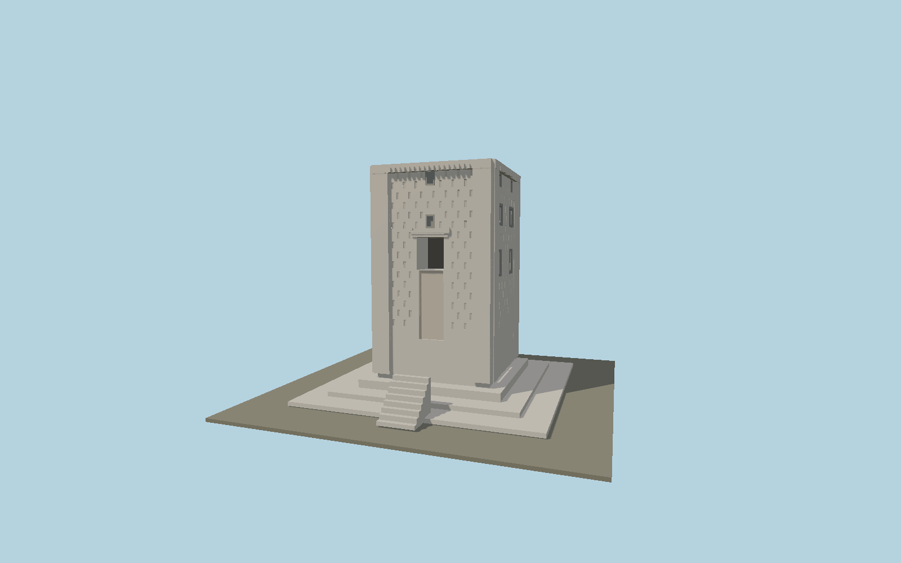

# Ka'ba-ye Zartosht

Surviving limestone tower at Naqsh-e Rustam with engaged corners, shallow staggered recesses, dark false windows, 17-dentil cornices, broken access flight and low pyramidal stone roof.

## Identity and geometry

Catalog N0575, [Q2363092](https://www.wikidata.org/wiki/Q2363092). Schmidt / Oriental Institute field measurements and elevations, Persepolis III (1970), figures 5-15 and pp. 35-37. Surviving eight-step remnant is retained; the hypothetical complete thirty-step stair is excluded.

Tower center at original ground level; base pavement included. +Z points toward the entrance / geographic north-northwest; +Y is up. The geographic proposal identifies its anchor and orientation evidence separately from remaining terrain and azimuth uncertainty.

Source facts and measured references are recorded in spec.json. References: [1](https://isac.uchicago.edu/publications/persepolis-iii-royal-tombs-and-other-monuments), [2](https://isac-assets.s3.amazonaws.com/isac-publications/oip70.pdf), [3](https://www.iranicaonline.org/articles/kaba-ye-zardost/), [4](https://www.openstreetmap.org/way/235636110). Reference pages and images are not redistributed.

## Original source and shared materials

Geometry is authored in `packages/worldgen/scripts/heritage-tower-models.mjs`. Shared material graphs with metric repeat UV0 and original vertex tints; GLB PBR fallback remains self-contained. No per-model texture duplication. No third-party mesh or photograph is embedded.

14,038 triangles; 28,080 vertices; 2 material groups; 1,181,340 source bytes. Source hash: `sha256:0dc595aa6418cd360bb4b765571cf6cad273223eadd8ee5e51996b1d225c3545`. Geometry validation checks finite Float32 coordinates, indices, triangle area and winding before export.

Regenerate with `node packages/worldgen/scripts/generate-heritage-towers.mjs N0575`; add `--check` for reproducibility. The generator refuses to overwrite a master whose hash differs from source.json. Import uses `--no-optimize` to preserve facade recesses.

## Remaining detail and review

- Individual cracks, scattered original blocks, engraved inscriptions, cramp holes and displaced northern roof slab are not reproduced.
- Shallow recess layout follows measured spacings but omits local masonry damage; false-window elevations are fitted from measured facade drawings.
- The excavated perimeter, modern railings and terrain cut are excluded. Lower-flight chips and irregular settled pavement remain simplified.
- Near/far visual QA, shared-material inspection and maximum-fidelity approval remain pending.

Named near/far cameras are included for lit visual review. A valid export is not maximum-fidelity certification.
