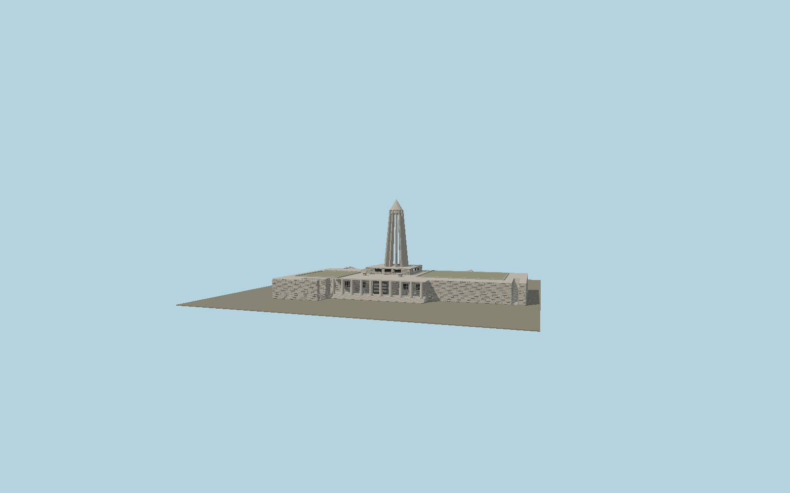

# Avicenna Mausoleum

Open twelve-rib tapered concrete memorial tower and cone above its granite plinth, ten-column eastern portico, asymmetrical stone museum platform, external stairs and paired rear ramps, roof gardens, clerestory apertures and rooftop memorial marker.

## Identity and geometry

Catalog N0601, [Q5952145](https://www.wikidata.org/wiki/Q5952145). Official Persian VisitIran provides the 23 m tower above roof, 2.05 m cone radius, 3.4 m cone height and 4.10 m ten-column entrance. The architect’s 28.5 m composition fixes the overall height. Heritage plan Figure 57 and current official/archive photographs establish the rounded inner faces of twelve tapering ribs. Mapped museum footprint establishes the extended asymmetric base; its 30/33 m tower tags conflict with primary dimensions and are discarded. Stone courses, ramp grades and fine openings are proportional exterior reconstructions.

Exact mapped raised central platform center; Y=0 exterior ground. Native +Z east toward the ten-column entrance; +X approximately north; +Y is up. The geographic proposal identifies its anchor and orientation evidence separately from remaining terrain and azimuth uncertainty.

Source facts and measured references are recorded in spec.json. References: [1](https://visitiran.ir/fa/attraction/آرامگاه-ابوعلی-سینا), [2](https://visitiran.ir/attraction/avicenna-museum-ibn-sina-museum), [3](https://whc.unesco.org/uploads/nominations/1398.pdf), [4](https://www.memar.io/fr/magazine/articles/avicenna-mausoleum-hamedan-129), [5](https://artebox.org/seyhoun-03/), [6](https://etoood.com/NewsShow.aspx?nw=3252), [7](https://www.openstreetmap.org/way/698835434), [8](https://www.openstreetmap.org/way/698835433). Reference pages and images are not redistributed.

## Original source and shared materials

Geometry is authored in `packages/worldgen/scripts/avicenna-mausoleum-model.mjs`. Shared material graphs with metric repeat UV0 and original vertex tints; GLB PBR fallback remains self-contained. No per-model texture duplication. No third-party mesh or photograph is embedded.

36,740 triangles; 72,062 vertices; 5 material groups; 2,966,192 source bytes. Source hash: `sha256:f40a901ae3a57a17d17d12c7b8c5a6462d32f206d0f8dfd437d52b8c42103a71`. Geometry validation checks finite Float32 coordinates, indices, triangle area and winding before export.

Regenerate with `node packages/worldgen/scripts/generate-heritage-towers.mjs N0601`; add `--check` for reproducibility. The generator refuses to overwrite a master whose hash differs from source.json. Import uses `--no-optimize` to preserve facade recesses.

## Remaining detail and review

- The broad exterior, rib count, cone and portico dimensions are published; stair and ramp grades, roof planting limits, small lightwell widths and individual granite stones are proportioned reconstructions.
- The architectural 28.5 m dimension fixes the tower composition; the broader connected museum platform follows the current mapped outline. Its full extent is inferred from the museum mapping rather than forced into a 28.5 m square.
- No interior museum displays, library contents, grave chamber, exact inscription glyphs or temporary site furniture are represented.
- Near/far visual QA, shared-material inspection and maximum-fidelity approval remain pending.

Named near/far cameras are included for lit visual review. A valid export is not maximum-fidelity certification.
