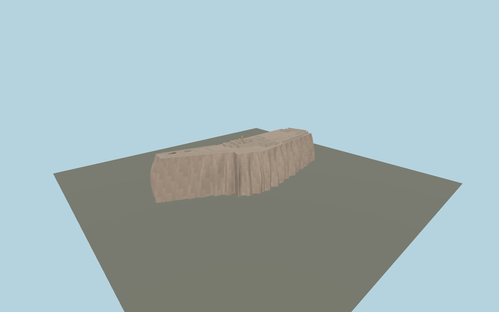

# Alamut Castle

Roofless Alamut upper-castle ruins on a narrow fluted rock ridge, with ten mapped ruin groups, northwest cells, open rock-cut reservoirs, brick arch remnants, broken stone walls and eastern approach stairs.

## Evidence and reconstruction

Published dimensions and reconstructed details are separated in spec.json. Primary references:

- [Reference](https://whc.unesco.org/en/list/1770/)
- [Reference](https://whc.unesco.org/en/documents/220797)
- [Reference](https://whc.unesco.org/en/documents/220798)
- [Reference](https://www.openstreetmap.org/way/590499418)
- [Reference](https://www.burgenwelt.org/iran/alamut/object.php)

No third-party geometry, photograph or bitmap texture is embedded. Shared surface graphs come from the central library; vertex tints carry model colors. Glazing uses PBR materials; transparent surfaces are declared per model.

## Model and axes

271,061 triangles; 652,777 vertices; 7 material groups; 26,756,940 bytes. Native bounds: -95.294, 0.000, -33.289 to 95.875, 47.029, 33.898. Source hash: `sha256:9b4f6d2f2a9967113c0bd7b502235807b944b8a44fe682a1a7fd30d4bf9bd588`.

{"up":"+Y","longitudinal":"+X southeast, 45.63 degrees south of east","front":"+Z southwest","origin":"Mapped upper castle anchor, provisional local rock contact"}

Draft until the cliff contact and upper/lower castle extent are checked on terrain.

## Reproduce

Run `node packages/worldgen/scripts/generate-signature-towers.mjs --ids=N0249` (or add `--check`). The generator preserves manually edited masters by checking their baseline hashes. Import through the standard authored-model workflow with optimization disabled; then capture all QA cameras, including shared-surface views.

## Pending work

- Maximum fidelity pending: mapped ruin footprints are preserved, but heights, individual chamber divisions, arch positions, masonry profiles and cistern positions/depths need measured archaeological plans.
- Includes the mapped upper castle only. The lower/onion castle, passing zone and complete 220 m mountain require additional source coverage and terrain integration.
- Rock geometry is a provisional local contact. Geological strata, excavated floor levels and the approach stair vertical alignment are not surveyed.
- The roofless state follows 2024 UNESCO views. Protective scaffolding visible in 2014 field photos is not treated as permanent historic architecture.
- Shared procedural sandstone, weathered stone, brick, plaster, timber and metal contain no embedded photos. Exact rock and mortar appearance remain to refine.

This bundle contains source geometry, not a claim of maximum-fidelity completion. Hash-bound visual acceptance is recorded separately after capture inspection.

## Additional geographic data

Map geometry © OpenStreetMap contributors, ODbL-1.0. UNESCO/ACHB photographs and published plan are references only; no pixels or third-party mesh copied.
