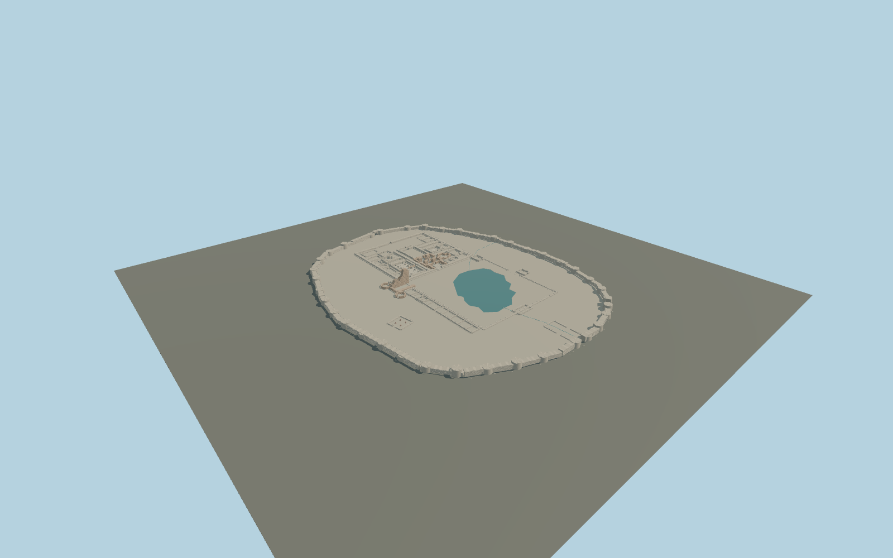

# Takht-e Soleyman

Oval stone enclosure with 38 bastions, mapped spring lake, roofless fire sanctuaries, columned western halls, tall broken west-iwan spine, octagonal foundations and the oblique four-column red-stone hall.

## Evidence and reconstruction

Published dimensions and reconstructed details are separated in spec.json. Primary references:

- [Reference](https://www.openstreetmap.org/way/203537193)
- [Reference](https://www.openstreetmap.org/way/314769016)
- [Reference](https://whc.unesco.org/en/list/1077)
- [Reference](https://whc.unesco.org/uploads/nominations/1077.pdf)
- [Reference](https://www.iranicaonline.org/articles/takt-e-solayman/)
- [Reference](https://www.iranicaonline.org/uploads/files/takht_solayman_fig_1.jpg)
- [Reference](https://www.iranicaonline.org/uploads/files/takht_solayman_fig_4.jpg)
- [Reference](https://commons.wikimedia.org/wiki/File:Takht-i-Suleiman_20170812_18.jpg)
- [Reference](https://commons.wikimedia.org/wiki/File:Takht-e_Soleymān_overview.jpg)

No third-party geometry, photograph or bitmap texture is embedded. Shared surface graphs come from the central library; vertex tints carry model colors. Glazing uses PBR materials; transparent surfaces are declared per model.

## Model and axes

817,410 triangles; 1,641,262 vertices; 8 material groups; 68,898,992 bytes. Native bounds: -206.017, 0.000, -163.419 to 204.154, 23.200, 163.807. Source hash: `sha256:41b6f6084c0178b38b404cefe961b44af4931cfea734ba1b0ac5c6ea266f5901`.

{"up":"+Y","longitudinal":"+X north","front":"+Z east","origin":"OSM enclosure anchor at provisional plateau contact"}

Keep as a draft until terrain, enclosure and lake registration are visually verified in the world viewer.

## Reproduce

Run `node packages/worldgen/scripts/generate-signature-towers.mjs --ids=N0246` (or add `--check`). The generator preserves manually edited masters by checking their baseline hashes. Import through the standard authored-model workflow with optimization disabled; then capture all QA cameras, including shared-surface views.

## Pending work

- Maximum fidelity remains pending. Interior plans are visually registered approximations, not a photogrammetric survey. Individual wall positions, present erosion profiles and archaeological phase boundaries need measured refinement.
- Thirty-eight bastions are documented, but the tower stations and surviving heights are reconstructed. The north, old southeast and newer south entrances need local measured alignment.
- The west iwan is modeled as a broken northern wall with partial vault springing. Its 22 m remaining peak, broken edges, side niches and octagonal foundations are proportional estimates. No complete ancient roof is asserted.
- Fire-temple corner piers, restored arches, basins and column stumps are interpreted from plans and photographs. Exact restoration dates and current condition are unverified; temporary scaffolding is excluded.
- Shared stone, travertine, brick and sandstone are used without embedded images. The spring uses local PBR color, without bathymetry or a bespoke water shader. Small stones and weathering are procedural details.
- The plateau slab is provisional. Full geological mound, distant Zendan/Belqeis sites, surrounding village and modern visitor structures are outside this asset. Terrain fit and hydrology remain pending.

This bundle contains source geometry, not a claim of maximum-fidelity completion. Hash-bound visual acceptance is recorded separately after capture inspection.

## Additional geographic data

Map geometry © OpenStreetMap contributors, ODbL-1.0. Publications and photographs used as architectural references; no third-party mesh or image pixels distributed.
