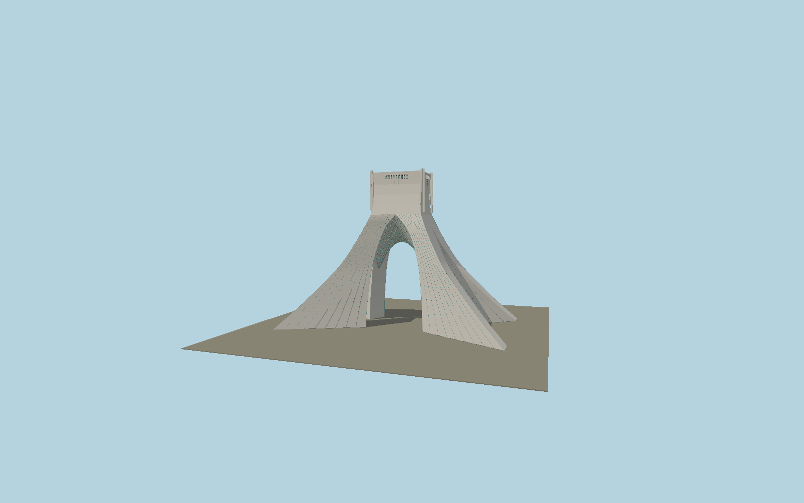

# Azadi Tower

Hossein Amanat’s four curved marble blades, flaring to diagonal feet beneath the pointed great arch, with a lower crossing arch, curved lattice soffit, long blue stone joints and a windcatcher-like perforated crown.

## Identity and geometry

Catalog N0563, [Q1140026](https://www.wikidata.org/wiki/Q1140026). Iran official tourism dimensions and exterior photographs, architect interview, and exact-QID OSM diagonal-blade outline. The published 64 m width is preferred to the map’s 69 m outer outline; the detailed curves and tile lattice are photograph-fitted.

Exact-QID mapped monument center at the surrounding plaza. ±Z are the major east/west arch elevations; ±X are the narrower side arches; +Y is up. The geographic proposal identifies its anchor and orientation evidence separately from remaining terrain and azimuth uncertainty.

Source facts and measured references are recorded in spec.json. References: [1](https://visitiran.ir/attraction/azadi-tower), [2](https://amanatarchitect.com/wp-content/uploads/2024/05/Bidoun-Interview-2013-1.pdf), [3](https://www.openstreetmap.org/relation/7814369). Reference pages and images are not redistributed.

## Original source and shared materials

Geometry is authored in `packages/worldgen/scripts/next-heritage-tower-models.mjs`. Shared material graphs with metric repeat UV0 and original vertex tints; GLB PBR fallback remains self-contained. No per-model texture duplication. No third-party mesh or photograph is embedded.

162,112 triangles; 324,224 vertices; 3 material groups; 13,619,760 source bytes. Source hash: `sha256:8d501e27bd67ca394ebf46c8e06a5c6cb8a4bcfe1fddf2bc031122d3d8936f2f`. Geometry validation checks finite Float32 coordinates, indices, triangle area and winding before export.

Regenerate with `node packages/worldgen/scripts/generate-heritage-towers.mjs N0563`; add `--check` for reproducibility. The generator refuses to overwrite a master whose hash differs from source.json. Import uses `--no-optimize` to preserve facade recesses.

## Remaining detail and review

- Blade curvature, arch intrados, soffit tile lattice and crown opening dimensions are fitted to official exterior photography rather than the original structural drawings.
- Blue joints and crossed soffit ribs are geometric; their exact tile tessellation, marble panel seam layout and tiny crown motifs remain simplified.
- The under-plaza museum, fountain and landscaped square are outside this exterior monument asset.
- Near/far visual QA, shared-material inspection and maximum-fidelity approval remain pending.

Named near/far cameras are included for lit visual review. A valid export is not maximum-fidelity certification.
