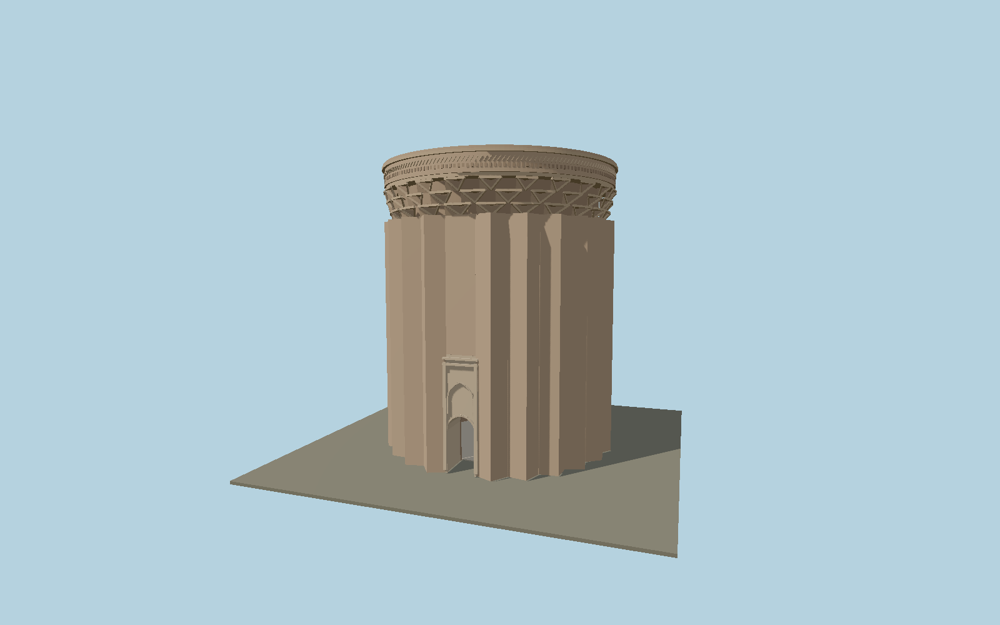

# Tughrul Tower

The current roofless Seljuk mausoleum at Rey: a deep stellar brick shaft, opposed entry portals, three ranks of recessed muqarnas beneath the corbelled brick cornice, reconstructed upper band and a genuinely open cylindrical court.

## Identity and geometry

Catalog N0581, [Q3437688](https://www.wikidata.org/wiki/Q3437688). Bernard O’Kane’s architectural study supplies the current 20 m height, 16.6 m diameter, twenty-two flanges, three corbel tiers and opposed north/south portals. Photographer-owned ground and upward views establish the round opening below a pointed blind relieving arch, three-dimensional recessed cells and brick relief courses. The mapped open courtyard supports an approximately 10.5 m inner diameter.

Mapped current tower center at ground contact Y=0. +Z is the lighter southern entry portal; −Z is the northern portal with the elevated staircase opening; +Y is up. The geographic proposal identifies its anchor and orientation evidence separately from remaining terrain and azimuth uncertainty.

Source facts and measured references are recorded in spec.json. References: [1](https://www.iranicaonline.org/articles/borj-e-togrol-tomb-tower-of-the-saljuq-period/), [2](https://commons.wikimedia.org/wiki/File:Burj_Tughrul_Ground.jpg), [3](https://commons.wikimedia.org/wiki/File:Burj_Tughrul_bala.jpg), [4](https://commons.wikimedia.org/wiki/File:Detail_of_brickwork_on_cornice_and_squinches.jpg), [5](https://www.openstreetmap.org/relation/8048810). Reference pages and images are not redistributed.

## Original source and shared materials

Geometry is authored in `packages/worldgen/scripts/heritage-towers-580-more-models.mjs`. Shared material graphs with metric repeat UV0 and original vertex tints; GLB PBR fallback remains self-contained. No per-model texture duplication. No third-party mesh or photograph is embedded.

20,512 triangles; 41,200 vertices; 3 material groups; 1,731,660 source bytes. Source hash: `sha256:c8c3fe22255b8417b22617d08fef51d2f30d89c74db385e2cba2d305d4da3ebd`. Geometry validation checks finite Float32 coordinates, indices, triangle area and winding before export.

Regenerate with `node packages/worldgen/scripts/generate-heritage-towers.mjs N0581`; add `--check` for reproducibility. The generator refuses to overwrite a master whose hash differs from source.json. Import uses `--no-optimize` to preserve facade recesses.

## Remaining detail and review

- The twenty-four-position exterior rhythm contains twenty-two projecting flanges and two opposed portal bays, reconciling the study’s flange count with common descriptions counting all rhythm positions.
- Eroded and reconstructed brickwork is represented by original geometric corbel cells and metric surfaces. No lost Kufic text or hypothetical medieval roof is invented.
- Near/far visual QA, shared-material inspection and maximum-fidelity approval remain pending.

Named near/far cameras are included for lit visual review. A valid export is not maximum-fidelity certification.
