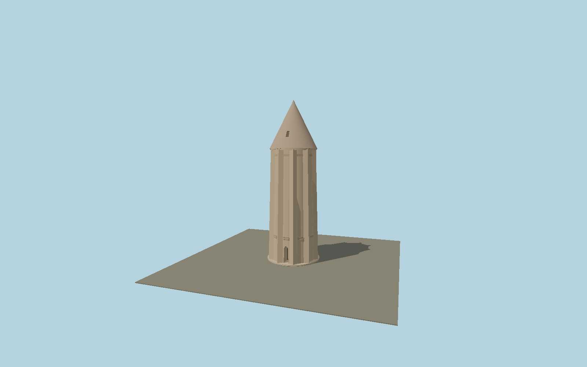

# Gonbad-e Qabus

Ten-flanged fired-brick tomb tower with a tapered star section, deep pointed entrance, two bordered inscription bands, corbelled neck and steep cone with a roof light.

## Identity and geometry

Catalog N0564, [Q606763](https://www.wikidata.org/wiki/Q606763). 2010 laser scan tables in UNESCO nomination, printed pp. 67-72, take precedence over the rounded 53 m overview and erroneous 72 m OSM height.

Tower center on the mound summit; Y=0 is the exterior tower base, excluding the 10 m mound. +Z is the entrance and roof-light side; +Y is up. The geographic proposal identifies its anchor and orientation evidence separately from remaining terrain and azimuth uncertainty.

Source facts and measured references are recorded in spec.json. References: [1](https://whc.unesco.org/en/list/1398), [2](https://whc.unesco.org/uploads/nominations/1398.pdf), [3](https://www.openstreetmap.org/way/328041889). Reference pages and images are not redistributed.

## Original source and shared materials

Geometry is authored in `packages/worldgen/scripts/heritage-tower-models.mjs`. Shared material graphs with metric repeat UV0 and original vertex tints; GLB PBR fallback remains self-contained. No per-model texture duplication. No third-party mesh or photograph is embedded.

11,482 triangles; 22,656 vertices; 4 material groups; 956,168 source bytes. Source hash: `sha256:cb3f9fef2179d6773d196d09a882d9c306714d6d199c6dfb70bd06a6a364e112`. Geometry validation checks finite Float32 coordinates, indices, triangle area and winding before export.

Regenerate with `node packages/worldgen/scripts/generate-heritage-towers.mjs N0564`; add `--check` for reproducibility. The generator refuses to overwrite a master whose hash differs from source.json. Import uses `--no-optimize` to preserve facade recesses.

## Remaining detail and review

- Ten right-angle flanges and taper are reconstructed from published plans, with curved bay radii interpolated between measured sections.
- Inscription borders are modeled but actual Kufic glyphs are omitted; detailed muqarnas, irregular brick repairs and the internal shell are incomplete.
- Cone light and entrance reveal use measured envelopes with simplified vault profiles. Modern site furniture and the surrounding mound are excluded.
- Near/far visual QA, shared-material inspection and maximum-fidelity approval remain pending.

Named near/far cameras are included for lit visual review. A valid export is not maximum-fidelity certification.
