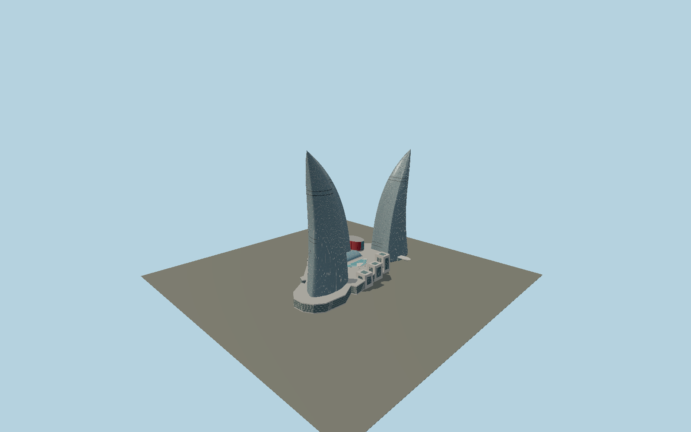

# Flame Towers

Three independent curved triangular glazed flames, with unequal heights, pointed swept crowns, unitized facade panels, dark maintenance slots, pale stepped retail pavilions and a glazed central atrium.

## Evidence and reconstruction

Published dimensions and reconstructed details are separated in spec.json. Primary references:

- [Reference](https://www.hok.com/projects/view/baku-flame-towers/)
- [Reference](https://www.wernersobek.com/de/projekte/baku-flame-towers-hochhauskomplex/)
- [Reference](https://www.skyscrapercenter.com/complex/618)
- [Reference](https://global.ctbuh.org/resources/papers/download/985-innovative-and-sustainable-high-rise-facade-systems-in-asia.pdf)
- [Reference](https://priedemann.net/en/cases/stormy-windows.html)
- [Reference](https://www.dlubal.com/en/downloads-and-information/references/customer-projects/000682)
- [Reference](https://www.openstreetmap.org/way/687226634)

No third-party geometry, photograph or bitmap texture is embedded. Shared surface graphs come from the central library; vertex tints carry model colors. Glazing uses PBR materials; transparent surfaces are declared per model.

## Model and axes

493,615 triangles; 1,230,301 vertices; 6 material groups; 50,217,872 bytes. Native bounds: -103.130, 0.000, -145.722 to 58.851, 182.000, 102.602. Source hash: `sha256:55c981f056c4cc274f1ec97200381c64cf73ac7cd2fbec3df7a30bbaec663c4e`.

{"up":"+Y","east":"+X","south":"+Z","front":"+X toward the eastern city frontage"}

The geographic proposal uses exact-QID OpenStreetMap evidence. Map-derived orientation and estimated architectural details require real-site visual review; preview eligibility is distinct from geographic/fidelity approval. Map attribution: © OpenStreetMap contributors, ODbL-1.0.

## Reproduce

Run `node packages/worldgen/scripts/generate-signature-towers.mjs --ids=N0191` (or add `--check`). The generator preserves manually edited masters by checking their baseline hashes. Import through the standard authored-model workflow with optimization disabled; then capture all QA cameras, including shared-surface views.

## Pending work

- Exterior geometry uses published overall dimensions and map evidence; panel subdivision, connection dimensions and local entrance details are reconstructed. Glazing uses opaque PBR with explicit geometry; no copied facade photograph is embedded.
- The primary engineer describes the three shells as related NURBS/developable surfaces, but the exact control points are not available; sectional curves, unitized pane pitch, maintenance-slot levels, podium pavilion details and roof furnishings are original reconstructions from completed HOK and Werner Sobek photographs. Heights are rounded published values. The media facade is a static daytime exterior; changing LED programs, signs, interior fit-out and sloping off-site landscaping are excluded.

This bundle contains source geometry, not a claim of maximum-fidelity completion. Hash-bound visual acceptance is recorded separately after capture inspection.
