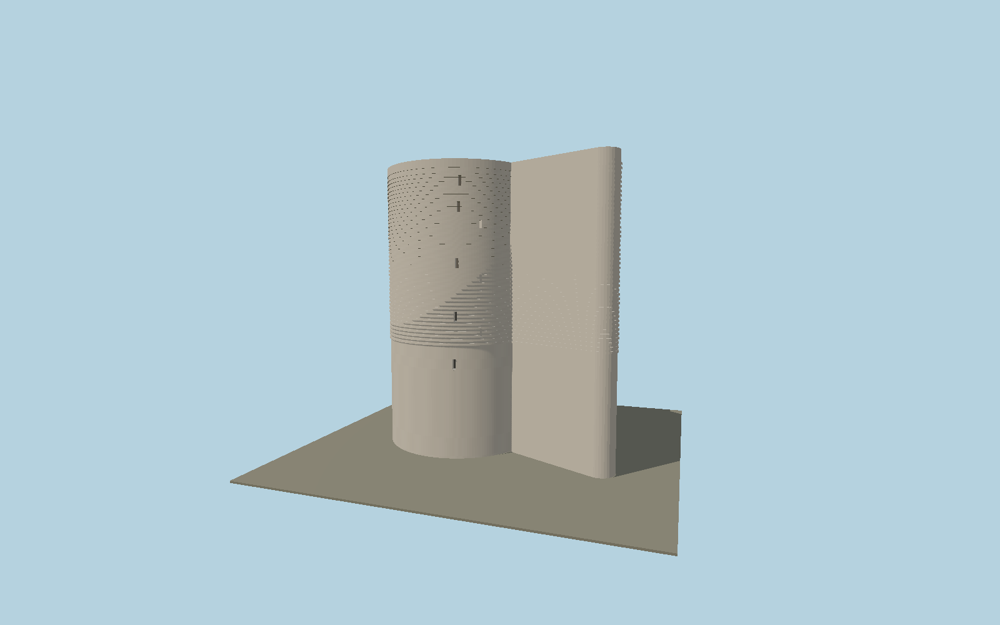

# Maiden Tower

Baku limestone tower with its asymmetric seaside buttress, rounded nose, relief masonry bands, recessed slit openings and open roof parapet.

## Identity and geometry

Catalog N0562, [Q842822](https://www.wikidata.org/wiki/Q842822). Reserve administration cylinder diameter and height envelope; Presidential Library entrance and panel dimensions; OSM asymmetric buttress footprint. Nominal 31 m base-to-parapet includes the reported 3 m site-level difference.

Minimum-area OSM footprint center in X/Z; nominal lowest exterior base at Y=0. OSM-local +X points approximately east; western doorway toward -X; +Y is up. The geographic proposal identifies its anchor and orientation evidence separately from remaining terrain and azimuth uncertainty.

Source facts and measured references are recorded in spec.json. References: [1](https://icherisheher.gov.az/en/monuments/show/qiz-qalasi), [2](https://bakucity.preslib.az/en/page/7eSskpB6tX), [3](https://www.openstreetmap.org/way/299418016). Reference pages and images are not redistributed.

## Original source and shared materials

Geometry is authored in `packages/worldgen/scripts/heritage-tower-models.mjs`. Shared material graphs with metric repeat UV0 and original vertex tints; GLB PBR fallback remains self-contained. No per-model texture duplication. No third-party mesh or photograph is embedded.

83,212 triangles; 166,200 vertices; 3 material groups; 6,817,868 source bytes. Source hash: `sha256:2bf3ed22d147ea9b8bc4d0e465e8ce09bbfe719e3d06a65ba5539bfd4064e585`. Geometry validation checks finite Float32 coordinates, indices, triangle area and winding before export.

Regenerate with `node packages/worldgen/scripts/generate-heritage-towers.mjs N0562`; add `--check` for reproducibility. The generator refuses to overwrite a master whose hash differs from source.json. Import uses `--no-optimize` to preserve facade recesses.

## Remaining detail and review

- Rib count, slit positions and buttress nose curvature are estimates from the library exterior photograph and OSM, not measured conservation geometry.
- Interior museum floors, the well, adjoining lower defensive buildings, inscriptions and individual damaged blocks are not reconstructed.
- A uniform Y=0 base requires terrain fitting to the sloping rock. Exterior dimensions do not establish a surveyed vertical datum.
- Near/far visual QA, shared-material inspection and maximum-fidelity approval remain pending.

Named near/far cameras are included for lit visual review. A valid export is not maximum-fidelity certification.
