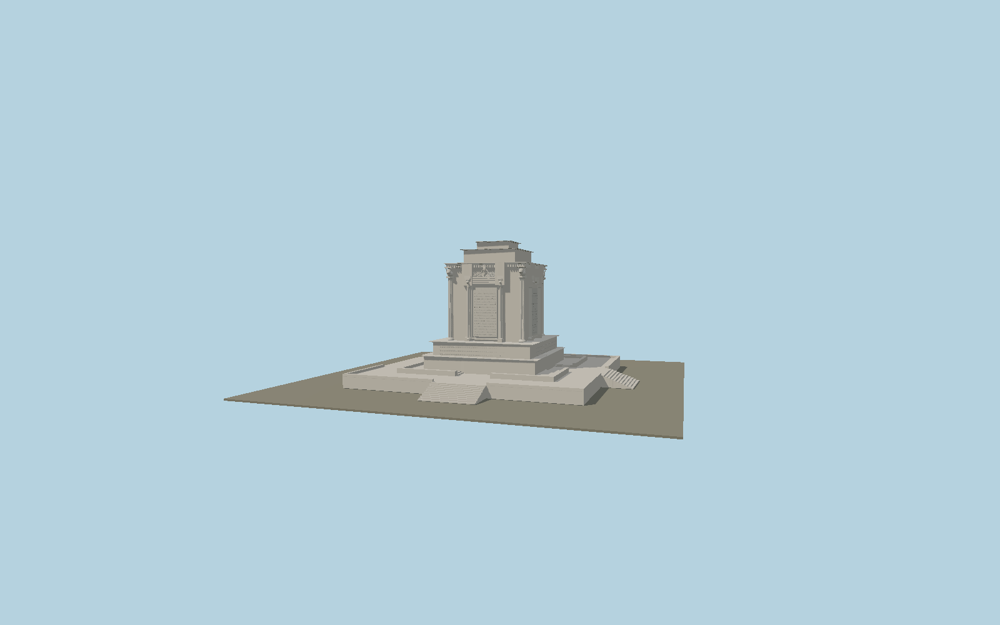

# Ferdowsi Mausoleum

Tus marble memorial with individually mapped entrance steps and layered podium, fluted Achaemenid columns, opposed bull capitals, pseudo-doorways, relief inscription fields, a winged royal figure and the three-step flat crown.

## Identity and geometry

Catalog N0576, [Q5959602](https://www.wikidata.org/wiki/Q5959602). Official Iranian cultural institute gives 18 m present exterior height. Exact OSM building parts supply present platform, stair, shaft and column locations; the measured part geometry is preserved as reference-metadata.json. The Iranica author describes the 1934 chamber as 16 m square; the current mapped upper chamber is about 10 m, consistent with current exterior photography, so the historical chamber dimension is not used to stretch the present crown.

Exact-QID mapped platform center at the lowest surrounding stair foot. +Z is the southern entrance-axis face with winged relief; +Y is up. The geographic proposal identifies its anchor and orientation evidence separately from remaining terrain and azimuth uncertainty.

Source facts and measured references are recorded in spec.json. References: [1](https://visitiran.ir/attraction/mausoleum-ferdowsi), [2](https://en.irancultura.it/tourism/attractions/attractions-mashhad/mashhad-the-tomb-of-Ferdowsi/), [3](https://www.iranicaonline.org/articles/ferdowsi-iii/), [4](https://www.openstreetmap.org/way/966196557), [5](https://www.openstreetmap.org/way/966196607). Reference pages and images are not redistributed.

## Original source and shared materials

Geometry is authored in `packages/worldgen/scripts/next-heritage-tower-more-models.mjs`. Shared material graphs with metric repeat UV0 and original vertex tints; GLB PBR fallback remains self-contained. No per-model texture duplication. No third-party mesh or photograph is embedded.

67,980 triangles; 134,122 vertices; 2 material groups; 5,512,016 source bytes. Source hash: `sha256:beae7fab69353707656c84831504a0768fefd883178cbfdd343321b77c59c1e5`. Geometry validation checks finite Float32 coordinates, indices, triangle area and winding before export.

Regenerate with `node packages/worldgen/scripts/generate-heritage-towers.mjs N0576`; add `--check` for reproducibility. The generator refuses to overwrite a master whose hash differs from source.json. Import uses `--no-optimize` to preserve facade recesses.

## Remaining detail and review

- Bull capitals, wing feathers and fluting are original geometric reconstructions fitted to reference photographs. Narrative scenes and calligraphic inscription fields are shallow sculptural marks, not readable transcriptions or casts of individual artworks.
- The current upper chamber proportions use OSM part geometry and current official photography; the published 16 m chamber dimension remains recorded as conflicting evidence rather than an established measurement of the current upper chamber.
- Near/far visual QA, shared-material inspection and maximum-fidelity approval remain pending.

Named near/far cameras are included for lit visual review. A valid export is not maximum-fidelity certification.
