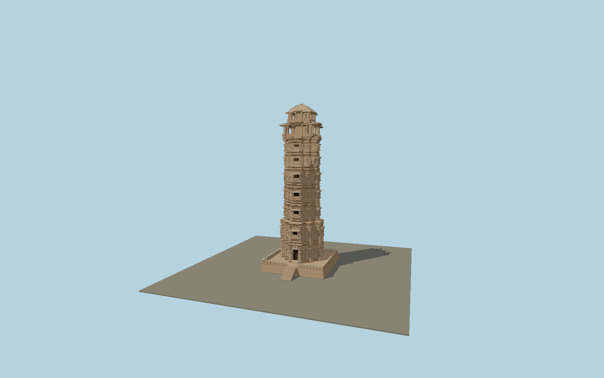

# Vijaya Stambha

Nine-storey Mewar victory monument: stepped cruciform carved sandstone shaft, broad lower pair of levels, dense relief niches and fluted pilasters, moulded projecting cornice bands, cardinal balcony windows and jali screens, two open upper pavilions and a ribbed domical crown. Original relief geometry preserves the documented sculpture rhythm without inventing inscription text.

## Identity and geometry

Catalog N0611, [Q2724452](https://www.wikidata.org/wiki/Q2724452). UNESCO nomination 247rev printed 2.47–2.48 reproduces the ASI stepped-cross plan and records 37.19 m overall height, 14.32 m maximum width and nine storeys. Thomas Holbein Hendley’s firsthand India volume 1 describes the narrower tower body as 30 ft wide; this is treated separately from the broad support terrace. Intermediate level heights and projections are proportional reconstructions from official tourism photos, UNESCO close views and Baudesson’s primary 1882 north/southwest/south-entrance photographs, checked against the modern comparison. No inconsistent printed raster scale is promoted to a new surveyed dimension.

Center of the square support terrace; Y=0 at the bottom of the exposed platform. Native +Z south, matching the ASI plan entrance; +X east; +Y is up. The geographic proposal identifies its anchor and orientation evidence separately from remaining terrain and azimuth uncertainty.

Source facts and measured references are recorded in spec.json. References: [1](https://whc.unesco.org/uploads/nominations/247rev.pdf), [2](https://ignca.gov.in/Asi_data/88329.pdf), [3](https://www.tourism.rajasthan.gov.in/chittorgarh.html), [4](https://dsr.nii.ac.jp/toyobunko/La-100/V-1/page/0090.html.en), [5](https://franpritchett.com/00routesdata/1400_1499/rajputforts/chitor_tower/chitor_tower.html), [6](https://www.wikidata.org/wiki/Q2724452), [7](https://www.openstreetmap.org/way/1549061397). Reference pages and images are not redistributed.

## Original source and shared materials

Geometry is authored in `packages/worldgen/scripts/vijaya-stambha-model.mjs`. Shared material graphs with metric repeat UV0 and original vertex tints; GLB PBR fallback remains self-contained. No per-model texture duplication. No third-party mesh or photograph is embedded.

851,816 triangles; 1,922,904 vertices; 2 material groups; 77,525,336 source bytes. Source hash: `sha256:43cbcb9132919cce564e37935b0e339cd7a3873eeb4e7f371074aff3a0c2aabf`. Geometry validation checks finite Float32 coordinates, indices, triangle area and winding before export.

Regenerate with `node packages/worldgen/scripts/generate-heritage-towers.mjs N0611`; add `--check` for reproducibility. The generator refuses to overwrite a master whose hash differs from source.json. Import uses `--no-optimize` to preserve facade recesses.

## Remaining detail and review

- The exterior includes original shallow sculptural figures with robes, halos and crowns; individual deity identities, hand attributes, damaged inscriptions and carving faces are not represented as exact replicas. No fabricated legible inscription text is used.
- The documented height, maximum base and nine levels govern scale. The lower shaft width and upper setbacks follow primary historical dimensions and photographs; intermediate floor elevations, dome profile and mouldings remain proportional reconstruction.
- The source is current restored exterior appearance as in official tourism photographs. Interior stairs and chambers, separate fort buildings and gardens are outside the asset. Mapped upper-roof evidence fixes the center and axis; the ground terrace retains the independently documented larger dimensions.
- Near/far visual QA, shared-material inspection and maximum-fidelity approval remain pending.

Named near/far cameras are included for lit visual review. A valid export is not maximum-fidelity certification.
