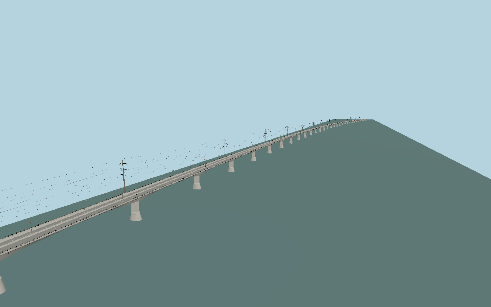

# Jamuna Bridge

Curved4800m segmental concrete crossing with47 equal main spans,2 end spans,128m approach viaducts, varying-depth single-cell box, paired seismic bearings, north-side230kV pylons and suspended south gas pipeline.

## Evidence

- [Primary reference](https://www.iabse-bd.org/old/proceedings2005RP1.pdf)
- [Primary reference](https://www.iabse-bd.org/session/52.pdf)
- [Primary reference](https://iabse-bd.org/2020/pdf/26.pdf)
- [Primary reference](https://bba.gov.bd/pages/projects/6922d980dbfbab28ce04d529)
- [Primary reference](https://bangla.bppa.gov.bd/upload/noa/2026-05-06-08-56-37-Signed-NOA_28.04.2026--Jamuna-Deck-Renovation.pdf)
- [Primary reference](https://www.eprocure.gov.bd/resources/common/ViewTender.jsp?TenderCancel=false&id=1319559)
- [Primary reference](https://www.openstreetmap.org/way/279534616)

Published dimensions and reconstruction assumptions are separated in spec.json. Source photos were consulted; no photos or third-party geometry are embedded. Map plan attribution: © OpenStreetMap contributors, ODbL-1.0.

## Source

1463352 triangles; 115327692 bytes; 6 material groups. SHA256: sha256:66cc99988cb333191d4f129bacccf2dc7337900026d1e55ca8eb45b1c101e547.

Shared surfaces (concrete_plain, metal_stainless, metal_painted) are loaded through the central library; any transparent materials use local PBR parameters. Axis and provisional vertical datum are in spec.json.

Regenerate with node packages/worldgen/scripts/generate-researched-bridges.mjs --ids=N0023; append --check to verify. Import and capture through the standard next-1000 scripts. Geometry validation does not substitute for current-frame visual review.

## Reconstruction limits

- Actual river, sandbar and embankment fit needs terrain-aware bridge placement.
- Pole profiles, pile-cap shape, exposed service supports and grade remain reconstructions requiring closer current-photo comparison.
- 2026 rail-lane widening is awarded; completion is unconfirmed, so the former north railway strip is modeled bare without inventing a completed widened carriageway.
- Buried foundation piles and temporary construction equipment are omitted from exterior geometry.
